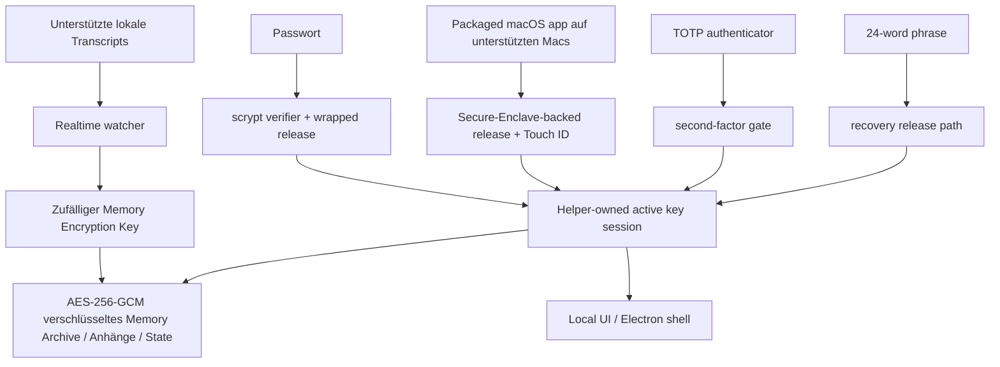

# DataMoat

Sprache: [English](./README.md) | [Português (Brasil)](./README.pt-BR.md) | [简体中文](./README.zh-CN.md) | [繁體中文](./README.zh-Hant.md) | [日本語](./README.ja.md) | [한국어](./README.ko.md) | [Türkçe](./README.tr.md) | [Русский](./README.ru.md) | [Tiếng Việt](./README.vi.md) | [ไทย](./README.th.md) | [Deutsch](./README.de.md)

[](#)
[](#install)
[](./LICENSE.md)
[](#supported-today)
[](#supported-today)
[](#install)
[](#install)
[](#supported-today)
[](#supported-today)
[](#supported-today)
[](#supported-today)
[](#supported-today)
[](#supported-today)
[](#supported-today)
[](#supported-today)

Offizielle Website: [https://datamoat.org](https://datamoat.org)
GitHub-Repository: [https://github.com/max-ng/datamoat](https://github.com/max-ng/datamoat)

## Alles, was Sie mit ChatGPT, Claude, Codex, Cursor, DeepSeek, Qwen und OpenClaw erstellen, schützen, exportieren, sichern, analysieren, durchsuchen und wiederverwenden

Lokales verschlüsseltes Backup-Archiv für Sessions, Bilder, Dateien/PDFs und `SKILL.md`-Ordner.

> **Schützen, exportieren, sichern, analysieren, durchsuchen und verwenden Sie alles wieder, was Sie mit ChatGPT, Claude, Codex, Cursor, DeepSeek, Qwen und OpenClaw erstellen.**
> DataMoat hält Ihre AI-Arbeitshistorie lokal und verschlüsselt, bewahrt die rohen Quellaufzeichnungen intakt und erstellt eine normalisierte Ebene für Analyse, Suche, Export, Wiederverwendung, Übergabe und private AI memory.
>
> **Ihre wertvollsten zukünftigen AI-Daten verschwinden bereits.**
> Laden Sie DataMoat jetzt herunter, um zu sehen, wie viel Claude-, Codex-, Cursor-, OpenClaw-, DeepSeek- und Qwen-Arbeitshistorie Sie noch erfassen können.

**Kernumfang des Backups:** DataMoat sichert unterstützte **Skills + Sessions + Anhänge** in dasselbe verschlüsselte lokale Memory Archive. Skills werden als vollständige Ordner-Snapshots gespeichert, nicht nur als Namen.

**Die Menschen und Unternehmen, die ihre AI-Daten besitzen, werden die Zukunft gewinnen.**

DataMoat ist ein AI work history memory archive für Personen und Teams, die mit ChatGPT exports, Claude CLI, Claude Desktop, DeepSeek und Qwen über Claude Code GUI Workflows, Codex CLI, Codex app, Cursor, OpenClaw und anderen AI-Tools arbeiten. Es bewahrt den vollständigen Arbeitsnachweis: Sessions, lokal gespeicherte thinking tokens und reasoning blocks, wenn vorhanden, Prompts, Antworten, Tool-Ausgabe, Dateien, Anhänge, Metadaten, Inhalte von Skills-Ordnern und ursprüngliche Quellaufzeichnungen auf derselben Maschine, damit Ihre Arbeit später prüfbar, geschützt, wiederverwendbar und leichter übergabefähig bleibt.


## Wie DataMoat Ihre Arbeit Speichert

DataMoat hält zwei Ebenen:

- **Raw archive:** ursprüngliche Session-JSONL, SQLite-Datensätze, Logs, Anhänge, Metadaten, Snapshots von Skills-Ordnern und lokal gespeicherte thinking tokens oder reasoning blocks werden so nah wie möglich am Quellformat bewahrt.
- **Normalized index:** Datensätze aus verschiedenen Tools werden in ein gemeinsames Schema umgewandelt, sodass Sie toolübergreifend analysieren, durchsuchen, prüfen, exportieren, wiederverwenden und Arbeit übergeben können.

**Heute unterstützte Quellen:** ChatGPT export ZIP/folder imports, Claude CLI, Codex CLI, lokale Sessions der Codex app, Claude Desktop local-agent sessions auf macOS, DeepSeek- und Qwen-Sessions, wenn sie von Claude Code GUI Workflows lokal geschrieben werden, unterstützte lokale OpenClaw session records und unterstützte lokale Cursor agent transcripts.
**Weitere Datenquellen und Plattform-Releases stehen auf der Roadmap:** star und watch dieses Repository, um neue Capture-Integrationen und Plattform-Updates zu verfolgen, sobald sie erscheinen.

## Warum DataMoat Installieren

- **Halten Sie Ihre vollständige AI-Arbeitshistorie wiederherstellbar.** Lokale Datensätze können nach Compaction, Cleanup, Retention-Änderungen, Account-Downgrades, Gerätewechsel oder Umgebungsverlust schwerer erneut aufzurufen sein.
- **Bewahren Sie die vollständigste lokale Version, solange sie noch verfügbar ist.** DataMoat speichert das lokal geschriebene Transcript, einschließlich lokal gespeicherter thinking tokens und reasoning blocks, wenn die Quelle sie auf die Festplatte schreibt.
- **Sichern Sie den umgebenden Arbeitskontext.** DataMoat schützt unterstützte Sessions, Anhänge und `SKILL.md`-basierte Inhalte von Skills-Ordnern im selben verschlüsselten Memory Archive.
- **Suchen Sie frühere Prompts, Lösungen, Tool-Ausgaben und Thinking-Token-Kontext.** Finden Sie frühere Fixes, Workflows, Zeitstempel und Anhänge, ohne von einer Live-Service-Ansicht abhängig zu sein.
- **Schützen Sie Kontinuität für Einzelpersonen und Teams.** Jede geschützte Maschine kann ihr eigenes verschlüsseltes lokales Archive für spätere Review, Handoff und Audit behalten.
- **Halten Sie Datensätze verschlüsselt und unter lokaler Kontrolle.** Andere Software oder Dienste können das Memory Archive nicht direkt lesen; nur genehmigte Unlock- und Recovery-Pfade können es entschlüsseln.

## Highlights

- **Verschlüsseltes lokales Memory Archive** für Transcripts, Skills, Anhänge und State mit AES-256-GCM.
- **Gespeicherte Inhalte bleiben lokal** als verschlüsselte Memory-Archive-Dateien, nicht als Klartext-Transcript-Dumps.
- **Starke lokale Authentifizierung** mit Passwort, optionalem TOTP und einer Recovery Phrase mit 24 Wörtern.
- **Secure-Enclave-backed Unlock-Pfad auf unterstützten Macs** für hardwaregestützten täglichen Unlock. Siehe Apples Überblick zum [Secure Enclave](https://support.apple.com/guide/security/secure-enclave-sec59b0b31ff/web). Touch ID ist Teil des packaged macOS app path.
- **Key custody im Besitz des Helpers**, sodass der Haupt-UI-Prozess den aktiven Memory Encryption Key nicht hält.
- **Tamper-evident local audit chain**: aktuelle lokale Audit-Einträge sind hash-verkettet und mit `datamoat audit verify` überprüfbar.
- **Versionierter lokaler State**, damit geschützter Storage im Laufe der Zeit sicher migrieren kann.
- **Electron shell standardmäßig**, um Exposition gegenüber allgemeinen Browsern und Browser-Erweiterungen zu reduzieren, mit lokalem UI-Binding nur an `127.0.0.1`.
- **Keine Drittanbieter-Font- oder CDN-Abhängigkeit** in der UI.

## Heute Unterstützt

### Plattformen

| Plattform | Status | Hinweise |
|---|---|---|
| **macOS** | Heute unterstützt | Source install und signiertes packaged DMG sind jetzt verfügbar |
| **Linux** | Heute unterstützt | Source install ist jetzt verfügbar |
| **Packaged macOS DMG** | [DMG herunterladen](https://github.com/max-ng/datamoat/releases/download/v2.0.7/DataMoat-2.0.7-macos-arm64.dmg) (empfohlen) | Signiertes / notarisiertes Apple Silicon DMG mit Secure Enclave + Touch ID Unlock auf unterstützten Macs |
| **Windows x64 / ARM64** | ZIP + `DataMoat.exe` | Unsigned manual packages für Windows 11 x64 und Windows 11 on Arm; x64 hat GitHub Actions packaged runtime smoke bestanden, ARM64 hat echten VM UI/background capture smoke bestanden; signed installer noch in Arbeit |

### Quellen

| Quelle | Status | Was DataMoat bewahrt |
|---|---|---|
| **Claude CLI** | ✅ | Vollständiges lokales Transcript, einschließlich lokal geschriebener thinking blocks, wenn vorhanden |
| **Codex CLI** | ✅ | Erfasst unterstützte lokale Codex CLI session records; Transcript-Text, Tool-Ausgabe, Zeitstempel, Metadaten und stabile Bildanhänge werden bewahrt |
| **Codex app** | ✅ | Erfasst unterstützte lokale Codex app session records; Transcript-Text, Tool-Ausgabe, Zeitstempel, Metadaten und stabile Bildanhänge werden bewahrt |
| **Claude Desktop local-agent sessions (macOS)** | ✅ | Unterstützte lokale Claude Desktop agent session records, wenn vorhanden |
| **DeepSeek via Claude Code GUI** | ✅ | Wenn Claude Code GUI lokale Datensätze für DeepSeek-backed sessions schreibt, werden Transcript-Text, Tool-Ausgabe, Zeitstempel, Metadaten, Snapshots von Skills-Ordnern, Bilder und unterstützte Anhänge bewahrt |
| **Qwen via Claude Code GUI** | ✅ | Wenn Claude Code GUI lokale Datensätze für Qwen-backed sessions schreibt, werden Transcript-Text, Tool-Ausgabe, Zeitstempel, Metadaten, Snapshots von Skills-Ordnern, Bilder und unterstützte Anhänge bewahrt |
| **OpenClaw** | ✅ | Unterstützte lokale OpenClaw session transcripts und Metadaten |
| **Cursor** | ✅ | Erfasst lesbare lokale Cursor `agent-transcripts` JSONL records, einschließlich Text und Tool-Blöcken, wenn vorhanden |
| **Anhänge** | ✅ | Verschlüsselte Bilder und unterstützte Datei/PDF-Blöcke, zurück mit ihren Quell-Sessions verknüpft |
| **Skills folders** | ✅ | Globale und Projekt-`SKILL.md`-Ordner-Snapshots, einschließlich `SKILL.md` und enthaltener Hilfsdateien, nicht nur des Skill-Namens |

## Sicherheit Auf Einen Blick

- **Memory archive encryption**: Transcripts, Skills, Anhänge und lokaler State werden at rest mit AES-256-GCM verschlüsselt.
- **Owner-only local file permissions**: geschützte Memory-Archive-Dateien, Attachment-Blobs und State-Dateien werden mit restriktiven lokalen Dateisystem-Modi geschrieben.
- **Password handling**: Passwörter werden als `scrypt` verifier gespeichert, nicht im Klartext.
- **Authenticator support**: TOTP funktioniert mit Standard-Authenticator-Apps wie Google Authenticator, 1Password und Authy.
- **Recovery design**: jedes Memory Archive erhält eine BIP39 Recovery Phrase mit 24 Wörtern.
- **Local-only UI**: die UI bindet an `127.0.0.1` und nutzt `HttpOnly` + `SameSite=Strict` Cookies.
- **Reduced browser attack surface**: die standardmäßige Electron shell vermeidet den normalen allgemeinen Browserpfad; Browser-Fallback bleibt bei Bedarf verfügbar.
- **Local API write protection**: mutierende Requests müssen vom selben Origin kommen und einen CSRF token enthalten.
- **Unlock retry hardening**: Passwort-, Touch-ID- und Recovery-Fehler verwenden Backoff statt unbegrenzter schneller Wiederholungen.
- **Trusted source updates only**: in-place git updates sind nur für allow-listed remotes / branches auf einer sauberen working tree erlaubt.
- **Redacted diagnostics**: health-, crash-, log- und audit-Artefakte scrubben Secrets, bevor sie geschrieben werden.
- **Key isolation**: der Electron renderer oder Browser-Fallback erhält den rohen Memory Encryption Key nicht.
- **Auditability**: sicherheitsrelevante lokale Events werden in einen hash-chained audit log geschrieben. `datamoat audit verify` erkennt geänderte oder gebrochene Einträge im aktuellen lokalen Log; es ist kein remote notarization service oder deletion-proof ledger.
- **Backup integrity**: der Viewer liest die versiegelte Memory-Archive-Kopie als source of truth, nicht ein veränderliches Live-Quell-Transcript.

### Warum 24 Wörter Statt 12?

DataMoat verwendet eine BIP39 Phrase mit 24 Wörtern, weil sie langlebiges Recovery-Material für ein hochwertiges verschlüsseltes Memory Archive ist. Eine BIP39 Phrase mit 12 Wörtern trägt 128 Bits Entropie, während eine Phrase mit 24 Wörtern 256 Bits trägt. Zwölf Wörter sind weiterhin stark, aber für Recovery-Material, das den Zugriff über viele Jahre schützen muss, wählt DataMoat die größere Sicherheitsmarge.

### Wie Das Memory Archive Geschützt Wird



## Installation

Das signierte / notarisierte macOS DMG ist der empfohlene Installationspfad für Mac-Nutzer. Source install bleibt für Linux, Entwicklung und Fallback-Fälle verfügbar. Das macOS DMG ist über DataMoat release downloads unter [https://downloads.datamoat.org/releases/v2.0.7/DataMoat-2.0.7-macos-arm64.dmg](https://downloads.datamoat.org/releases/v2.0.7/DataMoat-2.0.7-macos-arm64.dmg) verfügbar und enthält Secure Enclave + Touch ID Unlock auf unterstützten Macs, Menüleisten-Autostart beim Login und packaged auto-update über DataMoats R2 release feed. Windows x64 und ARM64 sind als unsigned ZIP + `DataMoat.exe` packages verfügbar, während der signed installer fertiggestellt wird.

Release downloads:

[](https://github.com/max-ng/datamoat/releases/download/v2.0.7/DataMoat-2.0.7-macos-arm64.dmg)
[](https://github.com/max-ng/datamoat/releases/download/v2.0.7/DataMoat-2.0.7-win32-x64.zip)
[](https://github.com/max-ng/datamoat/releases/download/v2.0.7/DataMoat-2.0.7-win32-arm64.zip)

Jedes Windows ZIP enthält `DataMoat.exe` plus die erforderlichen App-Dateien. Entpacken Sie das Windows-Paket, halten Sie die Ordnerinhalte zusammen und führen Sie `Install DataMoat.cmd` einmal aus. Das startet DataMoat und registriert Startup für den aktuellen Windows-Benutzer, sodass die Tray-/Background-App nach Login oder Neustart zurückkommt. Dies ist weiterhin ein portables ZIP-Paket, noch kein signierter Single-File-Installer.

### AI-Assisted Install

Mac-Nutzer sollten zuerst das signierte und notarisierte packaged DMG verwenden: [Download DMG](https://github.com/max-ng/datamoat/releases/download/v2.0.7/DataMoat-2.0.7-macos-arm64.dmg). Beginnen Sie auf macOS nicht mit `git clone`, es sei denn, der Nutzer möchte ausdrücklich source install oder das packaged release ist nicht verfügbar.

Sie können ChatGPT export ZIP/folder imports, Claude CLI, Codex CLI oder OpenClaw bitten, DataMoat zu installieren, wenn Sie auf den Ziel-Desktop schauen.

Typischer Prompt:

```text
Installiere DataMoat auf diesem Mac mit dem neuesten signierten macOS DMG aus den DataMoat release downloads. Kopiere DataMoat.app nach Applications, starte es und sag mir Bescheid, wenn die lokale Setup-UI erscheint, damit ich password, authenticator, Touch ID und recovery steps selbst auf dem geschützten Desktop abschließen kann.
```

Wichtig:

- ein AI agent kann die Installation starten und die App vorbereiten
- das finale Recovery- und Unlock-Setup sollte weiterhin vom menschlichen Nutzer auf der geschützten Maschine abgeschlossen werden
- wenn Sie OpenClaw, Telegram, WhatsApp oder einen anderen remote chat relay verwenden, ohne den Ziel-Desktop zu sehen, nutzen Sie den dedizierten remote no-screen flow unten statt des normalen AI-assisted flow

### Remote No-Screen Install

Wenn die Installation über OpenClaw, Codex oder einen remote chat relay gestartet wird, während Sie den geschützten Desktop nicht sehen können, verwenden Sie zuerst das packaged macOS DMG oder Windows ZIP und starten Sie die installierte App mit der einzelnen no-screen flag.

macOS remote prompt:

```text
Installiere DataMoat auf diesem Mac mit dem neuesten signierten und notarisierten macOS DMG.

Verwende kein git clone oder source install, es sei denn, die DMG-Installation schlägt fehl.

Steps:
1. Lade das neueste macOS DMG herunter:
   https://downloads.datamoat.org/releases/v2.0.7/DataMoat-2.0.7-macos-arm64.dmg
2. Mounte das DMG.
3. Kopiere DataMoat.app nach ~/Applications.
4. Starte exakt:
   ~/Applications/DataMoat.app/Contents/MacOS/DataMoat --datamoat-remote-no-screen

Verwende nur --datamoat-remote-no-screen für remote no-screen pre-setup capture.
Schließe password, authenticator, Touch ID oder recovery phrase setup nicht in diesem Chat ab.

Nach dem Start sag mir:
DataMoat wurde vom DMG installiert und remote no-screen capture wurde gestartet. Ich muss das Setup später in der geschützten Desktop-GUI abschließen.
```

Windows remote prompt:

```text
Installiere DataMoat auf dieser Windows-Maschine mit dem neuesten Windows ZIP und DataMoat.exe.

Verwende kein git clone oder source install.

Steps:
1. Lade das richtige neueste Windows ZIP aus den DataMoat release downloads:
   x64: https://downloads.datamoat.org/releases/v2.0.7/DataMoat-2.0.7-win32-x64.zip
   ARM64: https://downloads.datamoat.org/releases/v2.0.7/DataMoat-2.0.7-win32-arm64.zip
2. Entpacke das ZIP nach Downloads.
3. Starte exakt:
   %USERPROFILE%\Downloads\DataMoat-win32-<arch>\DataMoat.exe --datamoat-remote-no-screen

Verwende DataMoat-win32-x64 für x64 oder DataMoat-win32-arm64 für ARM64.
Verwende nur --datamoat-remote-no-screen für remote no-screen pre-setup capture.
Schließe password, authenticator oder recovery phrase setup nicht in diesem Chat ab.

Nach dem Start sag mir:
DataMoat wurde vom Windows ZIP installiert und remote no-screen capture wurde gestartet. Ich muss das Setup später in der geschützten Desktop-GUI abschließen.
```

Manueller macOS launch command nach Installation des DMG:

```bash
"$HOME/Applications/DataMoat.app/Contents/MacOS/DataMoat" --datamoat-remote-no-screen
```

Verwenden Sie diesen Modus, um zu verhindern, dass password, authenticator enrollment secret, Touch ID prompt und 24-word recovery phrase jemals in Telegram, WhatsApp, OpenClaw chat, screenshots oder einem anderen remote relay erscheinen. DataMoat beginnt sofort mit der Erfassung unterstützter lokaler Records durch pre-setup encrypted capture, aber das vollständige Unlock-Setup muss später auf dem geschützten Desktop abgeschlossen werden.

Nach Abschluss der Remote-Installation sollte der Agent berichten, dass DataMoat erfolgreich installiert wurde und bereits unterstützte lokale Records erfasst. Wenn Sie zum geschützten Desktop zurückkehren, öffnen Sie DataMoat dort und schließen Sie das Setup lokal ab. Schließen Sie password, authenticator, Touch ID oder recovery setup nicht innerhalb der Bot-Konversation ab.

Linux fallback when no DMG exists:

```bash
git clone <repository-url> datamoat
cd datamoat
bash install.sh --remote-no-screen
```

### Manual Install

Empfohlen für source installs: verwenden Sie `git clone`.

```bash
git clone <repository-url> datamoat
cd datamoat
bash install.sh
datamoat
```

Requirements:

- `Node.js 18+`
- `macOS` oder `Linux`
- `macOS`: Xcode Command Line Tools für lokale native Builds
- `Linux`: eine normale Node-Build-Umgebung für Ihre Distro

Der erste Setup-Flow zeigt Recovery-Material lokal:

- password
- authenticator enrollment secret / QR
- 24-word recovery phrase

Das finale Memory-Setup sollte auf dem tatsächlichen Desktop-Bildschirm der geschützten Maschine abgeschlossen werden, nicht über Chat-Apps, Screenshots oder remote messaging channels weitergeleitet.

## Commands

```bash
datamoat
datamoat status
datamoat stop
datamoat scan
datamoat audit verify
datamoat update check
```

Audit verification prüft die Integrität des Audit-Logs, der auf der Festplatte vorhanden ist. Ohne externen Checkpoint kann sie allein nicht beweisen, dass eine lokale Audit-Datei nie von jemandem mit Schreibzugriff gelöscht, gekürzt oder vollständig neu geschrieben wurde.

Live git source installs unterstützen in-place source updates. Packaged macOS installs verwenden DataMoat R2 release downloads als packaged update source: das DMG ist für die Erstinstallation, und spätere packaged updates laden ein signiertes ZIP payload herunter und wenden es über den macOS app updater an, statt Nutzer zu bitten, für jedes Release ein neues DMG zu mounten.

## Grenzen Der Quelldienste

DataMoat sichert unterstützte lokale Transcript-Dateien, die bereits auf Ihrem Gerät vorhanden und Ihnen bereits zugänglich sind.

Es gewährt keine zusätzlichen Rechte an Inhalten oder Quelldiensten. Sie bleiben verantwortlich für die Einhaltung der Terms, Policies, Plan Restrictions und internen Regeln, die für ChatGPT, Claude, Codex, DeepSeek, Qwen, OpenClaw, Cursor und jeden anderen von Ihnen genutzten Quelldienst gelten.

DataMoat ist darauf ausgelegt, AI records zu schützen, die bereits auf Ihrer eigenen Maschine existieren. Statt Sessions, Skills, Attachments und Memory-Dateien über bekannte lokale Pfade verstreut oder in opaken Memory Plugins zu belassen, ergänzt es user-controlled local encryption, backup scope, recovery und auditability.

DataMoat kann auch Bilder, files/PDFs, generated assets und attachments über erfasste Versionen oder alternative conversation branches hinweg bewahren und übertragen, wenn diese records bereits lokal existieren. Viele AI memory plugins und einfache export tools hören bei Text auf; DataMoat hält die umgebenden Dateien zusammen mit der work history, die sie erzeugt hat.

DataMoat creates no new access zu Ihrer AI work history. Es schützt lokale records, die bereits in source-tool folders, exports, logs, attachments oder session stores auf Ihrem Computer vorhanden sind und sonst verstreut, lesbar und unverschlüsselt bleiben könnten.

Viele AI tools speichern work history bereits als ordinary local files auf dem Computer. Jede Person oder jeder process mit Zugriff auf dieses user account, disk, backups oder source-tool folders kann diese records möglicherweise lesen, bevor DataMoat sie schützt. DataMoat macht diese Daten nicht stärker exposed; es verschiebt ausgewählte bereits vorhandene records in ein encrypted archive unter Kontrolle des users.

Der DataMoat backup scope wird durch den User und durch die source records bestimmt, die auf der geschützten Maschine bereits verfügbar sind. Es umgeht keine account permissions, entsperrt keine remote services und gewährt keine Rechte über das hinaus, was der User auf diesem Computer bereits hat.

## Threat model: why installing can reduce local exposure

### Warum Nichtstun ebenfalls riskant sein kann

DataMoat fordert Sie nicht auf, ein neues sensitive dataset aus dem Nichts zu erstellen. Für viele AI tools existiert dieses dataset bereits auf Ihrem Computer als local transcripts, logs, exports, SQLite records, JSONL files, attachments und skills folders.

Ohne ein dediziertes archive können diese records als ordinary files über vorhersehbare local paths verstreut bleiben und nur durch normale OS account permissions geschützt sein. DataMoat hilft dabei, diese records zu identifizieren, ausgewählte supported records in einen local encrypted vault zu kopieren und ein recoverable, searchable, auditable archive unter Ihrer Kontrolle zu behalten.

### Vor DataMoat

Viele AI tools speichern transcripts, tool output, attachments, project context und manchmal reasoning-related blocks bereits als ordinary local files. Diese files können in bekannten application folders, exports, logs, SQLite databases, JSONL transcripts und attachment caches liegen. Jeder process, der als derselbe OS user läuft, kann möglicherweise schon einen Teil davon lesen.

### Was DataMoat tut

DataMoat erstellt keinen new access zu remote AI services und umgeht keine OS permissions. Es liest nur records, die dem aktuellen local user bereits verfügbar sind, und speichert ausgewählte supported records dann in einem user-controlled local encrypted archive. Die unterstützten local read paths und capture reasons sind im public application code zur review sichtbar; DataMoat nutzt keine hidden cloud collection und keinen undisclosed remote capture.

### Was DataMoat nicht automatisch löst

DataMoat löscht original source files nicht automatisch. Wenn der User keinen cleanup/export workflow wählt, können original records weiterhin in den folders der source apps verbleiben. DataMoat reduziert scattered plaintext exposure durch eine protected encrypted copy; es ersetzt keine endpoint security, disk encryption oder source-app retention policy.

### Wichtigster Tradeoff

Die Installation von DataMoat führt einen local watcher/importer process ein, der Zugriff auf ausgewählte AI record locations hat. Im Gegenzug erhalten users ein searchable encrypted archive, recovery path, audit log und portable backup, statt wichtige AI work in unencrypted local files verstreut zu lassen.

Windows packages sind derzeit unsigned manual builds, während der signed installer in Arbeit ist. Die codebase ist public for review; teams, die signed oder managed builds benötigen, können uns kontaktieren.

Sie müssen kein power user sein, um Ihre AI work history selbst zu besitzen. DataMoat lässt Sie heute mit einem kleinen lokalen archive anfangen und dessen Wert mit conversations, files, prompts und project context wachsen sehen.

## Enterprise

Enterprise deployment und management features stehen auf der Roadmap. Weitere enterprise-focused capabilities kommen; star und watch dieses Repository, um Updates zu verfolgen.

## Beratung Und Support

Fragen oder Hilfe bei Deployment:


## Lizenz

DataMoat ist unter der **Business Source License 1.1 (`BUSL-1.1`)** mit einem **Additional Use Grant** open-sourced.

Das bedeutet:

- persönliche Nutzung ist erlaubt
- interne Unternehmensnutzung ist erlaubt
- Nutzungen außerhalb dieses Grants erfordern eine separate kommerzielle Lizenz vom Licensor

Wir haben **BUSL-1.1** gewählt, damit der code auditable bleibt und zugleich das Risiko von misleading repackaged builds, malware clones und unsupported commercial forks eines security-sensitive local archive tool sinkt. Der gesamte application code ist public for review.

Siehe [LICENSE.md](LICENSE.md) für die vollständigen Bedingungen.

---

## Offizielle Website

Offizielle DataMoat Website: [https://datamoat.org](https://datamoat.org)
