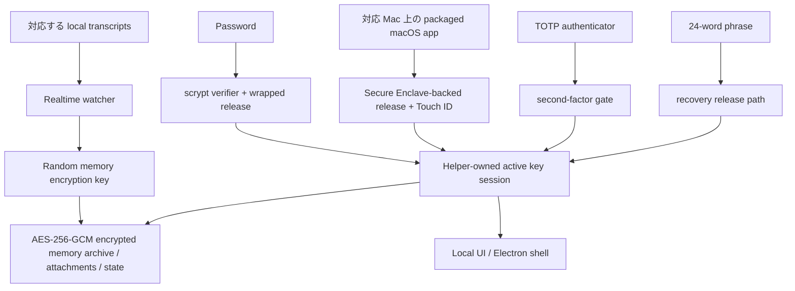

# DataMoat

言語: [English](./README.md) | [Português (Brasil)](./README.pt-BR.md) | [简体中文](./README.zh-CN.md) | [繁體中文](./README.zh-HK.md) | [日本語](./README.ja.md) | [한국어](./README.ko.md) | [Türkçe](./README.tr.md) | [Русский](./README.ru.md) | [Tiếng Việt](./README.vi.md) | [ไทย](./README.th.md) | [Deutsch](./README.de.md)

[](#)
[](#install)
[](./LICENSE.md)
[](#supported-today)
[](#supported-today)
[](#install)
[](#install)
[](#supported-today)
[](#supported-today)
[](#supported-today)
[](#supported-today)
[](#supported-today)
[](#supported-today)
[](#supported-today)

公式サイト: [https://datamoat.org](https://datamoat.org)
GitHub リポジトリ: [https://github.com/max-ng/datamoat](https://github.com/max-ng/datamoat)


> **Claude / Codex / Cursor / DeepSeek / Qwen のすべてのデータ + skills + 添付ファイルをエクスポートしてバックアップします。**
> DataMoat は AI 作業履歴をローカルかつ暗号化された状態で保持し、元のソース記録をそのまま保全しながら、検索、エクスポート、再利用、引き継ぎ、プライベート AI memory のための正規化インデックスを構築します。
>
> **将来いちばん価値を持つ AI データは、すでに消え始めています。**
> 今すぐ DataMoat をダウンロードして、Claude、Codex、Cursor、OpenClaw、DeepSeek、Qwen の作業履歴をどれだけまだ捕捉できるか確認してください。

**中核となるバックアップ範囲:** DataMoat は対応する **skills + sessions + attachments** を同じ暗号化ローカル memory archive にバックアップします。Skills は名前だけではなく、完全なフォルダスナップショットとして保存されます。

**自分たちの AI データを所有する人と企業が、未来を勝ち取ります。**

DataMoat は、Claude CLI、Claude Desktop、Claude Code GUI workflow 経由の DeepSeek と Qwen、Codex CLI、Codex app、Cursor、OpenClaw、その他の AI ツールを使う人とチームのための AI work history memory archive です。完全な作業記録を保存します: sessions、存在する場合はローカルに保存された thinking tokens と reasoning blocks、prompts、responses、tool output、files、attachments、metadata、skills folder contents、同じマシン上の元ソース記録です。これにより、あなたの作業は後から review 可能で、保護され、再利用でき、引き継ぎやすくなります。


## DataMoat が作業を保存する方法

DataMoat は 2 つの層を保持します:

- **Raw archive:** 元の session JSONL、SQLite records、logs、attachments、metadata、skills folder snapshots、そしてローカルに保存された thinking tokens または reasoning blocks は、できるだけソース形式に近い形で保存されます。
- **Normalized index:** 異なるツールの records は共通 schema に変換され、ツールをまたいで検索、review、export、分析、再利用、handoff ができます。

**現在対応しているソース:** Claude CLI、Codex CLI、Codex app local sessions、macOS の Claude Desktop local-agent sessions、Claude Code GUI workflows がローカルに書き込む DeepSeek と Qwen sessions、対応するローカル OpenClaw session records、対応するローカル Cursor agent transcripts。
**さらに多くのデータソースとプラットフォームリリースは roadmap にあります:** この repository を star / watch すると、新しい capture integrations と platform updates のリリースを追えます。

## DataMoat をインストールする理由

- **完全な AI 作業履歴を復旧可能に保つ。** ローカル records は compaction、cleanup、retention changes、account downgrades、device replacement、environment loss の後で再確認しにくくなることがあります。
- **最も完全なローカル版がまだあるうちに保存する。** DataMoat は、ソースがディスクに保存する場合の locally stored thinking tokens と reasoning blocks を含め、ローカルに書き込まれた transcript を保存します。
- **周辺の作業コンテキストをバックアップする。** DataMoat は対応する sessions、attachments、`SKILL.md` ベースの skills folder contents を同じ暗号化 memory archive に保護します。
- **過去の prompts、solutions、tool output、thinking-token context を検索する。** ライブの service view に依存せず、以前の fixes、workflows、timestamps、attachments を見つけられます。
- **個人とチームの continuity を守る。** 保護された各マシンは、後から review、handoff、audit するための暗号化ローカル archive を持てます。
- **records を暗号化し、ローカル管理下に置く。** 他の software や services は memory archive を直接読めません。承認された unlock と recovery paths だけが復号できます。

## Highlights

- AES-256-GCM を使った transcripts、skills、attachments、state のための **暗号化ローカル memory archive**。
- **保存された内容はローカルに残る** 暗号化 memory archive files であり、plaintext transcript dumps ではありません。
- password、optional TOTP、24-word recovery phrase による **強力なローカル認証**。
- **対応 Mac の Secure Enclave-backed unlock path** により、日常の unlock をハードウェア支援します。Apple の [Secure Enclave](https://support.apple.com/guide/security/secure-enclave-sec59b0b31ff/web) 概要を参照してください。Touch ID は packaged macOS app path の一部です。
- **Helper-owned key custody** により、main UI process が active memory encryption key を保持しません。
- **Tamper-evident local audit chain**: 現在の local audit entries は hash-chained され、`datamoat audit verify` で検証できます。
- **Versioned local state** により、protected storage は時間とともに安全に migrate できます。
- **Electron shell by default** により、general-purpose browser と browser-extension exposure を減らし、local-only UI binding は `127.0.0.1` です。
- UI に **third-party font や CDN dependency はありません**。

## 現在対応

### Platforms

| Platform | Status | Notes |
|---|---|---|
| **macOS** | 現在対応 | Source install と署名済み packaged DMG が利用できます |
| **Linux** | 現在対応 | Source install が利用できます |
| **Packaged macOS DMG** | [DMG をダウンロード](https://datamoat.org/download/macos) (推奨) | Secure Enclave + Touch ID unlock に対応した、署名済み / notarized Apple Silicon DMG |
| **Windows x64 / ARM64** | ZIP + `DataMoat.exe` | Windows 11 x64 と Windows 11 on Arm 向けの unsigned manual packages。x64 は GitHub Actions packaged runtime smoke 済み、ARM64 は実 VM UI/background capture smoke 済み。signed installer はまだ進行中 |

### Sources

| Source | Status | DataMoat が保存する内容 |
|---|---|---|
| **Claude CLI** | ✅ | locally written thinking blocks が存在する場合を含む、完全な local transcript |
| **Codex CLI** | ✅ | 対応する local Codex CLI session records を捕捉し、transcript text、tool output、timestamps、metadata、stable image attachments を保存 |
| **Codex app** | ✅ | 対応する local Codex app session records を捕捉し、transcript text、tool output、timestamps、metadata、stable image attachments を保存 |
| **Claude Desktop local-agent sessions (macOS)** | ✅ | 存在する場合の local Claude Desktop agent session records |
| **DeepSeek via Claude Code GUI** | ✅ | Claude Code GUI が DeepSeek-backed sessions の local records を書き込む場合、transcript text、tool output、timestamps、metadata、skills folder snapshots、images、対応 attachments を保存 |
| **Qwen via Claude Code GUI** | ✅ | Claude Code GUI が Qwen-backed sessions の local records を書き込む場合、transcript text、tool output、timestamps、metadata、skills folder snapshots、images、対応 attachments を保存 |
| **OpenClaw** | ✅ | 対応する local OpenClaw session transcripts と metadata |
| **Cursor** | ✅ | 読み取り可能な local Cursor `agent-transcripts` JSONL records を捕捉し、存在する場合は text と tool blocks を含む |
| **Attachments** | ✅ | 暗号化された image と対応 file/PDF blocks を source sessions に紐づけて保存 |
| **Skills folders** | ✅ | Global と project の `SKILL.md` folder snapshots。`SKILL.md` と含まれる helper files を含み、skill name だけではありません |

## Security At A Glance

- **Memory archive encryption**: transcripts、skills、attachments、local state は AES-256-GCM で at rest 暗号化されます。
- **Owner-only local file permissions**: protected memory archive files、attachment blobs、state files は制限された local filesystem modes で書き込まれます。
- **Password handling**: passwords は plaintext ではなく `scrypt` verifiers として保存されます。
- **Authenticator support**: TOTP は Google Authenticator、1Password、Authy などの標準 authenticator apps で動作します。
- **Recovery design**: すべての memory archive には 24-word BIP39 recovery phrase が与えられます。
- **Local-only UI**: UI は `127.0.0.1` に bind し、`HttpOnly` + `SameSite=Strict` cookies を使います。
- **Reduced browser attack surface**: default Electron shell は通常の general-purpose browser path を避けます。必要な場合は browser fallback も利用できます。
- **Local API write protection**: 変更を行う requests は same origin から来て CSRF token を含む必要があります。
- **Unlock retry hardening**: password、Touch ID、recovery failures は無制限の高速 retry ではなく back off します。
- **Trusted source updates only**: in-place git updates は clean working tree 上の allow-listed remotes / branches のみに許可されます。
- **Redacted diagnostics**: health、crash、log、audit artifacts は書き込まれる前に secrets が scrub されます。
- **Key isolation**: Electron renderer または browser fallback は raw memory encryption key を受け取りません。
- **Auditability**: security-relevant local events は hash-chained audit log に書き込まれます。`datamoat audit verify` は現在の local log の changed または broken entries を検出しますが、remote notarization service や deletion-proof ledger ではありません。
- **Backup integrity**: viewer は mutable live source transcript ではなく、sealed memory archive copy を source of truth として読みます。

### なぜ 12 Words ではなく 24 Words?

DataMoat が 24-word BIP39 phrase を使うのは、高価値の暗号化 memory archive に対する長期 recovery material だからです。12-word BIP39 phrase は 128 bits の entropy を持ち、24-word phrase は 256 bits を持ちます。12 words も十分強力ですが、何年にもわたって access を守る必要がある recovery material には、DataMoat はより大きい safety margin を選びます。

### Memory Archive はどう保護されるか



## Install

署名済み / notarized macOS DMG は Mac users に推奨される install path です。Source install は Linux、development、fallback cases 向けに引き続き利用できます。macOS DMG は DataMoat release downloads の [https://datamoat.org/download/macos](https://datamoat.org/download/macos) から入手でき、対応 Mac での Secure Enclave + Touch ID unlock、menu-bar auto-start at login、DataMoat の R2 release feed を通した packaged auto-update を含みます。Windows x64 と ARM64 は signed installer が完成するまで、unsigned ZIP + `DataMoat.exe` packages として提供されます。

Release downloads:

[](https://datamoat.org/download/macos)
[](https://datamoat.org/download/windows-x64)
[](https://datamoat.org/download/windows-arm64)

各 Windows ZIP には `DataMoat.exe` と必要な app files が含まれます。Windows package を unzip し、folder contents を一緒に保ったまま、`Install DataMoat.cmd` を 1 回実行してください。これにより DataMoat が launch され、現在の Windows user 向けに startup が登録され、login または restart 後に tray/background app が戻ってきます。これはまだ portable ZIP package であり、signed single-file installer ではありません。

### AI-Assisted Install

Mac users はまず署名済みかつ notarized の packaged DMG を使ってください: [Download DMG](https://datamoat.org/download/macos)。ユーザーが明示的に source install を望む場合、または packaged release が利用できない場合を除き、macOS では `git clone` から始めないでください。

target desktop を見ているとき、Claude CLI、Codex CLI、OpenClaw に DataMoat のインストールを依頼できます。

Typical prompt:

```text
DataMoat release downloads から最新の署名済み macOS DMG を使って、この Mac に DataMoat をインストールしてください。DataMoat.app を Applications にコピーし、起動して、local setup UI が表示されたら教えてください。password、authenticator、Touch ID、recovery steps は保護された desktop 上で私自身が完了します。
```

Important:

- AI agent は install を開始し app を準備できます
- 最終的な recovery と unlock setup は、保護された machine 上で human user が完了するべきです
- OpenClaw、Telegram、WhatsApp、または target desktop が見えない remote chat relay を使っている場合、通常の AI-assisted flow ではなく、下の dedicated remote no-screen flow を使ってください

### Remote No-Screen Install

OpenClaw、Codex、または任意の remote chat relay から install を開始し、保護された desktop が見えない場合は、まず packaged macOS DMG または Windows ZIP を使い、インストール済み app を single no-screen flag で launch してください。

macOS remote prompt:

```text
最新の署名済みかつ notarized の macOS DMG を使って、この Mac に DataMoat をインストールしてください。

DMG install が失敗しない限り、git clone または source install は使わないでください。

Steps:
1. 最新 macOS DMG をダウンロード:
   https://datamoat.org/download/macos
2. DMG を mount。
3. DataMoat.app を ~/Applications にコピー。
4. 正確に以下を launch:
   ~/Applications/DataMoat.app/Contents/MacOS/DataMoat --datamoat-remote-no-screen

remote no-screen pre-setup capture には --datamoat-remote-no-screen だけを使ってください。
この chat で password、authenticator、Touch ID、recovery phrase setup を完了しないでください。

Launch 後、こう伝えてください:
DataMoat was installed from the DMG and remote no-screen capture was started. I must finish setup later on the protected desktop GUI.
```

Windows remote prompt:

```text
最新の Windows ZIP と DataMoat.exe を使って、この Windows machine に DataMoat をインストールしてください。

git clone または source install は使わないでください。

Steps:
1. DataMoat release downloads から正しい最新 Windows ZIP をダウンロード:
   x64: https://datamoat.org/download/windows-x64
   ARM64: https://datamoat.org/download/windows-arm64
2. ZIP を Downloads に展開。
3. 正確に以下を launch:
   %USERPROFILE%\Downloads\DataMoat-win32-<arch>\DataMoat.exe --datamoat-remote-no-screen

x64 では DataMoat-win32-x64、ARM64 では DataMoat-win32-arm64 を使ってください。
remote no-screen pre-setup capture には --datamoat-remote-no-screen だけを使ってください。
この chat で password、authenticator、recovery phrase setup を完了しないでください。

Launch 後、こう伝えてください:
DataMoat was installed from the Windows ZIP and remote no-screen capture was started. I must finish setup later on the protected desktop GUI.
```

DMG インストール後の manual macOS launch command:

```bash
"$HOME/Applications/DataMoat.app/Contents/MacOS/DataMoat" --datamoat-remote-no-screen
```

この mode を使うと、password、authenticator enrollment secret、Touch ID prompt、24-word recovery phrase が Telegram、WhatsApp、OpenClaw chat、screenshots、その他の remote relay に表示されることを防げます。DataMoat は pre-setup encrypted capture により対応する local records の収集をすぐ開始しますが、完全な unlock setup は後で保護された desktop 上で完了する必要があります。

remote install 完了後、agent は DataMoat が正常にインストールされ、対応する local records をすでに捕捉していると報告するべきです。保護された desktop に戻ったら、そこで DataMoat を開き、setup を local に完了してください。bot conversation 内で password、authenticator、Touch ID、recovery setup を完了しないでください。

Linux fallback when no DMG exists:

```bash
git clone <repository-url> datamoat
cd datamoat
bash install.sh --remote-no-screen
```

### Manual Install

Source installs には `git clone` を推奨します。

```bash
git clone <repository-url> datamoat
cd datamoat
bash install.sh
datamoat
```

Requirements:

- `Node.js 18+`
- `macOS` または `Linux`
- `macOS`: local native builds 用の Xcode Command Line Tools
- `Linux`: 使用 distro に通常必要な Node build environment

最初の setup flow は recovery material を local に表示します:

- password
- authenticator enrollment secret / QR
- 24-word recovery phrase

Final memory setup は、chat apps、screenshots、remote messaging channels 経由ではなく、保護対象 machine の実際の desktop screen 上で完了するべきです。

## Commands

```bash
datamoat
datamoat status
datamoat stop
datamoat scan
datamoat audit verify
datamoat update check
```

Audit verification は、ディスク上に存在する audit log の integrity を確認します。external checkpoint がない場合、それだけでは local audit file が write access を持つ誰かに削除、truncate、完全 rewrite されていないことを証明できません。

Live git source installs は in-place source updates に対応します。Packaged macOS installs は DataMoat R2 release downloads を packaged update source として使います: DMG は初回 install 用で、その後の packaged updates は signed ZIP payload をダウンロードし、毎回新しい DMG を mount させる代わりに macOS app updater で適用します。

## Source Service Boundaries

DataMoat は、あなたの device 上にすでに存在し、あなたがすでにアクセスできる対応 local transcript files をバックアップします。

DataMoat は content または source services に対する追加の権利を付与しません。Claude、Codex、DeepSeek、Qwen、OpenClaw、Cursor、および使用するその他の source service に適用される terms、policies、plan restrictions、internal rules を遵守する責任はあなたにあります。

## Enterprise

Enterprise deployment と management features は roadmap にあります。より enterprise-focused な capabilities が今後追加されます。更新を追うにはこの repository を star / watch してください。

## Consultation and Support

質問または deployment help:


## License

DataMoat は **Business Source License 1.1 (`BUSL-1.1`)** と **Additional Use Grant** のもとで配布されます。

これは次を意味します:

- personal use は許可されています
- internal company use は許可されています
- その grant の外の用途には、licensor からの separate commercial license が必要です

これは **source-available** であり、OSI-approved open source ではありません。

完全な条件は [LICENSE.md](LICENSE.md) を参照してください。

---

## Official Website

DataMoat 公式サイト: [https://datamoat.org](https://datamoat.org)
