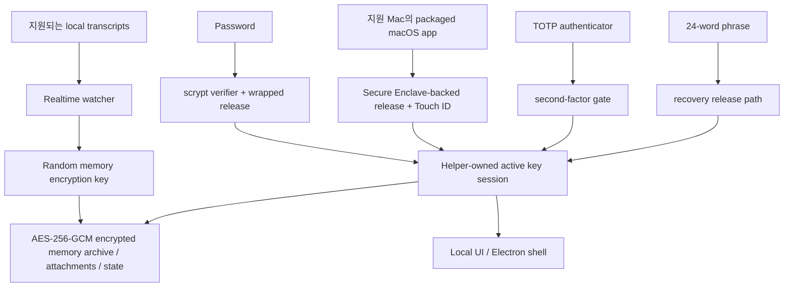

# DataMoat

언어: [English](./README.md) | [Português (Brasil)](./README.pt-BR.md) | [简体中文](./README.zh-CN.md) | [繁體中文](./README.zh-Hant.md) | [日本語](./README.ja.md) | [한국어](./README.ko.md) | [Türkçe](./README.tr.md) | [Русский](./README.ru.md) | [Tiếng Việt](./README.vi.md) | [ไทย](./README.th.md) | [Deutsch](./README.de.md)

[](#)
[](#install)
[](./LICENSE.md)
[](#supported-today)
[](#supported-today)
[](#install)
[](#install)
[](#supported-today)
[](#supported-today)
[](#supported-today)
[](#supported-today)
[](#supported-today)
[](#supported-today)
[](#supported-today)

공식 웹사이트: [https://datamoat.org](https://datamoat.org)
GitHub 저장소: [https://github.com/max-ng/datamoat](https://github.com/max-ng/datamoat)


> **Claude / Codex / Cursor / DeepSeek / Qwen 데이터 + skills + 첨부 파일을 모두 export하고 backup합니다.**
> DataMoat는 AI 작업 기록을 local 및 encrypted 상태로 유지하고, raw source records를 온전히 보존하며, search, export, reuse, handoff, private AI memory를 위한 normalized index를 만듭니다.
>
> **미래에 가장 가치 있을 AI 데이터는 이미 사라지고 있습니다.**
> 지금 DataMoat를 다운로드해 Claude, Codex, Cursor, OpenClaw, DeepSeek, Qwen 작업 기록을 얼마나 더 capture할 수 있는지 확인하세요.

**핵심 backup scope:** DataMoat는 지원되는 **skills + sessions + attachments**를 같은 encrypted local memory archive에 백업합니다. Skills는 이름만이 아니라 전체 folder snapshot으로 저장됩니다.

**자신의 AI 데이터를 소유하는 사람과 회사가 미래를 이깁니다.**

DataMoat는 Claude CLI, Claude Desktop, Claude Code GUI workflows를 통한 DeepSeek 및 Qwen, Codex CLI, Codex app, Cursor, OpenClaw, 기타 AI tools를 쓰는 사람과 팀을 위한 AI work history memory archive입니다. sessions, source가 존재할 때 local에 저장된 thinking tokens 및 reasoning blocks, prompts, responses, tool output, files, attachments, metadata, skills folder contents, 같은 machine의 original source records까지 전체 working record를 보존하여 작업을 나중에도 review, protect, reuse, handoff하기 쉽게 만듭니다.


## DataMoat가 작업을 저장하는 방식

DataMoat는 두 계층을 유지합니다:

- **Raw archive:** original session JSONL, SQLite records, logs, attachments, metadata, skills folder snapshots, local에 저장된 thinking tokens 또는 reasoning blocks를 source format에 최대한 가깝게 보존합니다.
- **Normalized index:** 서로 다른 tools의 records를 common schema로 변환해 tools 전반에서 search, review, export, analyze, reuse, handoff할 수 있게 합니다.

**현재 지원되는 sources:** Claude CLI, Codex CLI, Codex app local sessions, macOS의 Claude Desktop local-agent sessions, Claude Code GUI workflows가 local로 쓰는 DeepSeek 및 Qwen sessions, 지원되는 local OpenClaw session records, 지원되는 local Cursor agent transcripts.
**더 많은 data sources와 platform releases가 roadmap에 있습니다:** 이 repository를 star/watch해서 새 capture integrations와 platform updates를 따라오세요.

## DataMoat를 설치해야 하는 이유

- **전체 AI work history를 recoverable하게 유지합니다.** Local records는 compaction, cleanup, retention changes, account downgrades, device replacement, environment loss 이후 다시 보기 어려워질 수 있습니다.
- **가장 완전한 local version이 아직 있을 때 보존합니다.** DataMoat는 source가 disk에 저장하는 경우 local에 written transcript와 locally stored thinking tokens 및 reasoning blocks를 저장합니다.
- **주변 work context를 backup합니다.** DataMoat는 지원되는 sessions, attachments, `SKILL.md` 기반 skills folder contents를 같은 encrypted memory archive에 보호합니다.
- **과거 prompts, solutions, tool output, thinking-token context를 search합니다.** Live service view에 의존하지 않고 이전 fixes, workflows, timestamps, attachments를 찾습니다.
- **개인과 팀의 continuity를 보호합니다.** 각 protected machine은 나중의 review, handoff, audit를 위해 자기 encrypted local archive를 보유할 수 있습니다.
- **records를 encrypted 및 local control 아래 둡니다.** 다른 software나 services는 memory archive를 직접 읽을 수 없고, approved unlock 및 recovery paths만 decrypt할 수 있습니다.

## Highlights

- AES-256-GCM을 사용하는 transcripts, skills, attachments, state용 **encrypted local memory archive**.
- **저장된 content는 local에 남습니다**. Plaintext transcript dumps가 아니라 encrypted memory archive files입니다.
- password, optional TOTP, 24-word recovery phrase를 사용하는 **strong local auth**.
- **지원되는 Mac의 Secure Enclave-backed unlock path**로 hardware-assisted daily unlock을 제공합니다. Apple의 [Secure Enclave](https://support.apple.com/guide/security/secure-enclave-sec59b0b31ff/web) 개요를 참고하세요. Touch ID는 packaged macOS app path의 일부입니다.
- **Helper-owned key custody**로 main UI process가 active memory encryption key를 보관하지 않습니다.
- **Tamper-evident local audit chain**: 현재 local audit entries는 hash-chained이며 `datamoat audit verify`로 확인할 수 있습니다.
- **Versioned local state**로 protected storage가 시간이 지나도 안전하게 migrate할 수 있습니다.
- **Electron shell by default**로 general-purpose browser 및 browser-extension exposure를 줄이고, local-only UI binding은 `127.0.0.1`입니다.
- UI에 **third-party font 또는 CDN dependency가 없습니다**.

## 현재 지원

### Platforms

| Platform | Status | Notes |
|---|---|---|
| **macOS** | 현재 지원 | Source install과 signed packaged DMG를 사용할 수 있습니다 |
| **Linux** | 현재 지원 | Source install을 사용할 수 있습니다 |
| **Packaged macOS DMG** | [DMG 다운로드](https://datamoat.org/download/macos) (권장) | 지원 Mac에서 Secure Enclave + Touch ID unlock을 제공하는 signed / notarized Apple Silicon DMG |
| **Windows x64 / ARM64** | ZIP + `DataMoat.exe` | Windows 11 x64 및 Windows 11 on Arm용 unsigned manual packages; x64는 GitHub Actions packaged runtime smoke 통과, ARM64는 real VM UI/background capture smoke 통과; signed installer는 아직 진행 중 |

### Sources

| Source | Status | DataMoat가 보존하는 것 |
|---|---|---|
| **Claude CLI** | ✅ | 존재할 때 locally written thinking blocks를 포함한 full local transcript |
| **Codex CLI** | ✅ | 지원되는 local Codex CLI session records를 capture하며 transcript text, tool output, timestamps, metadata, stable image attachments를 보존 |
| **Codex app** | ✅ | 지원되는 local Codex app session records를 capture하며 transcript text, tool output, timestamps, metadata, stable image attachments를 보존 |
| **Claude Desktop local-agent sessions (macOS)** | ✅ | 존재할 때 지원되는 local Claude Desktop agent session records |
| **DeepSeek via Claude Code GUI** | ✅ | Claude Code GUI가 DeepSeek-backed sessions의 local records를 쓸 때 transcript text, tool output, timestamps, metadata, skills folder snapshots, images, supported attachments를 보존 |
| **Qwen via Claude Code GUI** | ✅ | Claude Code GUI가 Qwen-backed sessions의 local records를 쓸 때 transcript text, tool output, timestamps, metadata, skills folder snapshots, images, supported attachments를 보존 |
| **OpenClaw** | ✅ | 지원되는 local OpenClaw session transcripts 및 metadata |
| **Cursor** | ✅ | 읽을 수 있는 local Cursor `agent-transcripts` JSONL records를 capture하며 존재할 때 text 및 tool blocks 포함 |
| **Attachments** | ✅ | encrypted image 및 supported file/PDF blocks를 source sessions에 다시 연결 |
| **Skills folders** | ✅ | Global 및 project `SKILL.md` folder snapshots. `SKILL.md`와 포함된 helper files까지 저장하며 skill name만 저장하지 않음 |

## Security At A Glance

- **Memory archive encryption**: transcripts, skills, attachments, local state는 AES-256-GCM으로 at rest encrypted됩니다.
- **Owner-only local file permissions**: protected memory archive files, attachment blobs, state files는 restrictive local filesystem modes로 기록됩니다.
- **Password handling**: passwords는 plaintext가 아니라 `scrypt` verifiers로 저장됩니다.
- **Authenticator support**: TOTP는 Google Authenticator, 1Password, Authy 같은 standard authenticator apps와 작동합니다.
- **Recovery design**: 모든 memory archive는 24-word BIP39 recovery phrase를 받습니다.
- **Local-only UI**: UI는 `127.0.0.1`에 bind되고 `HttpOnly` + `SameSite=Strict` cookies를 사용합니다.
- **Reduced browser attack surface**: default Electron shell은 일반 general-purpose browser path를 피합니다. 필요하면 browser fallback도 사용할 수 있습니다.
- **Local API write protection**: mutating requests는 same origin에서 와야 하며 CSRF token을 포함해야 합니다.
- **Unlock retry hardening**: password, Touch ID, recovery failures는 unlimited rapid retries 대신 back off합니다.
- **Trusted source updates only**: in-place git updates는 clean working tree에서 allow-listed remotes / branches에만 허용됩니다.
- **Redacted diagnostics**: health, crash, log, audit artifacts는 기록 전에 secrets를 scrub합니다.
- **Key isolation**: Electron renderer 또는 browser fallback은 raw memory encryption key를 받지 않습니다.
- **Auditability**: security-relevant local events는 hash-chained audit log에 기록됩니다. `datamoat audit verify`는 현재 local log에서 changed 또는 broken entries를 탐지하지만 remote notarization service나 deletion-proof ledger는 아닙니다.
- **Backup integrity**: viewer는 mutable live source transcript가 아니라 sealed memory archive copy를 source of truth로 읽습니다.

### 왜 12 Words가 아니라 24 Words인가?

DataMoat는 24-word BIP39 phrase를 사용합니다. 고가치 encrypted memory archive를 위한 long-lived recovery material이기 때문입니다. 12-word BIP39 phrase는 128 bits of entropy를 가지며, 24-word phrase는 256 bits를 가집니다. 12 words도 여전히 강력하지만, 여러 해 동안 access를 보호해야 할 수 있는 recovery material에는 DataMoat가 더 큰 security margin을 선택합니다.

### Memory Archive가 보호되는 방식



## Install

Signed / notarized macOS DMG는 Mac users에게 권장되는 install path입니다. Source install은 Linux, development, fallback cases에서 계속 사용할 수 있습니다. macOS DMG는 DataMoat release downloads의 [https://datamoat.org/download/macos](https://datamoat.org/download/macos)에서 받을 수 있으며, 지원 Mac의 Secure Enclave + Touch ID unlock, menu-bar auto-start at login, DataMoat의 R2 release feed를 통한 packaged auto-update를 포함합니다. Windows x64 및 ARM64는 signed installer가 완료되는 동안 unsigned ZIP + `DataMoat.exe` packages로 제공됩니다.

Release downloads:

[](https://datamoat.org/download/macos)
[](https://datamoat.org/download/windows-x64)
[](https://datamoat.org/download/windows-arm64)

각 Windows ZIP에는 `DataMoat.exe`와 필요한 app files가 포함됩니다. Windows package를 unzip하고 folder contents를 함께 유지한 다음 `Install DataMoat.cmd`를 한 번 실행하세요. 그러면 DataMoat가 launch되고 현재 Windows user의 startup이 등록되어 login 또는 restart 후 tray/background app이 돌아옵니다. 이것은 아직 portable ZIP package이며 signed single-file installer는 아닙니다.

### AI-Assisted Install

Mac users는 signed 및 notarized packaged DMG를 먼저 사용하세요: [Download DMG](https://datamoat.org/download/macos). 사용자가 명시적으로 source install을 원하거나 packaged release를 사용할 수 없는 경우가 아니라면 macOS에서 `git clone`으로 시작하지 마세요.

Target desktop을 보고 있을 때 Claude CLI, Codex CLI 또는 OpenClaw에게 DataMoat 설치를 요청할 수 있습니다.

Typical prompt:

```text
DataMoat release downloads의 최신 signed macOS DMG를 사용해 이 Mac에 DataMoat를 설치하세요. DataMoat.app을 Applications에 복사하고 실행한 뒤 local setup UI가 나타나면 알려주세요. password, authenticator, Touch ID, recovery steps는 protected desktop에서 제가 직접 완료하겠습니다.
```

Important:

- AI agent는 install을 시작하고 app을 준비할 수 있습니다
- final recovery 및 unlock setup은 protected machine에서 human user가 직접 완료해야 합니다
- OpenClaw, Telegram, WhatsApp 또는 target desktop을 볼 수 없는 remote chat relay를 사용하는 경우 일반 AI-assisted flow 대신 아래 dedicated remote no-screen flow를 사용하세요

### Remote No-Screen Install

OpenClaw, Codex 또는 remote chat relay를 통해 install을 시작하는데 protected desktop을 볼 수 없다면, 먼저 packaged macOS DMG 또는 Windows ZIP을 사용하고 installed app을 single no-screen flag로 launch하세요.

macOS remote prompt:

```text
최신 signed 및 notarized macOS DMG를 사용해 이 Mac에 DataMoat를 설치하세요.

DMG install이 실패하지 않는 한 git clone 또는 source install을 사용하지 마세요.

Steps:
1. 최신 macOS DMG 다운로드:
   https://datamoat.org/download/macos
2. DMG mount.
3. DataMoat.app을 ~/Applications에 복사.
4. 정확히 launch:
   ~/Applications/DataMoat.app/Contents/MacOS/DataMoat --datamoat-remote-no-screen

remote no-screen pre-setup capture에는 --datamoat-remote-no-screen만 사용하세요.
이 chat에서 password, authenticator, Touch ID 또는 recovery phrase setup을 완료하지 마세요.

Launch 후 이렇게 말하세요:
DataMoat was installed from the DMG and remote no-screen capture was started. I must finish setup later on the protected desktop GUI.
```

Windows remote prompt:

```text
최신 Windows ZIP 및 DataMoat.exe를 사용해 이 Windows machine에 DataMoat를 설치하세요.

git clone 또는 source install을 사용하지 마세요.

Steps:
1. DataMoat release downloads에서 올바른 최신 Windows ZIP 다운로드:
   x64: https://datamoat.org/download/windows-x64
   ARM64: https://datamoat.org/download/windows-arm64
2. ZIP을 Downloads에 extract.
3. 정확히 launch:
   %USERPROFILE%\Downloads\DataMoat-win32-<arch>\DataMoat.exe --datamoat-remote-no-screen

x64는 DataMoat-win32-x64, ARM64는 DataMoat-win32-arm64를 사용하세요.
remote no-screen pre-setup capture에는 --datamoat-remote-no-screen만 사용하세요.
이 chat에서 password, authenticator 또는 recovery phrase setup을 완료하지 마세요.

Launch 후 이렇게 말하세요:
DataMoat was installed from the Windows ZIP and remote no-screen capture was started. I must finish setup later on the protected desktop GUI.
```

DMG 설치 후 manual macOS launch command:

```bash
"$HOME/Applications/DataMoat.app/Contents/MacOS/DataMoat" --datamoat-remote-no-screen
```

이 mode를 사용하면 password, authenticator enrollment secret, Touch ID prompt, 24-word recovery phrase가 Telegram, WhatsApp, OpenClaw chat, screenshots 또는 다른 remote relay에 나타나는 것을 막을 수 있습니다. DataMoat는 pre-setup encrypted capture로 지원되는 local records 수집을 즉시 시작하지만, full unlock setup은 나중에 protected desktop에서 완료해야 합니다.

Remote install이 끝난 후 agent는 DataMoat가 성공적으로 설치되었고 지원되는 local records를 이미 capture하고 있다고 보고해야 합니다. Protected desktop으로 돌아오면 그곳에서 DataMoat를 열고 setup을 local로 완료하세요. Bot conversation 안에서 password, authenticator, Touch ID 또는 recovery setup을 완료하지 마세요.

Linux fallback when no DMG exists:

```bash
git clone <repository-url> datamoat
cd datamoat
bash install.sh --remote-no-screen
```

### Manual Install

Source installs에는 `git clone`을 권장합니다.

```bash
git clone <repository-url> datamoat
cd datamoat
bash install.sh
datamoat
```

Requirements:

- `Node.js 18+`
- `macOS` 또는 `Linux`
- `macOS`: local native builds용 Xcode Command Line Tools
- `Linux`: distro에 맞는 일반 Node build environment

첫 setup flow는 recovery material을 local에 표시합니다:

- password
- authenticator enrollment secret / QR
- 24-word recovery phrase

Final memory setup은 chat apps, screenshots 또는 remote messaging channels로 relay하지 말고 protected machine의 실제 desktop screen에서 완료해야 합니다.

## Commands

```bash
datamoat
datamoat status
datamoat stop
datamoat scan
datamoat audit verify
datamoat update check
```

Audit verification은 disk에 존재하는 audit log의 integrity를 확인합니다. External checkpoint가 없다면 write access를 가진 사람이 local audit file을 delete, truncate 또는 완전히 rewrite하지 않았다는 사실을 그것만으로는 증명할 수 없습니다.

Live git source installs는 in-place source updates를 지원합니다. Packaged macOS installs는 DataMoat R2 release downloads를 packaged update source로 사용합니다: DMG는 first install용이고, 이후 packaged updates는 signed ZIP payload를 다운로드해 macOS app updater로 적용하며 매 release마다 새 DMG를 mount하게 하지 않습니다.

## Source Service Boundaries

DataMoat는 이미 device에 존재하고 이미 접근 가능한 supported local transcript files를 backup합니다.

DataMoat는 content 또는 source services에 대한 추가 권리를 부여하지 않습니다. Claude, Codex, DeepSeek, Qwen, OpenClaw, Cursor 및 사용하는 다른 source service에 적용되는 terms, policies, plan restrictions, internal rules를 준수할 책임은 사용자에게 있습니다.

## Enterprise

Enterprise deployment 및 management features는 roadmap에 있습니다. 더 많은 enterprise-focused capabilities가 제공될 예정입니다. 업데이트를 보려면 이 repository를 star/watch하세요.

## Consultation and Support

질문 또는 deployment help:


## License

DataMoat는 **Business Source License 1.1 (`BUSL-1.1`)** 및 **Additional Use Grant**에 따라 배포됩니다.

의미:

- personal use 허용
- internal company use 허용
- 이 grant 밖의 use는 licensor로부터 separate commercial license가 필요합니다

이 프로젝트는 **source-available**이며 OSI-approved open source가 아닙니다.

전체 조건은 [LICENSE.md](LICENSE.md)를 확인하세요.

---

## Official Website

DataMoat 공식 웹사이트: [https://datamoat.org](https://datamoat.org)
