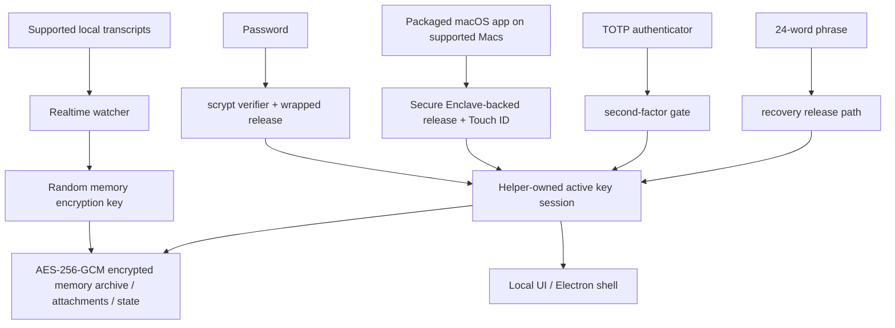

# DataMoat

Language: [English](./README.md) | [Português (Brasil)](./README.pt-BR.md) | [简体中文](./README.zh-CN.md) | [繁體中文](./README.zh-Hant.md) | [日本語](./README.ja.md) | [한국어](./README.ko.md) | [Türkçe](./README.tr.md) | [Русский](./README.ru.md) | [Tiếng Việt](./README.vi.md) | [ไทย](./README.th.md) | [Deutsch](./README.de.md)

[](#)
[](#install)
[](./LICENSE.md)
[](#supported-today)
[](#supported-today)
[](#install)
[](#install)
[](#supported-today)
[](#supported-today)
[](#supported-today)
[](#supported-today)
[](#supported-today)
[](#supported-today)
[](#supported-today)
[](#supported-today)

Official website: [https://datamoat.org](https://datamoat.org)
GitHub repo: [https://github.com/max-ng/datamoat](https://github.com/max-ng/datamoat)

## Do 10x more with AI — without starting from zero every time

DataMoat is a private AI workspace that saves everything you do with AI, so you can find it, reuse it, and do more.

For people and teams, every AI task becomes part of a private system that gets more useful over time.


## What You Can Do

- **Export:** Claude, Codex, Cursor, ChatGPT exports, DeepSeek, Qwen, and OpenClaw data.
- **Full coverage:** Supported sessions, tool outputs, versioned attachments, images, files, and `SKILL.md` skills.
- **Backup:** Encrypted raw archives are compressed; real source-record tests measured about 60% of original source bytes.
- **Search:** Full-text search across prompts, messages, metadata, and supported tool outputs.
- **Analyze:** Answer questions like "How did we solve this bug before?" or "Why did the AI make this decision?"
- **Audit:** Hash-chained local audit checks with redacted diagnostics.
- **Reuse:** No more repeating work; export context for your own RAG, internal database, or handoff.
- **Customization:** Bookmark important messages and sessions.
- **Free:** Personal use and internal company use are allowed.
- **Decentralized local ownership:** No one else can access or own your archive without your permission.
- **Protection:** AES-256-GCM, 24-word BIP39 recovery phrase, and Secure Enclave-backed unlock on supported Macs.

Know more: [website](https://datamoat.org), [how storage works](#how-datamoat-stores-your-work), [supported sources](#supported-today), [security](#security-at-a-glance), [install](#install).

DM me or open an issue with feedback so we can build a better AI future together.

## How DataMoat Stores Your Work

DataMoat keeps two layers:

- **Raw archive:** original session JSONL, SQLite records, logs, attachments, metadata, skills folder snapshots, and any locally stored thinking tokens or reasoning blocks are preserved as close to the source format as possible.
- **Normalized index:** records from different tools are converted into a common schema so you can analyze, search, review, export, reuse, and hand off work across tools.

**Supported sources today:** ChatGPT export ZIP/folder imports, Claude CLI, Codex CLI, Codex app local sessions, Claude Desktop local-agent sessions on macOS, supported local Cursor agent transcripts, DeepSeek and Qwen sessions when written locally by Claude Code GUI workflows, and supported local OpenClaw session records.
**More data sources and platform releases are on the roadmap:** star and watch this repository so you can follow new capture integrations and platform updates as they ship.  

## Storage, Backup, And Reuse

DataMoat is designed to preserve AI work without turning your disk into a dump.

- **Raw records, compressed.** DataMoat preserves original source records while storing repetitive raw backup data in compressed encrypted archives. Real source-record tests measured raw archive storage around 60% of original source bytes.
- **Full coverage for supported records.** Sessions, tool outputs, supported images, file/PDF attachments, ChatGPT exports, and `SKILL.md` folders can live in the same encrypted memory archive.
- **Search and analyze.** Find prompts, tool output, files, decisions, and attachments; answer questions like "How did we solve this bug before?" or "Why did the AI make this decision?"
- **Reuse.** Export context for your own RAG, internal database, future agents, or teammate handoff.
- **Move between computers.** Copy the DataMoat folder to another machine and restore across macOS, Windows, and Linux.
- **Second backup.** Keep a duplicate encrypted DataMoat folder on USB or an external drive so your AI work history can travel separately from the source computer.

## New In 2.0.9: Annotations, ChatGPT Export Memory Import, And Safer Transfer

DataMoat now imports supported ChatGPT export ZIP files or extracted export folders into the same encrypted local memory archive used for Claude, Codex, Cursor, DeepSeek, Qwen, OpenClaw, skills, and attachments.

- **Restore, view, search, and backup ChatGPT exports.** Supported conversations, alternate branches, attachments, assets, and raw export files are imported into the encrypted vault.
- **Annotate what matters.** Bookmark sessions and individual messages, vote useful or weak answers, and filter review views so reusable context is easier to find.
- **Keep the raw export without wasting disk.** DataMoat preserves original source records and can store repetitive raw backup data in compressed encrypted archives; real source-record tests showed raw archive storage around 60% of original source bytes.
- **Move work across computers.** Copy the DataMoat folder to another machine and restore it across macOS, Windows, and Linux, including Mac to Windows and Linux to Mac.
- **Carry a second backup.** Save the encrypted DataMoat folder to USB or an external drive so your AI work history can travel separately from the source computer.

### Raw records, smaller on disk

DataMoat preserves raw source records while storing repetitive raw backup data in compressed encrypted archives. Real source-record tests measured raw archive storage around 60% of original source bytes.

### Move between computers

Copy the DataMoat folder to another machine and restore across macOS, Windows, and Linux, including Mac to Windows and Linux to Mac.

### USB

**Second backup on external storage.** Keep a duplicate encrypted DataMoat folder on USB or an external drive so the memory archive can travel separately from the source computer.

## Why Install DataMoat

- **Keep your full AI work history recoverable.** Local records can become harder to revisit after compaction, cleanup, retention changes, account downgrades, device replacement, or environment loss.
- **Preserve the fullest local version while it is still available.** DataMoat saves the locally written transcript, including locally stored thinking tokens and reasoning blocks when the source stores them on disk.
- **Back up the surrounding work context.** DataMoat protects supported sessions, attachments, and `SKILL.md`-based skills folder contents in the same encrypted memory archive.
- **Search past prompts, solutions, tool output, and thinking-token context.** Find previous fixes, workflows, timestamps, and attachments without depending on a live service view.
- **Protect continuity for individuals and teams.** Each protected machine can keep its own encrypted local archive for later review, handoff, and audit.
- **Keep records encrypted and under local control.** Other software or services cannot read the memory archive directly; only approved unlock and recovery paths can decrypt it.

## Highlights

- **Encrypted local memory archive** for transcripts, skills, attachments, and state using AES-256-GCM.
- **Saved content stays local** as encrypted memory archive files, not plaintext transcript dumps.
- **Strong local auth** with password, optional TOTP, and a 24-word recovery phrase.
- **Secure Enclave-backed unlock path on supported Macs** for hardware-assisted daily unlock. See Apple's overview of the [Secure Enclave](https://support.apple.com/guide/security/secure-enclave-sec59b0b31ff/web). Touch ID is part of the packaged macOS app path.
- **Helper-owned key custody** so the main UI process does not keep the active memory encryption key.
- **Tamper-evident local audit chain**: current local audit entries are hash-chained and verifiable with `datamoat audit verify`.
- **Versioned local state** so protected storage can migrate safely over time.
- **Electron shell by default** to reduce general-purpose browser and browser-extension exposure, with local-only UI binding to `127.0.0.1`.
- **No third-party font or CDN dependency** in the UI.

## Supported Today

### Platforms

| Platform | Status | Notes |
|---|---|---|
| **macOS** | Supported today | Source install and signed packaged DMG are available now |
| **Linux** | Supported today | Source install available now |
| **Packaged macOS DMG** | [Download DMG](https://downloads.datamoat.org/releases/v2.0.11/DataMoat-2.0.11-macos-arm64.dmg?s=gh-public) (recommended) | Signed / notarized Apple Silicon DMG with Secure Enclave + Touch ID unlock on supported Macs |
| **Windows x64 / ARM64** | ZIP + `DataMoat.exe` | Unsigned manual packages for Windows 11 x64 and Windows 11 on Arm; x64 has passed GitHub Actions packaged runtime smoke, ARM64 has passed real VM UI/background capture smoke; signed installer still in progress |

### Sources

| Source | Status | What DataMoat preserves |
|---|---|---|
| **Claude CLI** | ✅ | Full local transcript, including locally written thinking blocks when present |
| **Codex CLI** | ✅ | Captures supported local Codex CLI session records; transcript text, tool output, timestamps, metadata, and stable image attachments are preserved |
| **Codex app** | ✅ | Captures supported local Codex app session records; transcript text, tool output, timestamps, metadata, and stable image attachments are preserved |
| **Claude Desktop local-agent sessions (macOS)** | ✅ | Supported local Claude Desktop agent session records when present |
| **DeepSeek via Claude Code GUI** | ✅ | When Claude Code GUI writes local records for DeepSeek-backed sessions, transcript text, tool output, timestamps, metadata, skills folder snapshots, images, and supported attachments are preserved |
| **Qwen via Claude Code GUI** | ✅ | When Claude Code GUI writes local records for Qwen-backed sessions, transcript text, tool output, timestamps, metadata, skills folder snapshots, images, and supported attachments are preserved |
| **OpenClaw** | ✅ | Supported local OpenClaw session transcripts and metadata |
| **Cursor** | ✅ | Captures readable local Cursor `agent-transcripts` JSONL records, including text and tool blocks when present |
| **ChatGPT export** | ✅ | Imports supported ChatGPT export ZIPs or extracted folders, including conversations, branches, assets, and raw export files |
| **Attachments** | ✅ | Encrypted image and supported file/PDF blocks, linked back to their source sessions |
| **Skills folders** | ✅ | Global and project `SKILL.md` folder snapshots, including `SKILL.md` and included helper files, not just the skill name |

## Security At A Glance

- **Memory archive encryption**: transcripts, skills, attachments, and local state are encrypted at rest with AES-256-GCM.
- **Owner-only local file permissions**: protected memory archive files, attachment blobs, and state files are written with restrictive local filesystem modes.
- **Password handling**: passwords are stored as `scrypt` verifiers, not plaintext.
- **Authenticator support**: TOTP works with standard authenticator apps such as Google Authenticator, 1Password, and Authy.
- **Recovery design**: every memory archive gets a 24-word BIP39 recovery phrase.
- **Local-only UI**: the UI binds to `127.0.0.1` and uses `HttpOnly` + `SameSite=Strict` cookies.
- **Reduced browser attack surface**: the default Electron shell avoids the normal general-purpose browser path; browser fallback remains available when needed.
- **Local API write protection**: mutating requests must come from the same origin and include a CSRF token.
- **Unlock retry hardening**: password, Touch ID, and recovery failures back off instead of allowing unlimited rapid retries.
- **Trusted source updates only**: in-place git updates are allowed only for allow-listed remotes / branches on a clean working tree.
- **Redacted diagnostics**: health, crash, log, and audit artifacts scrub secrets before they are written.
- **Key isolation**: the Electron renderer or browser fallback does not receive the raw memory encryption key.
- **Auditability**: security-relevant local events are written to a hash-chained audit log. `datamoat audit verify` detects changed or broken entries in the current local log; it is not a remote notarization service or deletion-proof ledger.
- **Backup integrity**: the viewer reads the sealed memory archive copy as the source of truth, not a mutable live source transcript.

### Why 24 Words Instead of 12?

DataMoat uses a 24-word BIP39 phrase because it is long-lived recovery material for a high-value encrypted memory archive. A 12-word BIP39 phrase carries 128 bits of entropy, while a 24-word phrase carries 256 bits. Twelve words are still strong, but for recovery material that may need to protect access for many years, DataMoat chooses the larger security margin.

### How The Memory Archive Is Protected



## Install

The signed / notarized macOS DMG is the recommended install path for Mac users. Source install remains available for Linux, development, and fallback cases. The macOS DMG is available from DataMoat release downloads at [https://downloads.datamoat.org/releases/v2.0.11/DataMoat-2.0.11-macos-arm64.dmg](https://downloads.datamoat.org/releases/v2.0.11/DataMoat-2.0.11-macos-arm64.dmg) and includes Secure Enclave + Touch ID unlock on supported Macs, menu-bar auto-start at login, and packaged auto-update through DataMoat's R2 release feed. Windows x64 and ARM64 are available as unsigned ZIP + `DataMoat.exe` packages while the signed installer is completed.

Release downloads:

[](https://downloads.datamoat.org/releases/v2.0.11/DataMoat-2.0.11-macos-arm64.dmg?s=gh-public)
[](https://downloads.datamoat.org/releases/v2.0.11/DataMoat-2.0.11-win32-x64.zip?s=gh-public)
[](https://downloads.datamoat.org/releases/v2.0.11/DataMoat-2.0.11-win32-arm64.zip?s=gh-public)

Each Windows ZIP includes `DataMoat.exe` plus the required app files. Unzip the Windows package, keep the folder contents together, and run `Install DataMoat.cmd` once. That launches DataMoat and registers startup for the current Windows user so the tray/background app comes back after login or restart. This is still a portable ZIP package, not a signed single-file installer yet.

### AI-Assisted Install

For Mac users, use the signed and notarized packaged DMG first: [Download DMG](https://downloads.datamoat.org/releases/v2.0.11/DataMoat-2.0.11-macos-arm64.dmg?s=gh-public). Do not start with `git clone` on macOS unless the user explicitly wants source install or the packaged release is unavailable.

You can ask Claude CLI, Codex CLI, or OpenClaw to install DataMoat when you are looking at the target desktop.

Typical prompt:

```text
Install DataMoat on this Mac using the latest signed macOS DMG from DataMoat release downloads. Copy DataMoat.app to Applications, launch it, and tell me when the local setup UI appears so I can complete the password, authenticator, Touch ID, and recovery steps myself on the protected desktop.
```

Important:

- an AI agent can start the install and prepare the app
- the final recovery and unlock setup should still be completed by the human user on the protected machine
- if you are using OpenClaw, Telegram, WhatsApp, or another remote chat relay without seeing the target desktop, use the dedicated remote no-screen flow below instead of the normal AI-assisted flow

### Remote No-Screen Install

If the install is being started through OpenClaw, Codex, or any remote chat relay while you cannot see the protected desktop, use the packaged macOS DMG or Windows ZIP first and launch the installed app with the single no-screen flag.

macOS remote prompt:

```text
Install DataMoat on this Mac using the latest signed and notarized macOS DMG.

Do not use git clone or source install unless the DMG install fails.

Steps:
1. Download the latest macOS DMG:
   https://downloads.datamoat.org/releases/v2.0.11/DataMoat-2.0.11-macos-arm64.dmg
2. Mount the DMG.
3. Copy DataMoat.app to ~/Applications.
4. Launch exactly:
   ~/Applications/DataMoat.app/Contents/MacOS/DataMoat --datamoat-remote-no-screen

Use only --datamoat-remote-no-screen for remote no-screen pre-setup capture.
Do not complete password, authenticator, Touch ID, or recovery phrase setup in this chat.

After launch, tell me:
DataMoat was installed from the DMG and remote no-screen capture was started. I must finish setup later on the protected desktop GUI.
```

Windows remote prompt:

```text
Install DataMoat on this Windows machine using the latest Windows ZIP and DataMoat.exe.

Do not use git clone or source install.

Steps:
1. Download the correct latest Windows ZIP from DataMoat release downloads:
   x64: https://downloads.datamoat.org/releases/v2.0.11/DataMoat-2.0.11-win32-x64.zip
   ARM64: https://downloads.datamoat.org/releases/v2.0.11/DataMoat-2.0.11-win32-arm64.zip
2. Extract the ZIP into Downloads.
3. Launch exactly:
   %USERPROFILE%\Downloads\DataMoat-win32-<arch>\DataMoat.exe --datamoat-remote-no-screen

Use DataMoat-win32-x64 for x64 or DataMoat-win32-arm64 for ARM64.
Use only --datamoat-remote-no-screen for remote no-screen pre-setup capture.
Do not complete password, authenticator, or recovery phrase setup in this chat.

After launch, tell me:
DataMoat was installed from the Windows ZIP and remote no-screen capture was started. I must finish setup later on the protected desktop GUI.
```

Manual macOS launch command after installing the DMG:

```bash
"$HOME/Applications/DataMoat.app/Contents/MacOS/DataMoat" --datamoat-remote-no-screen
```

Use this mode to prevent the password, authenticator enrollment secret, Touch ID prompt, and 24-word recovery phrase from ever appearing in Telegram, WhatsApp, OpenClaw chat, screenshots, or any other remote relay. DataMoat starts collecting supported local records immediately with pre-setup encrypted capture, but the full unlock setup must still be completed later on the protected desktop.

After the remote install finishes, the agent should report that DataMoat was installed successfully and is already capturing supported local records. When you return to the protected desktop, open DataMoat there and complete setup locally. Do not complete password, authenticator, Touch ID, or recovery setup inside the bot conversation.

Linux fallback when no DMG exists:

```bash
git clone <repository-url> datamoat
cd datamoat
bash install.sh --remote-no-screen
```

### Manual Install

Recommended for source installs: use `git clone`.

```bash
git clone <repository-url> datamoat
cd datamoat
bash install.sh
datamoat
```

Requirements:

- `Node.js 18+`
- `macOS` or `Linux`
- `macOS`: Xcode Command Line Tools for local native builds
- `Linux`: a normal Node build environment for your distro

The first setup flow shows recovery material locally:

- password
- authenticator enrollment secret / QR
- 24-word recovery phrase

Final memory setup should be completed on the actual desktop screen of the machine being protected, not relayed through chat apps, screenshots, or remote messaging channels.

## Commands

```bash
datamoat
datamoat status
datamoat stop
datamoat scan
datamoat audit verify
datamoat update check
```

Audit verification checks the integrity of the audit log that is present on disk. Without an external checkpoint, it cannot by itself prove that a local audit file was never deleted, truncated, or fully rewritten by someone with write access.

Live git source installs support in-place source updates. Packaged macOS installs use DataMoat R2 release downloads as the packaged update source: the DMG is for first install, and later packaged updates download a signed ZIP payload and apply it through the macOS app updater instead of asking users to mount a new DMG for every release.

## Local Record Scope And Source Service Boundaries

DataMoat is designed to protect AI records that already exist on your own machine. Instead of leaving sessions, skills, attachments, and memory files scattered across known local paths or relying on opaque memory plugins, it adds user-controlled local encryption, backup scope, recovery, and auditability.

DataMoat can also preserve and move over images, files/PDFs, generated assets, and attachments across captured versions or alternate conversation branches when those records already exist locally. Most AI memory plugins and simple export tools stop at text; DataMoat keeps the surrounding files with the work history that produced them.

DataMoat does not create new access to your AI work history. It protects local records that already exist on your own computer in source-tool folders, exports, logs, attachments, or session stores that may otherwise remain scattered, readable, and unencrypted. The goal is to move those already-present records into a user-controlled encrypted memory archive instead of leaving them spread across known local locations.

Many AI tools already store work history as ordinary local files on the computer. Anyone or any process with access to that user account, disk, backups, or source-tool folders may be able to read those records before DataMoat protects them. DataMoat does not make this data more exposed; it moves selected already-present records into an encrypted archive controlled by the user.

DataMoat backup scope is controlled by the user and by the source records already available on the protected machine. It does not bypass account permissions, unlock remote services, or grant rights beyond what the user already has on that computer. Users and organizations remain responsible for deciding which local AI records, attachments, code, secrets, or sensitive data should be imported, retained, exported, or excluded under their own policies.

## Threat model: why installing can reduce local exposure

### Why doing nothing can also be risky

DataMoat is not asking you to create a new sensitive dataset from nothing. For many AI tools, that dataset already exists on your computer as local transcripts, logs, exports, SQLite records, JSONL files, attachments, and skills folders.

Without a dedicated archive, those records may remain scattered across predictable local paths as ordinary files controlled only by normal OS account permissions. DataMoat's job is to help you identify those records, copy selected supported records into a local encrypted vault, and keep a recoverable, searchable, auditable archive under your control.

### Before DataMoat

Many AI tools already store transcripts, tool output, attachments, project context, and sometimes reasoning-related blocks as ordinary local files. These files may sit in known application folders, exports, logs, SQLite databases, JSONL transcripts, and attachment caches. Any process running as the same OS user may already be able to read some of them.

### What DataMoat does

DataMoat does not create new access to remote AI services and does not bypass OS permissions. It only reads records already available to the current local user, then stores selected supported records into a local encrypted archive controlled by the user. The supported local read paths and capture reasons are visible in the public application code for review; DataMoat does not use hidden cloud collection or undisclosed remote capture.

### What DataMoat does not solve automatically

DataMoat does not magically erase the original source files. Unless the user chooses a cleanup/export workflow, original records may still remain in the source apps' folders. DataMoat reduces scattered plaintext exposure by creating a protected encrypted copy; it is not a substitute for endpoint security, disk encryption, or source-app retention policy.

### Main tradeoff

Installing DataMoat introduces a local watcher/importer process with access to selected AI record locations. In exchange, users get a searchable encrypted archive, recovery path, audit log, and portable backup instead of leaving important AI work scattered in unencrypted local files.

Windows packages are currently unsigned manual builds while the signed installer is in progress. The codebase is public for review, and teams that require signed or managed builds can contact us.

You do not need to be a power user to start owning your AI work history. DataMoat lets you begin with a small local archive today, then watch its value compound as your conversations, files, prompts, and project context grow.

## Enterprise

Enterprise deployment and management features are on the roadmap. More enterprise-focused capabilities are coming; star and watch this repository to follow updates.

## Consultation and Support

Questions or deployment help:


## License

Free: personal use and internal company use are allowed.

See [LICENSE.md](LICENSE.md) for the license and [LICENSE-DETAILS.md](LICENSE-DETAILS.md) for the short explanation.

---

## Official Website

Official DataMoat website: [https://datamoat.org](https://datamoat.org)
