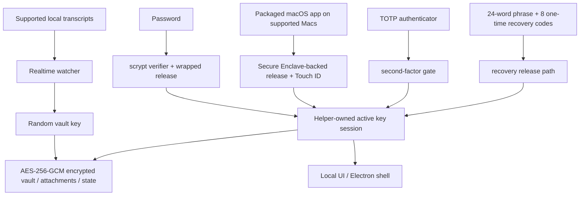

# DataMoat

[](#)
[](#install)
[](./LICENSE.md)
[](#supported-today)
[](#supported-today)
[](#install)
[](#install)
[](#supported-today)
[](#supported-today)
[](#supported-today)
[](#supported-today)
[](#supported-today)

> **Automatically captures Claude CLI, Claude Desktop, Codex CLI, Codex app, OpenClaw, and Cursor work records into an encrypted local vault.**
> Search past prompts, tool output, and locally available reasoning content while keeping your full record protected on your own machine. Back up your AI workflows before they disappear.

**The people and companies that own their AI data will win the future.**

DataMoat is an encrypted local vault for Claude CLI, Claude Desktop, Codex CLI, Codex app, OpenClaw, and Cursor work records. It preserves searchable transcripts, prompts, tool output, locally available reasoning content, metadata, and attachments on the same machine, so your full AI work history stays reviewable, protected, and easier to hand off later.

**Supported sources today:** Claude CLI, Codex CLI, Codex app local sessions, Claude Desktop local-agent sessions on macOS, supported local OpenClaw session records, and supported local Cursor agent transcripts.
**More data sources and platform releases are on the roadmap:** star and watch this repository so you can follow new capture integrations and platform updates as they ship.  

## Why Install DataMoat

- **Keep your full AI work history recoverable.** Local records can become harder to revisit after compaction, cleanup, retention changes, account downgrades, device replacement, or environment loss.
- **Preserve the fullest local version while it is still available.** DataMoat saves the locally written transcript, including visible reasoning content when the source stores it on disk.
- **Search past prompts, solutions, tool output, and reasoning-visible work.** Find previous fixes, workflows, timestamps, and attachments without depending on a live service view.
- **Protect continuity for individuals and teams.** Each protected machine can keep its own encrypted local archive for later review, handoff, and audit.
- **Keep records encrypted and under local control.** Other software or services cannot read the vault directly; only approved unlock and recovery paths can decrypt it.

## Highlights

- **Encrypted local vault** for transcripts, attachments, and state using AES-256-GCM.
- **Saved content stays local** as encrypted vault files, not plaintext transcript dumps.
- **Strong local auth** with password, optional TOTP, a 24-word recovery phrase, and 8 one-time recovery codes.
- **Secure Enclave-backed unlock path on supported Macs** for hardware-assisted daily unlock. See Apple's overview of the [Secure Enclave](https://support.apple.com/guide/security/secure-enclave-sec59b0b31ff/web). Touch ID is part of the packaged macOS app path.
- **Helper-owned key custody** so the main UI process does not keep the active vault key.
- **Tamper-evident local audit chain** with `datamoat audit verify`.
- **Versioned local state** so protected storage can migrate safely over time.
- **Electron shell by default** to reduce general-purpose browser and browser-extension exposure, with local-only UI binding to `127.0.0.1`.
- **No third-party font or CDN dependency** in the UI.

## Supported Today

### Platforms

| Platform | Status | Notes |
|---|---|---|
| **macOS** | Supported today | Source install and signed packaged DMG are available now |
| **Linux** | Supported today | Source install available now |
| **Packaged macOS DMG** | [Download DMG](https://github.com/max-ng/datamoat/releases/latest/download/DataMoat-0.1.14-macos-arm64.dmg) (recommended) | Signed / notarized Apple Silicon DMG with Secure Enclave + Touch ID unlock on supported Macs |
| **Windows x64 / ARM64** | ZIP + `DataMoat.exe` | Unsigned manual packages for Windows 11 x64 and Windows 11 on Arm; x64 has passed GitHub Actions packaged runtime smoke, ARM64 has passed real VM UI/background capture smoke; signed installer still in progress |

### Sources

| Source | Status | What DataMoat preserves |
|---|---|---|
| **Claude CLI** | ✅ | Full local transcript, including locally written thinking blocks when present |
| **Codex CLI** | ✅ | Captures supported local Codex CLI session records; transcript text, tool output, timestamps, metadata, and stable image attachments are preserved |
| **Codex app** | ✅ | Captures supported local Codex app session records; transcript text, tool output, timestamps, metadata, and stable image attachments are preserved |
| **Claude Desktop local-agent sessions (macOS)** | ✅ | Supported local Claude Desktop agent session records when present |
| **OpenClaw** | ✅ | Supported local OpenClaw session transcripts and metadata |
| **Cursor** | ✅ | Captures readable local Cursor `agent-transcripts` JSONL records, including text and tool blocks when present |
| **Claude CLI attachments** | ✅ | Encrypted image and supported file/PDF blocks |

## Security At A Glance

- **Vault encryption**: transcripts, attachments, and local state are encrypted at rest with AES-256-GCM.
- **Owner-only local file permissions**: protected vault files, attachment blobs, and state files are written with restrictive local filesystem modes.
- **Password handling**: passwords are stored as `scrypt` verifiers, not plaintext.
- **Authenticator support**: TOTP works with standard authenticator apps such as Google Authenticator, 1Password, and Authy.
- **Recovery design**: every vault gets a 24-word BIP39 recovery phrase and 8 one-time recovery codes.
- **Local-only UI**: the UI binds to `127.0.0.1` and uses `HttpOnly` + `SameSite=Strict` cookies.
- **Reduced browser attack surface**: the default Electron shell avoids the normal general-purpose browser path; browser fallback remains available when needed.
- **Local API write protection**: mutating requests must come from the same origin and include a CSRF token.
- **Unlock retry hardening**: password, Touch ID, and recovery failures back off instead of allowing unlimited rapid retries.
- **Trusted source updates only**: in-place git updates are allowed only for allow-listed remotes / branches on a clean working tree.
- **Redacted diagnostics**: health, crash, log, and audit artifacts scrub secrets before they are written.
- **Key isolation**: the Electron renderer or browser fallback does not receive the raw vault key.
- **Auditability**: security-relevant local events are written to a hash-chained audit log verifiable with `datamoat audit verify`.
- **Backup integrity**: the viewer reads the sealed vault copy as the source of truth, not a mutable live source transcript.

### Why 24 Words Instead of 12?

DataMoat uses a 24-word BIP39 phrase because it is long-lived recovery material for a high-value encrypted archive. A 12-word BIP39 phrase carries 128 bits of entropy, while a 24-word phrase carries 256 bits. Twelve words are still strong, but for recovery material that may need to protect access for many years, DataMoat chooses the larger security margin.

### How The Vault Is Protected



## Install

The signed / notarized macOS DMG is the recommended install path for Mac users. Source install remains available for Linux, development, and fallback cases. The macOS DMG is available from [GitHub Releases](https://github.com/max-ng/datamoat/releases) and includes Secure Enclave + Touch ID unlock on supported Macs, menu-bar auto-start at login, and packaged auto-update through GitHub Releases. Windows x64 and ARM64 are available as unsigned ZIP + `DataMoat.exe` packages while the signed installer is completed.

Windows ZIP + `DataMoat.exe` downloads:

[](https://github.com/max-ng/datamoat/releases/latest/download/DataMoat-0.1.14-win32-x64.zip)
[](https://github.com/max-ng/datamoat/releases/latest/download/DataMoat-0.1.14-win32-arm64.zip)

Each Windows ZIP includes `DataMoat.exe` plus the required app files. Unzip the Windows package and run `DataMoat.exe` from inside the extracted folder. Keep the folder contents together; this is not a standalone single-file `.exe` installer yet.

### AI-Assisted Install

For Mac users, use the signed and notarized packaged DMG first: [Download DMG](https://github.com/max-ng/datamoat/releases/latest/download/DataMoat-0.1.14-macos-arm64.dmg). Do not start with `git clone` on macOS unless the user explicitly wants source install or the packaged release is unavailable.

You can ask Claude CLI, Codex CLI, or OpenClaw to install DataMoat when you are looking at the target desktop.

Typical prompt:

```text
Install DataMoat on this Mac using the latest signed macOS DMG from GitHub Releases. Copy DataMoat.app to Applications, launch it, and tell me when the local setup UI appears so I can complete the password, authenticator, Touch ID, and recovery steps myself on the protected desktop.
```

Important:

- an AI agent can start the install and prepare the app
- the final recovery and unlock setup should still be completed by the human user on the protected machine
- if you are using OpenClaw, Telegram, WhatsApp, or another remote chat relay without seeing the target desktop, use the dedicated remote no-screen flow below instead of the normal AI-assisted flow

### Remote No-Screen Install

If the install is being started through OpenClaw, Codex, or any remote chat relay while you cannot see the protected desktop, use the packaged macOS DMG or Windows ZIP first and launch the installed app with the single no-screen flag.

macOS remote prompt:

```text
Install DataMoat on this Mac using the latest signed and notarized macOS DMG.

Do not use git clone or source install unless the DMG install fails.

Steps:
1. Download the latest macOS DMG:
   https://github.com/max-ng/datamoat/releases/latest/download/DataMoat-0.1.14-macos-arm64.dmg
2. Mount the DMG.
3. Copy DataMoat.app to ~/Applications.
4. Launch exactly:
   ~/Applications/DataMoat.app/Contents/MacOS/DataMoat --datamoat-remote-no-screen

Use only --datamoat-remote-no-screen for remote no-screen pre-setup capture.
Do not complete password, authenticator, Touch ID, recovery phrase, or recovery-code setup in this chat.

After launch, tell me:
DataMoat was installed from the DMG and remote no-screen capture was started. I must finish setup later on the protected desktop GUI.
```

Windows remote prompt:

```text
Install DataMoat on this Windows machine using the latest Windows ZIP and DataMoat.exe.

Do not use git clone or source install.

Steps:
1. Download the correct latest Windows ZIP from GitHub Releases:
   x64: https://github.com/max-ng/datamoat/releases/latest/download/DataMoat-0.1.14-win32-x64.zip
   ARM64: https://github.com/max-ng/datamoat/releases/latest/download/DataMoat-0.1.14-win32-arm64.zip
2. Extract the ZIP into Downloads.
3. Launch exactly:
   %USERPROFILE%\Downloads\DataMoat-win32-<arch>\DataMoat.exe --datamoat-remote-no-screen

Use DataMoat-win32-x64 for x64 or DataMoat-win32-arm64 for ARM64.
Use only --datamoat-remote-no-screen for remote no-screen pre-setup capture.
Do not complete password, authenticator, recovery phrase, or recovery-code setup in this chat.

After launch, tell me:
DataMoat was installed from the Windows ZIP and remote no-screen capture was started. I must finish setup later on the protected desktop GUI.
```

Manual macOS launch command after installing the DMG:

```bash
"$HOME/Applications/DataMoat.app/Contents/MacOS/DataMoat" --datamoat-remote-no-screen
```

Use this mode to prevent the password, authenticator enrollment secret, Touch ID prompt, 24-word recovery phrase, and recovery codes from ever appearing in Telegram, WhatsApp, OpenClaw chat, screenshots, or any other remote relay. DataMoat starts collecting supported local records immediately with pre-setup encrypted capture, but the full unlock setup must still be completed later on the protected desktop.

After the remote install finishes, the agent should report that DataMoat was installed successfully and is already capturing supported local records. When you return to the protected desktop, open DataMoat there and complete setup locally. Do not complete password, authenticator, Touch ID, or recovery setup inside the bot conversation.

Linux fallback when no DMG exists:

```bash
git clone <repository-url> datamoat
cd datamoat
bash install.sh --remote-no-screen
```

### Manual Install

Recommended for source installs: use `git clone`.

```bash
git clone <repository-url> datamoat
cd datamoat
bash install.sh
datamoat
```

Requirements:

- `Node.js 18+`
- `macOS` or `Linux`
- `macOS`: Xcode Command Line Tools for local native builds
- `Linux`: a normal Node build environment for your distro

The first setup flow shows recovery material locally:

- password
- authenticator enrollment secret / QR
- 24-word recovery phrase
- 8 one-time recovery codes

Final vault setup should be completed on the actual desktop screen of the machine being protected, not relayed through chat apps, screenshots, or remote messaging channels.

## Commands

```bash
datamoat
datamoat status
datamoat stop
datamoat scan
datamoat audit verify
datamoat update check
```

Live git source installs support in-place source updates. Packaged macOS installs use GitHub Releases as the packaged update source: the DMG is for first install, and later packaged updates download a signed ZIP payload and apply it through the macOS app updater instead of asking users to mount a new DMG for every release.

## Source Service Boundaries

DataMoat backs up supported local transcript files that are already present on your device and already accessible to you.

It does not grant additional rights to content or source services. You remain responsible for complying with the terms, policies, plan restrictions, and internal rules that apply to Claude, Codex, OpenClaw, Cursor, and any other source service you use.

## Enterprise

Enterprise deployment and management features are on the roadmap. More enterprise-focused capabilities are coming; star and watch this repository to follow updates.

## Consultation and Support

Questions or deployment help: `maxnghello at gmail.com`.

## License

DataMoat is distributed under **Business Source License 1.1 (`BUSL-1.1`)** with an **Additional Use Grant**.

This means:

- personal use is allowed
- internal company use is allowed
- uses outside that grant require a separate commercial license from the licensor

This is **source-available**, not OSI-approved open source.

See [LICENSE.md](LICENSE.md) for the full terms.

---

## Official Website

Official DataMoat website: [https://datamoat.org](https://datamoat.org)
