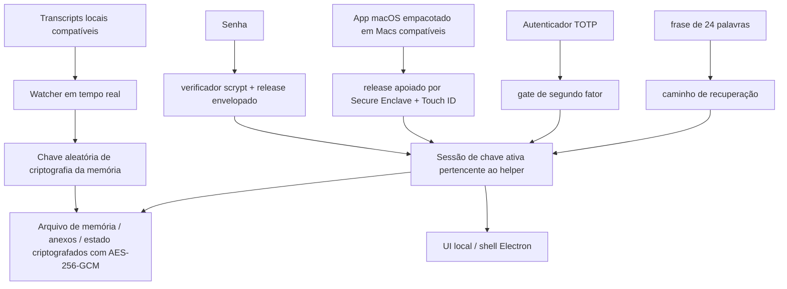

# DataMoat

Idioma: [English](./README.md) | [Português (Brasil)](./README.pt-BR.md) | [简体中文](./README.zh-CN.md) | [繁體中文](./README.zh-Hant.md) | [日本語](./README.ja.md) | [한국어](./README.ko.md) | [Türkçe](./README.tr.md) | [Русский](./README.ru.md) | [Tiếng Việt](./README.vi.md) | [ไทย](./README.th.md) | [Deutsch](./README.de.md)

[](#)
[](#install)
[](./LICENSE.md)
[](#supported-today)
[](#supported-today)
[](#install)
[](#install)
[](#supported-today)
[](#supported-today)
[](#supported-today)
[](#supported-today)
[](#supported-today)
[](#supported-today)
[](#supported-today)
[](#supported-today)

Site oficial: [https://datamoat.org](https://datamoat.org)
Repositório GitHub: [https://github.com/max-ng/datamoat](https://github.com/max-ng/datamoat)

## Proteja, exporte, faça backup, analise, pesquise e reutilize tudo o que você cria com ChatGPT, Claude, Codex, Cursor, DeepSeek, Qwen e OpenClaw

Arquivo local criptografado de backup para sessões, imagens, arquivos/PDFs e pastas `SKILL.md`.

> **Proteja, exporte, faça backup, analise, pesquise e reutilize tudo o que você cria com ChatGPT, Claude, Codex, Cursor, DeepSeek, Qwen e OpenClaw.**
> O DataMoat mantém seu histórico de trabalho com IA local e criptografado, preservando os registros brutos de origem intactos e criando uma camada normalizada para análise, busca, exportação, reutilização, handoff e memória privada de IA.
>
> **Seus dados de IA mais valiosos para o futuro já estão desaparecendo.**
> Baixe o DataMoat agora para ver quanto histórico de trabalho do ChatGPT, Claude, Codex, Cursor, DeepSeek, Qwen e OpenClaw você ainda consegue capturar.

**Escopo principal do backup:** o DataMoat faz backup de **skills + sessões + anexos** compatíveis no mesmo arquivo de memória local criptografado. Skills são salvas como snapshots completos de pastas, não apenas como nomes.

**As pessoas e empresas que forem donas dos seus dados de IA vencerão o futuro.**

DataMoat é um arquivo de memória de histórico de trabalho com IA para pessoas e equipes que trabalham com ChatGPT exports, Claude CLI, Claude Desktop, DeepSeek e Qwen por meio de workflows do Claude Code GUI, Codex CLI, Codex app, Cursor, OpenClaw e outras ferramentas de IA. Ele preserva o registro completo do trabalho: sessões, thinking tokens e blocos de raciocínio armazenados localmente quando existem, prompts, respostas, saída de ferramentas, arquivos, anexos, metadados, conteúdo de pastas de skills e registros de origem originais na mesma máquina, para que seu trabalho continue revisável, protegido, reutilizável e mais fácil de entregar depois.


## Como O DataMoat Armazena Seu Trabalho

O DataMoat mantém duas camadas:

- **Arquivo bruto:** JSONL de sessão original, registros SQLite, logs, anexos, metadados, snapshots de pastas de skills e qualquer thinking token ou bloco de raciocínio armazenado localmente são preservados o mais próximo possível do formato de origem.
- **Índice normalizado:** registros de ferramentas diferentes são convertidos para um esquema comum, para que você possa analisar, buscar, revisar, exportar, reutilizar e entregar trabalho entre ferramentas.

**Fontes compatíveis hoje:** importação ZIP/pasta de ChatGPT export, Claude CLI, Codex CLI, sessões locais do Codex app, sessões local-agent do Claude Desktop no macOS, sessões DeepSeek e Qwen quando escritas localmente por workflows do Claude Code GUI, registros locais compatíveis do OpenClaw e transcripts locais compatíveis do agente do Cursor.
**Mais fontes de dados e lançamentos de plataforma estão no roadmap:** dê star e watch neste repositório para acompanhar novas integrações de captura e atualizações de plataforma quando forem lançadas.

## Por Que Instalar O DataMoat

- **Mantenha seu histórico completo de trabalho com IA recuperável.** Registros locais podem ficar mais difíceis de revisitar depois de compaction, limpeza, mudanças de retenção, downgrade de conta, troca de dispositivo ou perda de ambiente.
- **Preserve a versão local mais completa enquanto ela ainda existe.** O DataMoat salva o transcript escrito localmente, incluindo thinking tokens e blocos de raciocínio armazenados localmente quando a fonte os grava em disco.
- **Faça backup do contexto de trabalho ao redor.** O DataMoat protege sessões, anexos e conteúdo de pastas de skills baseadas em `SKILL.md` no mesmo arquivo de memória criptografado.
- **Pesquise prompts passados, soluções, saídas de ferramentas e contexto de thinking tokens.** Encontre correções, workflows, timestamps e anexos anteriores sem depender de uma visualização viva do serviço.
- **Proteja a continuidade para indivíduos e equipes.** Cada máquina protegida pode manter seu próprio arquivo local criptografado para revisão, handoff e auditoria posteriores.
- **Mantenha registros criptografados e sob controle local.** Outros softwares ou serviços não conseguem ler diretamente o arquivo de memória; apenas caminhos aprovados de unlock e recovery podem descriptografá-lo.

## Destaques

- **Arquivo de memória local criptografado** para transcripts, skills, anexos e estado usando AES-256-GCM.
- **O conteúdo salvo permanece local** como arquivos de memória criptografados, não dumps de transcript em texto puro.
- **Autenticação local forte** com senha, TOTP opcional e frase de recuperação de 24 palavras.
- **Caminho de unlock apoiado pelo Secure Enclave em Macs compatíveis** para unlock diário assistido por hardware. Veja a visão geral da Apple sobre o [Secure Enclave](https://support.apple.com/guide/security/secure-enclave-sec59b0b31ff/web). Touch ID faz parte do caminho do app macOS empacotado.
- **Custódia da chave pelo helper**, para que o processo principal da UI não mantenha a chave ativa de criptografia da memória.
- **Cadeia local de auditoria com evidência de adulteração**: entradas locais atuais de auditoria são encadeadas por hash e verificáveis com `datamoat audit verify`.
- **Estado local versionado**, para que o armazenamento protegido possa migrar com segurança ao longo do tempo.
- **Shell Electron por padrão** para reduzir exposição a browsers de uso geral e extensões, com UI local vinculada apenas a `127.0.0.1`.
- **Sem dependência de fonte de terceiros ou CDN** na UI.

## Compatível Hoje

### Plataformas

| Plataforma | Status | Observações |
|---|---|---|
| **macOS** | Compatível hoje | Instalação por código-fonte e DMG empacotado assinado já estão disponíveis |
| **Linux** | Compatível hoje | Instalação por código-fonte disponível agora |
| **DMG macOS empacotado** | [Baixar DMG](https://github.com/max-ng/datamoat/releases/download/v2.0.7/DataMoat-2.0.7-macos-arm64.dmg) (recomendado) | DMG Apple Silicon assinado / notarizado com unlock via Secure Enclave + Touch ID em Macs compatíveis |
| **Windows x64 / ARM64** | ZIP + `DataMoat.exe` | Pacotes manuais sem assinatura para Windows 11 x64 e Windows 11 on Arm; x64 passou em smoke de runtime empacotado no GitHub Actions, ARM64 passou em smoke real de UI/captura em background em VM; instalador assinado ainda em andamento |

### Fontes

| Fonte | Status | O que o DataMoat preserva |
|---|---|---|
| **Claude CLI** | ✅ | Transcript local completo, incluindo thinking blocks escritos localmente quando presentes |
| **Codex CLI** | ✅ | Captura registros de sessão local compatíveis do Codex CLI; texto do transcript, saída de ferramentas, timestamps, metadados e anexos de imagem estáveis são preservados |
| **Codex app** | ✅ | Captura registros de sessão local compatíveis do Codex app; texto do transcript, saída de ferramentas, timestamps, metadados e anexos de imagem estáveis são preservados |
| **Sessões local-agent do Claude Desktop (macOS)** | ✅ | Registros de sessão local-agent do Claude Desktop quando presentes |
| **DeepSeek via Claude Code GUI** | ✅ | Quando o Claude Code GUI grava registros locais para sessões com DeepSeek, transcript, saída de ferramentas, timestamps, metadados, snapshots de pastas de skills, imagens e anexos compatíveis são preservados |
| **Qwen via Claude Code GUI** | ✅ | Quando o Claude Code GUI grava registros locais para sessões com Qwen, transcript, saída de ferramentas, timestamps, metadados, snapshots de pastas de skills, imagens e anexos compatíveis são preservados |
| **OpenClaw** | ✅ | Transcripts e metadados locais compatíveis do OpenClaw |
| **Cursor** | ✅ | Captura registros JSONL locais legíveis de `agent-transcripts` do Cursor, incluindo texto e blocos de ferramentas quando presentes |
| **Anexos** | ✅ | Imagens criptografadas e blocos de arquivos/PDF compatíveis, vinculados de volta às sessões de origem |
| **Pastas de skills** | ✅ | Snapshots de pastas `SKILL.md` globais e de projeto, incluindo `SKILL.md` e arquivos auxiliares incluídos, não apenas o nome da skill |

## Segurança Em Resumo

- **Criptografia do arquivo de memória**: transcripts, skills, anexos e estado local são criptografados em repouso com AES-256-GCM.
- **Permissões locais somente para o dono**: arquivos de memória protegidos, blobs de anexos e arquivos de estado são gravados com modos restritivos do sistema de arquivos local.
- **Tratamento de senha**: senhas são armazenadas como verificadores `scrypt`, não como texto puro.
- **Suporte a autenticador**: TOTP funciona com apps autenticadores padrão como Google Authenticator, 1Password e Authy.
- **Design de recuperação**: cada arquivo de memória recebe uma frase de recuperação BIP39 de 24 palavras.
- **UI somente local**: a UI vincula a `127.0.0.1` e usa cookies `HttpOnly` + `SameSite=Strict`.
- **Superfície de ataque de browser reduzida**: o shell Electron padrão evita o caminho normal de browser de uso geral; fallback por browser continua disponível quando necessário.
- **Proteção de escrita da API local**: requisições mutantes precisam vir da mesma origem e incluir um token CSRF.
- **Endurecimento de tentativas de unlock**: falhas de senha, Touch ID e recuperação aplicam backoff em vez de permitir tentativas rápidas ilimitadas.
- **Atualizações apenas de fontes confiáveis**: updates git in-place são permitidos apenas para remotes / branches allow-listed em uma working tree limpa.
- **Diagnósticos redigidos**: artefatos de health, crash, log e audit removem segredos antes de serem gravados.
- **Isolamento de chave**: o renderer Electron ou fallback por browser não recebe a chave bruta de criptografia da memória.
- **Auditabilidade**: eventos locais relevantes para segurança são gravados em um audit log encadeado por hash. `datamoat audit verify` detecta entradas alteradas ou quebradas no log local atual; ele não é um serviço remoto de notarização nem um ledger à prova de exclusão.
- **Integridade do backup**: o viewer lê a cópia selada do arquivo de memória como fonte da verdade, não um transcript vivo e mutável da origem.

### Por Que 24 Palavras Em Vez De 12?

O DataMoat usa uma frase BIP39 de 24 palavras porque ela é material de recuperação de longo prazo para um arquivo de memória criptografado de alto valor. Uma frase BIP39 de 12 palavras carrega 128 bits de entropia, enquanto uma frase de 24 palavras carrega 256 bits. Doze palavras ainda são fortes, mas para material de recuperação que talvez precise proteger acesso por muitos anos, o DataMoat escolhe a margem de segurança maior.

### Como O Arquivo De Memória É Protegido



## Instalação

O DMG macOS assinado / notarizado é o caminho de instalação recomendado para usuários de Mac. A instalação por código-fonte continua disponível para Linux, desenvolvimento e fallback. O DMG macOS está disponível nos downloads de release do DataMoat em [https://downloads.datamoat.org/releases/v2.0.7/DataMoat-2.0.7-macos-arm64.dmg](https://downloads.datamoat.org/releases/v2.0.7/DataMoat-2.0.7-macos-arm64.dmg) e inclui unlock com Secure Enclave + Touch ID em Macs compatíveis, início automático no login pela barra de menu e auto-update empacotado pelo feed de releases R2 do DataMoat. Windows x64 e ARM64 estão disponíveis como pacotes ZIP sem assinatura + `DataMoat.exe` enquanto o instalador assinado é concluído.

Downloads de release:

[](https://github.com/max-ng/datamoat/releases/download/v2.0.7/DataMoat-2.0.7-macos-arm64.dmg)
[](https://github.com/max-ng/datamoat/releases/download/v2.0.7/DataMoat-2.0.7-win32-x64.zip)
[](https://github.com/max-ng/datamoat/releases/download/v2.0.7/DataMoat-2.0.7-win32-arm64.zip)

Cada ZIP do Windows inclui `DataMoat.exe` e os arquivos necessários do app. Descompacte o pacote Windows, mantenha o conteúdo da pasta junto e execute `Install DataMoat.cmd` uma vez. Isso inicia o DataMoat e registra startup para o usuário Windows atual, para que o app de tray/background volte após login ou restart. Este ainda é um pacote ZIP portátil, não um instalador single-file assinado.

### Instalação Assistida Por IA

Para usuários de Mac, use primeiro o DMG empacotado assinado e notarizado: [Download DMG](https://github.com/max-ng/datamoat/releases/download/v2.0.7/DataMoat-2.0.7-macos-arm64.dmg). Não comece com `git clone` no macOS a menos que o usuário queira explicitamente instalação por código-fonte ou o release empacotado esteja indisponível.

Você pode pedir ao ChatGPT export ZIP/folder imports, Claude CLI, Codex CLI ou OpenClaw para instalar o DataMoat quando estiver olhando para o desktop alvo.

Prompt típico:

```text
Instale o DataMoat neste Mac usando o DMG macOS assinado mais recente dos downloads de release do DataMoat. Copie DataMoat.app para Applications, inicie o app e me avise quando a UI local de setup aparecer para que eu mesmo complete password, authenticator, Touch ID e recovery steps no desktop protegido.
```

Importante:

- um agente de IA pode iniciar a instalação e preparar o app
- o setup final de recovery e unlock ainda deve ser concluído pelo usuário humano na máquina protegida
- se você estiver usando OpenClaw, Telegram, WhatsApp ou outro relay de chat remoto sem ver o desktop alvo, use o fluxo remoto no-screen dedicado abaixo em vez do fluxo normal assistido por IA

### Instalação Remota No-Screen

Se a instalação estiver sendo iniciada por OpenClaw, Codex ou qualquer relay de chat remoto enquanto você não consegue ver o desktop protegido, use primeiro o DMG macOS empacotado ou ZIP Windows e inicie o app instalado com a flag única de no-screen.

Prompt remoto para macOS:

```text
Instale o DataMoat neste Mac usando o DMG macOS assinado e notarizado mais recente.

Não use git clone ou source install a menos que a instalação por DMG falhe.

Steps:
1. Baixe o DMG macOS mais recente:
   https://downloads.datamoat.org/releases/v2.0.7/DataMoat-2.0.7-macos-arm64.dmg
2. Monte o DMG.
3. Copie DataMoat.app para ~/Applications.
4. Inicie exatamente:
   ~/Applications/DataMoat.app/Contents/MacOS/DataMoat --datamoat-remote-no-screen

Use apenas --datamoat-remote-no-screen para remote no-screen pre-setup capture.
Não complete password, authenticator, Touch ID ou recovery phrase setup neste chat.

Depois de iniciar, me diga:
DataMoat foi instalado pelo DMG e remote no-screen capture foi iniciado. Eu preciso terminar o setup depois na GUI do desktop protegido.
```

Prompt remoto para Windows:

```text
Instale o DataMoat nesta máquina Windows usando o ZIP Windows mais recente e DataMoat.exe.

Não use git clone ou source install.

Steps:
1. Baixe o ZIP Windows correto e mais recente dos downloads de release do DataMoat:
   x64: https://downloads.datamoat.org/releases/v2.0.7/DataMoat-2.0.7-win32-x64.zip
   ARM64: https://downloads.datamoat.org/releases/v2.0.7/DataMoat-2.0.7-win32-arm64.zip
2. Extraia o ZIP em Downloads.
3. Inicie exatamente:
   %USERPROFILE%\Downloads\DataMoat-win32-<arch>\DataMoat.exe --datamoat-remote-no-screen

Use DataMoat-win32-x64 para x64 ou DataMoat-win32-arm64 para ARM64.
Use apenas --datamoat-remote-no-screen para remote no-screen pre-setup capture.
Não complete password, authenticator ou recovery phrase setup neste chat.

Depois de iniciar, me diga:
DataMoat foi instalado pelo ZIP Windows e remote no-screen capture foi iniciado. Eu preciso terminar o setup depois na GUI do desktop protegido.
```

Comando manual de launch no macOS depois de instalar o DMG:

```bash
"$HOME/Applications/DataMoat.app/Contents/MacOS/DataMoat" --datamoat-remote-no-screen
```

Use este modo para impedir que password, authenticator enrollment secret, Touch ID prompt e 24-word recovery phrase apareçam no Telegram, WhatsApp, OpenClaw chat, screenshots ou qualquer outro relay remoto. O DataMoat começa a coletar registros locais compatíveis imediatamente com captura criptografada pré-setup, mas o setup completo de unlock ainda precisa ser concluído depois no desktop protegido.

Depois que a instalação remota terminar, o agente deve informar que o DataMoat foi instalado com sucesso e já está capturando registros locais compatíveis. Quando você voltar ao desktop protegido, abra o DataMoat ali e complete o setup localmente. Não complete password, authenticator, Touch ID ou recovery setup dentro da conversa com o bot.

Fallback Linux quando não houver DMG:

```bash
git clone <repository-url> datamoat
cd datamoat
bash install.sh --remote-no-screen
```

### Instalação Manual

Recomendado para instalações por código-fonte: use `git clone`.

```bash
git clone <repository-url> datamoat
cd datamoat
bash install.sh
datamoat
```

Requisitos:

- `Node.js 18+`
- `macOS` ou `Linux`
- `macOS`: Xcode Command Line Tools para builds nativos locais
- `Linux`: um ambiente normal de build Node para sua distro

O primeiro fluxo de setup mostra material de recuperação localmente:

- password
- authenticator enrollment secret / QR
- 24-word recovery phrase

O setup final da memória deve ser concluído na tela real do desktop da máquina protegida, não retransmitido por apps de chat, screenshots ou canais de mensagem remotos.

## Comandos

```bash
datamoat
datamoat status
datamoat stop
datamoat scan
datamoat audit verify
datamoat update check
```

A verificação de auditoria checa a integridade do audit log presente em disco. Sem um checkpoint externo, ela não consegue provar sozinha que um arquivo local de auditoria nunca foi excluído, truncado ou totalmente reescrito por alguém com acesso de escrita.

Instalações vivas por git source suportam updates source in-place. Instalações macOS empacotadas usam os downloads de release R2 do DataMoat como fonte de update empacotado: o DMG é para a primeira instalação, e updates empacotados posteriores baixam um payload ZIP assinado e aplicam pelo updater do app macOS, em vez de pedir que usuários montem um novo DMG a cada release.

## Limites Dos Serviços De Origem

O DataMoat faz backup de arquivos locais de transcript compatíveis que já estão presentes no seu dispositivo e já são acessíveis a você.

Ele não concede direitos adicionais sobre conteúdo ou serviços de origem. Você continua responsável por cumprir os termos, políticas, restrições de plano e regras internas aplicáveis a ChatGPT, Claude, Codex, DeepSeek, Qwen, OpenClaw, Cursor e qualquer outro serviço de origem que você use.

O DataMoat foi projetado para proteger AI records que já existem na sua própria máquina. Em vez de deixar sessões, skills, anexos e arquivos de memória espalhados por paths locais conhecidos ou depender de memory plugins opacos, ele adiciona local encryption controlada pelo usuário, backup scope, recovery e auditability.

O DataMoat também pode preservar e mover images, files/PDFs, generated assets e attachments entre versões capturadas ou alternate conversation branches quando esses records já existem localmente. Muitos AI memory plugins e ferramentas simples de export param no texto; o DataMoat mantém os arquivos ao redor junto com o work history que os produziu.

O DataMoat não cria novo acesso ao seu AI work history. Ele protege local records que já existem no seu computador em source-tool folders, exports, logs, attachments ou session stores que poderiam permanecer espalhados, legíveis e sem criptografia.

Muitas AI tools já armazenam work history como ordinary local files no computador. Qualquer pessoa ou process com acesso a esse user account, disk, backups ou source-tool folders pode conseguir ler esses records antes de o DataMoat protegê-los. O DataMoat não torna esses dados mais exposed; ele move selected already-present records para um encrypted archive controlado pelo usuário.

O DataMoat backup scope é controlado pelo usuário e pelos source records já disponíveis na máquina protegida. Ele não bypass account permissions, não unlock remote services e não concede direitos além do que o usuário já tem naquele computador.

## Threat model: why installing can reduce local exposure

### Por que não fazer nada também pode ser arriscado

O DataMoat não pede que você crie um novo sensitive dataset do zero. Para muitos AI tools, esse dataset já existe no seu computador como local transcripts, logs, exports, SQLite records, JSONL files, attachments e skills folders.

Sem um archive dedicado, esses records podem permanecer espalhados por predictable local paths como ordinary files controlados apenas por permissões normais do OS account. O trabalho do DataMoat é ajudar a identificar esses records, copiar selected supported records para um local encrypted vault e manter um archive recoverable, searchable e auditable sob seu controle.

### Antes do DataMoat

Muitos AI tools já armazenam transcripts, tool output, attachments, project context e às vezes reasoning-related blocks como ordinary local files. Esses files podem ficar em known application folders, exports, logs, SQLite databases, JSONL transcripts e attachment caches. Qualquer process rodando como o mesmo OS user pode já conseguir ler parte deles.

### O que o DataMoat faz

O DataMoat não cria new access a remote AI services e não bypass OS permissions. Ele lê apenas records já disponíveis para o current local user e então armazena selected supported records em um user-controlled local encrypted archive. Os local read paths e capture reasons suportados ficam visíveis no public application code para review; o DataMoat não usa hidden cloud collection nem undisclosed remote capture.

### O que o DataMoat não resolve automaticamente

O DataMoat não apaga magicamente os original source files. A menos que o usuário escolha um cleanup/export workflow, original records ainda podem permanecer nas folders dos source apps. O DataMoat reduz scattered plaintext exposure criando uma protected encrypted copy; ele não substitui endpoint security, disk encryption ou source-app retention policy.

### Principal tradeoff

Instalar o DataMoat introduz um local watcher/importer process com acesso a selected AI record locations. Em troca, users recebem um searchable encrypted archive, recovery path, audit log e portable backup em vez de deixar AI work importante espalhado em unencrypted local files.

Os Windows packages atualmente são unsigned manual builds enquanto o signed installer está em progresso. A codebase é public for review, e teams que precisam de signed ou managed builds podem entrar em contato.

Você não precisa ser power user para começar a possuir seu AI work history. O DataMoat permite começar com um pequeno local archive hoje e ver o valor dele crescer conforme suas conversations, files, prompts e project context aumentam.

## Enterprise

Recursos de implantação e gestão enterprise estão no roadmap. Mais capacidades voltadas para enterprise estão chegando; dê star e watch neste repositório para acompanhar atualizações.

## Consultoria E Suporte

Dúvidas ou ajuda com deployment:


## Licença

O DataMoat é open-sourced sob a **Business Source License 1.1 (`BUSL-1.1`)** com uma **Additional Use Grant**.

Isso significa:

- uso pessoal é permitido
- uso interno em empresa é permitido
- usos fora dessa grant exigem uma licença comercial separada do licensor

Escolhemos **BUSL-1.1** para manter o code auditable enquanto reduzimos o risco de misleading repackaged builds, malware clones e unsupported commercial forks de uma security-sensitive local archive tool. Todo o application code é public for review.

Veja [LICENSE.md](LICENSE.md) para os termos completos.

---

## Site Oficial

Site oficial do DataMoat: [https://datamoat.org](https://datamoat.org)
