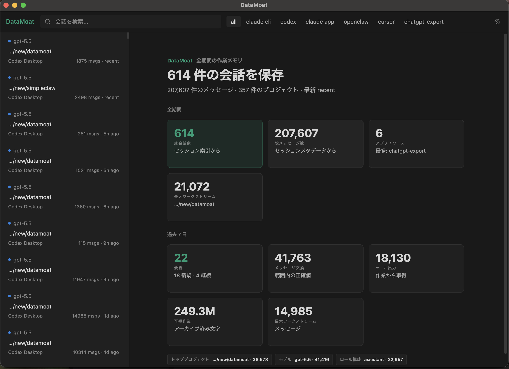
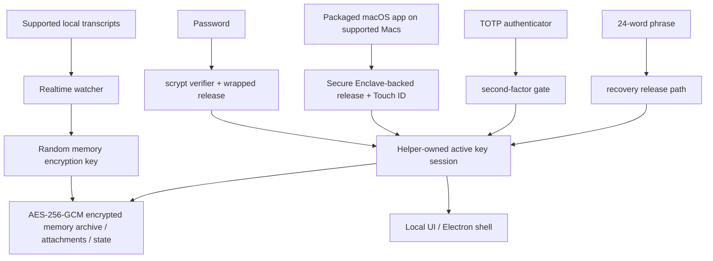
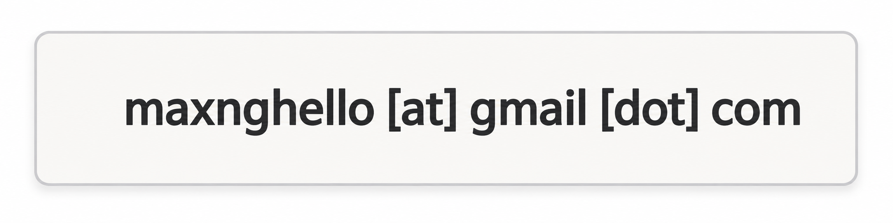

# DataMoat

Язык: [English](./README.md) | [Português (Brasil)](./README.pt-BR.md) | [简体中文](./README.zh-CN.md) | [繁體中文](./README.zh-Hant.md) | [日本語](./README.ja.md) | [한국어](./README.ko.md) | [Türkçe](./README.tr.md) | [Русский](./README.ru.md) | [Tiếng Việt](./README.vi.md) | [ไทย](./README.th.md) | [Deutsch](./README.de.md)

[](#)
[](#install)
[](./LICENSE.md)
[](#supported-today)
[](#supported-today)
[](#install)
[](#install)
[](#supported-today)
[](#supported-today)
[](#supported-today)
[](#supported-today)
[](#supported-today)
[](#supported-today)
[](#supported-today)
[](#supported-today)

Официальный сайт: [https://datamoat.org](https://datamoat.org)
GitHub репозиторий: [https://github.com/max-ng/datamoat](https://github.com/max-ng/datamoat)

## Защищайте, экспортируйте, создавайте резервные копии, анализируйте, ищите и повторно используйте все, что вы создаете с ChatGPT, Claude, Codex, Cursor, DeepSeek, Qwen и OpenClaw

Локальный encrypted backup archive для sessions, images, files/PDFs и папок `SKILL.md`.

> **Защищайте, экспортируйте, создавайте резервные копии, анализируйте, ищите и повторно используйте все, что вы создаете с ChatGPT, Claude, Codex, Cursor, DeepSeek, Qwen и OpenClaw.**
> DataMoat хранит вашу историю работы с AI локально и в зашифрованном виде, сохраняет исходные raw source records нетронутыми и создает normalized layer для анализа, поиска, экспорта, повторного использования, handoff и private AI memory.
>
> **Ваши самые ценные будущие AI-данные уже исчезают.**
> Скачайте DataMoat сейчас, чтобы увидеть, сколько истории работы ChatGPT, Claude, Codex, Cursor, DeepSeek, Qwen и OpenClaw вы еще можете захватить.

**Основной объем backup:** DataMoat делает backup поддерживаемых **skills + sessions + attachments** в один и тот же encrypted local memory archive. Skills сохраняются как полные snapshots папок, а не только как имена.

**Люди и компании, которые владеют своими AI-данными, выиграют будущее.**

DataMoat — это AI work history memory archive для людей и команд, работающих с ChatGPT exports, Claude CLI, Claude Desktop, DeepSeek и Qwen через Claude Code GUI workflows, Codex CLI, Codex app, Cursor, OpenClaw и другие AI tools. Он сохраняет полный рабочий record: sessions, локально сохраненные thinking tokens и reasoning blocks при наличии, prompts, responses, tool output, files, attachments, metadata, содержимое skills folders и исходные source records на той же машине, чтобы ваша работа оставалась reviewable, protected, reusable и проще передавалась дальше.



## Как DataMoat Хранит Вашу Работу

DataMoat хранит два слоя:

- **Raw archive:** original session JSONL, SQLite records, logs, attachments, metadata, skills folder snapshots и любые locally stored thinking tokens или reasoning blocks сохраняются максимально близко к source format.
- **Normalized index:** records из разных tools переводятся в common schema, чтобы можно было analyze, искать, review, export, reuse и handoff работу между tools.

**Поддерживаемые сегодня sources:** ChatGPT export ZIP/folder imports, Claude CLI, Codex CLI, Codex app local sessions, Claude Desktop local-agent sessions на macOS, DeepSeek и Qwen sessions, когда они записываются local через Claude Code GUI workflows, поддерживаемые local OpenClaw session records и поддерживаемые local Cursor agent transcripts.
**Больше data sources и platform releases находятся в roadmap:** поставьте star и watch этому repository, чтобы следить за новыми capture integrations и platform updates.

## Что Нового В 2.0.9: Аннотации, Импорт ChatGPT Export И Более Безопасный Перенос

DataMoat теперь импортирует поддерживаемые ChatGPT export ZIP-файлы или распакованные export-папки в тот же encrypted local memory archive, который используется для Claude, Codex, Cursor, DeepSeek, Qwen, OpenClaw, skills и attachments.

- **Восстанавливайте, просматривайте, ищите и делайте backup ChatGPT exports.** Поддерживаемые conversations, alternate branches, attachments, assets и raw export files импортируются в encrypted vault.
- **Отмечайте важный контекст.** Добавляйте sessions и отдельные messages в bookmarks, голосуйте за полезные или слабые ответы и быстрее находите reusable context.
- **Сохраняйте raw export без лишнего расхода диска.** DataMoat сохраняет original source records и может хранить повторяющиеся raw backup data в compressed encrypted archives; реальные source-record tests показали raw archive storage около 60% от original source bytes.
- **Переносите работу между компьютерами.** Скопируйте папку DataMoat на другую машину и восстановите ее между macOS, Windows и Linux, включая Mac to Windows и Linux to Mac.
- **Носите вторую backup-копию.** Сохраните encrypted DataMoat folder на USB или external drive, чтобы AI work history могла храниться отдельно от source computer.

## Зачем Устанавливать DataMoat

- **Держите полную AI work history восстанавливаемой.** Local records могут стать труднее для повторного просмотра после compaction, cleanup, retention changes, account downgrades, device replacement или environment loss.
- **Сохраните самую полную local version, пока она еще доступна.** DataMoat сохраняет locally written transcript, включая locally stored thinking tokens и reasoning blocks, когда source записывает их на диск.
- **Делайте backup окружающего work context.** DataMoat защищает supported sessions, attachments и `SKILL.md`-based skills folder contents в одном encrypted memory archive.
- **Ищите прошлые prompts, solutions, tool output и thinking-token context.** Находите предыдущие fixes, workflows, timestamps и attachments без зависимости от live service view.
- **Защитите continuity для людей и команд.** Каждая protected machine может держать свой encrypted local archive для последующего review, handoff и audit.
- **Держите records encrypted и под local control.** Другое software или services не могут напрямую прочитать memory archive; расшифровать его могут только approved unlock и recovery paths.

## Highlights

- **Encrypted local memory archive** для transcripts, skills, attachments и state с AES-256-GCM.
- **Сохраненный content остается local** как encrypted memory archive files, а не plaintext transcript dumps.
- **Strong local auth** с password, optional TOTP и 24-word recovery phrase.
- **Secure Enclave-backed unlock path на поддерживаемых Macs** для hardware-assisted daily unlock. См. обзор Apple о [Secure Enclave](https://support.apple.com/guide/security/secure-enclave-sec59b0b31ff/web). Touch ID является частью packaged macOS app path.
- **Helper-owned key custody**, чтобы main UI process не держал active memory encryption key.
- **Tamper-evident local audit chain**: current local audit entries hash-chained и проверяются через `datamoat audit verify`.
- **Versioned local state**, чтобы protected storage мог safely migrate со временем.
- **Electron shell by default** для уменьшения exposure обычного browser и browser extensions, с local-only UI binding к `127.0.0.1`.
- **Нет third-party font или CDN dependency** в UI.

## Поддерживается Сегодня

### Platforms

| Platform | Status | Notes |
|---|---|---|
| **macOS** | Поддерживается сегодня | Source install и signed packaged DMG доступны сейчас |
| **Linux** | Поддерживается сегодня | Source install доступен сейчас |
| **Packaged macOS DMG** | [Скачать DMG](https://downloads.datamoat.org/releases/v2.0.11/DataMoat-2.0.11-macos-arm64.dmg?s=gh-ru) (рекомендуется) | Signed / notarized Apple Silicon DMG с Secure Enclave + Touch ID unlock на поддерживаемых Macs |
| **Windows x64 / ARM64** | ZIP + `DataMoat.exe` | Unsigned manual packages для Windows 11 x64 и Windows 11 on Arm; x64 прошел GitHub Actions packaged runtime smoke, ARM64 прошел real VM UI/background capture smoke; signed installer еще в работе |

### Sources

| Source | Status | Что сохраняет DataMoat |
|---|---|---|
| **Claude CLI** | ✅ | Full local transcript, включая locally written thinking blocks при наличии |
| **Codex CLI** | ✅ | Captures supported local Codex CLI session records; transcript text, tool output, timestamps, metadata и stable image attachments сохраняются |
| **Codex app** | ✅ | Captures supported local Codex app session records; transcript text, tool output, timestamps, metadata и stable image attachments сохраняются |
| **Claude Desktop local-agent sessions (macOS)** | ✅ | Supported local Claude Desktop agent session records при наличии |
| **DeepSeek via Claude Code GUI** | ✅ | Когда Claude Code GUI записывает local records для DeepSeek-backed sessions, сохраняются transcript text, tool output, timestamps, metadata, skills folder snapshots, images и supported attachments |
| **Qwen via Claude Code GUI** | ✅ | Когда Claude Code GUI записывает local records для Qwen-backed sessions, сохраняются transcript text, tool output, timestamps, metadata, skills folder snapshots, images и supported attachments |
| **OpenClaw** | ✅ | Supported local OpenClaw session transcripts и metadata |
| **Cursor** | ✅ | Captures readable local Cursor `agent-transcripts` JSONL records, включая text и tool blocks при наличии |
| **Attachments** | ✅ | Encrypted image и supported file/PDF blocks, связанные обратно с source sessions |
| **Skills folders** | ✅ | Global и project `SKILL.md` folder snapshots, включая `SKILL.md` и included helper files, а не только skill name |

## Security At A Glance

- **Memory archive encryption**: transcripts, skills, attachments и local state encrypted at rest с AES-256-GCM.
- **Owner-only local file permissions**: protected memory archive files, attachment blobs и state files записываются с restrictive local filesystem modes.
- **Password handling**: passwords хранятся как `scrypt` verifiers, не plaintext.
- **Authenticator support**: TOTP работает со standard authenticator apps, такими как Google Authenticator, 1Password и Authy.
- **Recovery design**: каждый memory archive получает 24-word BIP39 recovery phrase.
- **Local-only UI**: UI bind к `127.0.0.1` и использует `HttpOnly` + `SameSite=Strict` cookies.
- **Reduced browser attack surface**: default Electron shell избегает обычного general-purpose browser path; browser fallback остается доступен при необходимости.
- **Local API write protection**: mutating requests должны приходить из same origin и включать CSRF token.
- **Unlock retry hardening**: password, Touch ID и recovery failures back off вместо unlimited rapid retries.
- **Trusted source updates only**: in-place git updates разрешены только для allow-listed remotes / branches на clean working tree.
- **Redacted diagnostics**: health, crash, log и audit artifacts scrub secrets перед записью.
- **Key isolation**: Electron renderer или browser fallback не получает raw memory encryption key.
- **Auditability**: security-relevant local events записываются в hash-chained audit log. `datamoat audit verify` обнаруживает changed или broken entries в текущем local log; это не remote notarization service и не deletion-proof ledger.
- **Backup integrity**: viewer читает sealed memory archive copy как source of truth, а не mutable live source transcript.

### Почему 24 Words Вместо 12?

DataMoat использует 24-word BIP39 phrase, потому что это long-lived recovery material для high-value encrypted memory archive. 12-word BIP39 phrase несет 128 bits of entropy, а 24-word phrase — 256 bits. Twelve words все еще сильны, но для recovery material, который может защищать access многие годы, DataMoat выбирает больший security margin.

### Как Memory Archive Защищен



## Install

Signed / notarized macOS DMG — рекомендуемый install path для Mac users. Source install остается доступен для Linux, development и fallback cases. macOS DMG доступен в DataMoat release downloads по адресу [https://downloads.datamoat.org/releases/v2.0.11/DataMoat-2.0.11-macos-arm64.dmg](https://downloads.datamoat.org/releases/v2.0.11/DataMoat-2.0.11-macos-arm64.dmg) и включает Secure Enclave + Touch ID unlock на поддерживаемых Macs, menu-bar auto-start at login и packaged auto-update через DataMoat R2 release feed. Windows x64 и ARM64 доступны как unsigned ZIP + `DataMoat.exe` packages, пока signed installer завершается.

Release downloads:

[](https://downloads.datamoat.org/releases/v2.0.11/DataMoat-2.0.11-macos-arm64.dmg?s=gh-ru)
[](https://downloads.datamoat.org/releases/v2.0.11/DataMoat-2.0.11-win32-x64.zip?s=gh-ru)
[](https://downloads.datamoat.org/releases/v2.0.11/DataMoat-2.0.11-win32-arm64.zip?s=gh-ru)

Каждый Windows ZIP включает `DataMoat.exe` и необходимые app files. Распакуйте Windows package, держите содержимое folder вместе и один раз запустите `Install DataMoat.cmd`. Это launch DataMoat и регистрирует startup для current Windows user, чтобы tray/background app возвращался после login или restart. Это все еще portable ZIP package, а не signed single-file installer.

### AI-Assisted Install

Для Mac users сначала используйте signed и notarized packaged DMG: [Download DMG](https://downloads.datamoat.org/releases/v2.0.11/DataMoat-2.0.11-macos-arm64.dmg?s=gh-ru). Не начинайте с `git clone` на macOS, если user явно не хочет source install или packaged release недоступен.

Вы можете попросить ChatGPT export ZIP/folder imports, Claude CLI, Codex CLI или OpenClaw установить DataMoat, когда смотрите на target desktop.

Typical prompt:

```text
Установи DataMoat на этот Mac с помощью latest signed macOS DMG из DataMoat release downloads. Скопируй DataMoat.app в Applications, launch его и скажи мне, когда появится local setup UI, чтобы я сам завершил password, authenticator, Touch ID и recovery steps на protected desktop.
```

Important:

- AI agent может начать install и подготовить app
- final recovery и unlock setup все равно должен выполнить human user на protected machine
- если вы используете OpenClaw, Telegram, WhatsApp или другой remote chat relay без видимости target desktop, используйте dedicated remote no-screen flow ниже вместо обычного AI-assisted flow

### Remote No-Screen Install

Если install запускается через OpenClaw, Codex или любой remote chat relay, пока вы не видите protected desktop, сначала используйте packaged macOS DMG или Windows ZIP и launch установленный app с single no-screen flag.

macOS remote prompt:

```text
Установи DataMoat на этот Mac, используя latest signed and notarized macOS DMG.

Не используй git clone или source install, если DMG install не fails.

Steps:
1. Download latest macOS DMG:
   https://downloads.datamoat.org/releases/v2.0.11/DataMoat-2.0.11-macos-arm64.dmg
2. Mount the DMG.
3. Copy DataMoat.app to ~/Applications.
4. Launch exactly:
   ~/Applications/DataMoat.app/Contents/MacOS/DataMoat --datamoat-remote-no-screen

Use only --datamoat-remote-no-screen for remote no-screen pre-setup capture.
Do not complete password, authenticator, Touch ID, or recovery phrase setup in this chat.

After launch, tell me:
DataMoat was installed from the DMG and remote no-screen capture was started. I must finish setup later on the protected desktop GUI.
```

Windows remote prompt:

```text
Установи DataMoat на эту Windows machine, используя latest Windows ZIP and DataMoat.exe.

Не используй git clone или source install.

Steps:
1. Download the correct latest Windows ZIP from DataMoat release downloads:
   x64: https://downloads.datamoat.org/releases/v2.0.11/DataMoat-2.0.11-win32-x64.zip
   ARM64: https://downloads.datamoat.org/releases/v2.0.11/DataMoat-2.0.11-win32-arm64.zip
2. Extract the ZIP into Downloads.
3. Launch exactly:
   %USERPROFILE%\Downloads\DataMoat-win32-<arch>\DataMoat.exe --datamoat-remote-no-screen

Use DataMoat-win32-x64 for x64 or DataMoat-win32-arm64 for ARM64.
Use only --datamoat-remote-no-screen for remote no-screen pre-setup capture.
Do not complete password, authenticator, or recovery phrase setup in this chat.

After launch, tell me:
DataMoat was installed from the Windows ZIP and remote no-screen capture was started. I must finish setup later on the protected desktop GUI.
```

Manual macOS launch command after installing the DMG:

```bash
"$HOME/Applications/DataMoat.app/Contents/MacOS/DataMoat" --datamoat-remote-no-screen
```

Используйте этот mode, чтобы password, authenticator enrollment secret, Touch ID prompt и 24-word recovery phrase никогда не появлялись в Telegram, WhatsApp, OpenClaw chat, screenshots или другом remote relay. DataMoat сразу начинает собирать supported local records с pre-setup encrypted capture, но full unlock setup все равно нужно закончить позже на protected desktop.

После remote install agent должен сообщить, что DataMoat успешно установлен и уже capturing supported local records. Когда вы вернетесь к protected desktop, откройте DataMoat там и завершите setup локально. Не завершайте password, authenticator, Touch ID или recovery setup внутри bot conversation.

Linux fallback when no DMG exists:

```bash
git clone <repository-url> datamoat
cd datamoat
bash install.sh --remote-no-screen
```

### Manual Install

Рекомендуется для source installs: используйте `git clone`.

```bash
git clone <repository-url> datamoat
cd datamoat
bash install.sh
datamoat
```

Requirements:

- `Node.js 18+`
- `macOS` или `Linux`
- `macOS`: Xcode Command Line Tools for local native builds
- `Linux`: обычная Node build environment для вашего distro

First setup flow показывает recovery material локально:

- password
- authenticator enrollment secret / QR
- 24-word recovery phrase

Final memory setup должен быть завершен на actual desktop screen защищаемой machine, а не через chat apps, screenshots или remote messaging channels.

## Commands

```bash
datamoat
datamoat status
datamoat stop
datamoat scan
datamoat audit verify
datamoat update check
```

Audit verification проверяет integrity audit log, который присутствует на диске. Без external checkpoint она сама по себе не может доказать, что local audit file никогда не был deleted, truncated или полностью rewritten кем-то с write access.

Live git source installs поддерживают in-place source updates. Packaged macOS installs используют DataMoat R2 release downloads как packaged update source: DMG нужен для first install, а later packaged updates скачивают signed ZIP payload и применяют его через macOS app updater вместо того, чтобы просить users mount новый DMG для каждого release.

## Source Service Boundaries

DataMoat делает backup supported local transcript files, которые уже присутствуют на вашем device и уже доступны вам.

Он не дает дополнительных прав на content или source services. Вы сами отвечаете за соблюдение terms, policies, plan restrictions и internal rules, которые применяются к ChatGPT, Claude, Codex, DeepSeek, Qwen, OpenClaw, Cursor и любому другому source service, который вы используете.

DataMoat designed to protect AI records, которые уже существуют на вашей собственной машине. Вместо того чтобы оставлять sessions, skills, attachments и memory files разбросанными по known local paths или полагаться на opaque memory plugins, он добавляет user-controlled local encryption, backup scope, recovery и auditability.

DataMoat также может preserve и move over images, files/PDFs, generated assets и attachments между captured versions или alternate conversation branches, когда эти records уже существуют локально. Большинство AI memory plugins и simple export tools останавливаются на text; DataMoat сохраняет surrounding files вместе с work history, которая их создала.

DataMoat does not create new access к вашей AI work history. Он защищает local records, которые уже существуют на вашем computer в source-tool folders, exports, logs, attachments или session stores и иначе могут оставаться scattered, readable и unencrypted.

Многие AI tools уже хранят work history как ordinary local files на computer. Любой person или process с access к этому user account, disk, backups или source-tool folders может иметь возможность читать эти records до того, как DataMoat их защитит. DataMoat не делает эти data более exposed; он переносит selected already-present records в encrypted archive, controlled by the user.

DataMoat backup scope контролируется user и source records, которые уже доступны на protected machine. Он не bypass account permissions, не unlock remote services и не дает rights сверх того, что user уже имеет на этом computer.

## Threat model: why installing can reduce local exposure

### Почему бездействие тоже может быть рискованным

DataMoat не просит вас создавать новый sensitive dataset с нуля. Для многих AI tools этот dataset уже существует на вашем computer как local transcripts, logs, exports, SQLite records, JSONL files, attachments и skills folders.

Без dedicated archive эти records могут оставаться разбросанными по predictable local paths как ordinary files, защищенные только обычными OS account permissions. Задача DataMoat - помочь найти эти records, скопировать выбранные supported records в local encrypted vault и сохранить recoverable, searchable, auditable archive под вашим контролем.

### До DataMoat

Многие AI tools уже хранят transcripts, tool output, attachments, project context и иногда reasoning-related blocks как ordinary local files. Эти files могут находиться в known application folders, exports, logs, SQLite databases, JSONL transcripts и attachment caches. Любой process, работающий от того же OS user, уже может читать часть из них.

### Что делает DataMoat

DataMoat не создает new access к remote AI services и не bypass OS permissions. Он читает только records, уже доступные current local user, а затем сохраняет выбранные supported records в user-controlled local encrypted archive. Supported local read paths и capture reasons видны в public application code for review; DataMoat не использует hidden cloud collection или undisclosed remote capture.

### Что DataMoat не решает автоматически

DataMoat не стирает original source files автоматически. Если user не выберет cleanup/export workflow, original records могут оставаться в folders исходных apps. DataMoat уменьшает scattered plaintext exposure за счет protected encrypted copy; это не замена endpoint security, disk encryption или source-app retention policy.

### Главный tradeoff

Установка DataMoat добавляет local watcher/importer process с access к выбранным AI record locations. В обмен users получают searchable encrypted archive, recovery path, audit log и portable backup вместо того, чтобы оставлять важную AI work разбросанной в unencrypted local files.

Windows packages сейчас являются unsigned manual builds, пока signed installer находится в работе. Codebase public for review; teams, которым нужны signed или managed builds, могут contact us.

Не нужно быть power user, чтобы начать owning your AI work history. DataMoat позволяет начать с небольшого local archive сегодня и увидеть, как его value растет вместе с conversations, files, prompts и project context.

## Enterprise

Enterprise deployment и management features находятся в roadmap. Больше enterprise-focused capabilities появится позже; star и watch этот repository, чтобы следить за обновлениями.

## Consultation and Support

Вопросы или deployment help:



## License

Бесплатно: личное использование и внутреннее использование в компании разрешены.

Лицензия: [LICENSE.md](LICENSE.md). Краткое объяснение: [LICENSE-DETAILS.md](LICENSE-DETAILS.md).

---

## Official Website

Официальный сайт DataMoat: [https://datamoat.org](https://datamoat.org)
