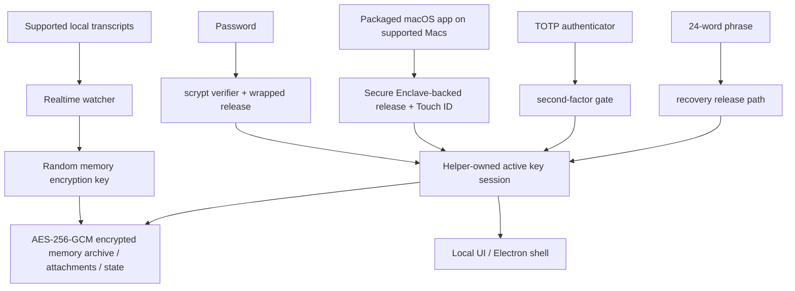

# DataMoat

ภาษา: [English](./README.md) | [Português (Brasil)](./README.pt-BR.md) | [简体中文](./README.zh-CN.md) | [繁體中文](./README.zh-Hant.md) | [日本語](./README.ja.md) | [한국어](./README.ko.md) | [Türkçe](./README.tr.md) | [Русский](./README.ru.md) | [Tiếng Việt](./README.vi.md) | [ไทย](./README.th.md) | [Deutsch](./README.de.md)

[](#)
[](#install)
[](./LICENSE.md)
[](#supported-today)
[](#supported-today)
[](#install)
[](#install)
[](#supported-today)
[](#supported-today)
[](#supported-today)
[](#supported-today)
[](#supported-today)
[](#supported-today)
[](#supported-today)
[](#supported-today)

เว็บไซต์ทางการ: [https://datamoat.org](https://datamoat.org)
GitHub repo: [https://github.com/max-ng/datamoat](https://github.com/max-ng/datamoat)

## Export และ backup ข้อมูล + skills + attachments ของ ChatGPT / Claude / Codex / Cursor / DeepSeek / Qwen

Local encrypted backup archive สำหรับ sessions, images, files/PDFs และ folders `SKILL.md`

> **Export และ backup ข้อมูล + skills + ไฟล์แนบทั้งหมดของ ChatGPT / Claude / Codex / Cursor / DeepSeek / Qwen.**
> DataMoat เก็บ AI work history ของคุณไว้แบบ local และ encrypted, รักษา raw source records ให้ครบ และสร้าง normalized index สำหรับ search, export, reuse, handoff และ private AI memory.
>
> **ข้อมูล AI ที่มีค่าที่สุดในอนาคตของคุณกำลังหายไปแล้ว**
> ดาวน์โหลด DataMoat ตอนนี้เพื่อดูว่าคุณยัง capture work history จาก ChatGPT, Claude, Codex, Cursor, DeepSeek, Qwen และ OpenClaw ได้มากแค่ไหน

**ขอบเขต backup หลัก:** DataMoat backup **skills + sessions + attachments** ที่รองรับไว้ใน encrypted local memory archive เดียวกัน Skills ถูกบันทึกเป็น full folder snapshots ไม่ใช่แค่ชื่อ

**คนและบริษัทที่เป็นเจ้าของ AI data ของตัวเองจะชนะอนาคต**

DataMoat คือ AI work history memory archive สำหรับคนและทีมที่ทำงานกับ ChatGPT exports, Claude CLI, Claude Desktop, DeepSeek และ Qwen ผ่าน Claude Code GUI workflows, Codex CLI, Codex app, Cursor, OpenClaw และ AI tools อื่น ๆ มันรักษา full working record: sessions, locally stored thinking tokens และ reasoning blocks เมื่อมี, prompts, responses, tool output, files, attachments, metadata, skills folder contents และ original source records บนเครื่องเดียวกัน เพื่อให้งานของคุณยัง reviewable, protected, reusable และ handoff ได้ง่ายขึ้นภายหลัง


## DataMoat เก็บงานของคุณอย่างไร

DataMoat เก็บสองชั้น:

- **Raw archive:** original session JSONL, SQLite records, logs, attachments, metadata, skills folder snapshots และ locally stored thinking tokens หรือ reasoning blocks จะถูกเก็บให้ใกล้ source format ที่สุด
- **Normalized index:** records จาก tools ต่าง ๆ จะถูกแปลงเป็น common schema เพื่อให้ search, review, export, analyze, reuse และ handoff งานข้าม tools ได้

**Sources ที่รองรับวันนี้:** ChatGPT export ZIP/folder imports, Claude CLI, Codex CLI, Codex app local sessions, Claude Desktop local-agent sessions บน macOS, DeepSeek และ Qwen sessions เมื่อถูกเขียน local โดย Claude Code GUI workflows, supported local OpenClaw session records และ supported local Cursor agent transcripts
**Data sources และ platform releases เพิ่มเติมอยู่ใน roadmap:** star และ watch repository นี้เพื่อติดตาม capture integrations และ platform updates ใหม่เมื่อ ship

## ทำไมควรติดตั้ง DataMoat

- **ทำให้ full AI work history recoverable.** Local records อาจกลับไปดูยากขึ้นหลัง compaction, cleanup, retention changes, account downgrades, device replacement หรือ environment loss
- **รักษา local version ที่สมบูรณ์ที่สุดขณะที่ยังมีอยู่.** DataMoat บันทึก locally written transcript รวมถึง locally stored thinking tokens และ reasoning blocks เมื่อ source เขียนลง disk
- **Backup work context รอบข้าง.** DataMoat ปกป้อง supported sessions, attachments และ `SKILL.md`-based skills folder contents ใน encrypted memory archive เดียวกัน
- **Search prompts, solutions, tool output และ thinking-token context ในอดีต.** หา fixes, workflows, timestamps และ attachments เก่าโดยไม่ต้องพึ่ง live service view
- **ปกป้อง continuity สำหรับบุคคลและทีม.** แต่ละ protected machine สามารถเก็บ encrypted local archive ของตัวเองไว้สำหรับ review, handoff และ audit ภายหลัง
- **เก็บ records แบบ encrypted และอยู่ภายใต้ local control.** Software หรือ services อื่นอ่าน memory archive โดยตรงไม่ได้ มีแค่ approved unlock และ recovery paths เท่านั้นที่ decrypt ได้

## Highlights

- **Encrypted local memory archive** สำหรับ transcripts, skills, attachments และ state ด้วย AES-256-GCM
- **Saved content stays local** เป็น encrypted memory archive files ไม่ใช่ plaintext transcript dumps
- **Strong local auth** ด้วย password, optional TOTP และ 24-word recovery phrase
- **Secure Enclave-backed unlock path บน Macs ที่รองรับ** สำหรับ hardware-assisted daily unlock ดูภาพรวมของ Apple เรื่อง [Secure Enclave](https://support.apple.com/guide/security/secure-enclave-sec59b0b31ff/web) Touch ID เป็นส่วนหนึ่งของ packaged macOS app path
- **Helper-owned key custody** ทำให้ main UI process ไม่ถือ active memory encryption key
- **Tamper-evident local audit chain**: current local audit entries เป็น hash-chained และ verify ได้ด้วย `datamoat audit verify`
- **Versioned local state** เพื่อให้ protected storage migrate ได้อย่างปลอดภัยเมื่อเวลาผ่านไป
- **Electron shell by default** เพื่อลด general-purpose browser และ browser-extension exposure พร้อม local-only UI binding ไปที่ `127.0.0.1`
- UI **ไม่มี third-party font หรือ CDN dependency**

## รองรับวันนี้

### Platforms

| Platform | Status | Notes |
|---|---|---|
| **macOS** | รองรับวันนี้ | Source install และ signed packaged DMG พร้อมใช้งานแล้ว |
| **Linux** | รองรับวันนี้ | Source install พร้อมใช้งานแล้ว |
| **Packaged macOS DMG** | [ดาวน์โหลด DMG](https://downloads.datamoat.org/releases/v2.0.7/DataMoat-2.0.7-macos-arm64.dmg) (แนะนำ) | Signed / notarized Apple Silicon DMG พร้อม Secure Enclave + Touch ID unlock บน Macs ที่รองรับ |
| **Windows x64 / ARM64** | ZIP + `DataMoat.exe` | Unsigned manual packages สำหรับ Windows 11 x64 และ Windows 11 on Arm; x64 ผ่าน GitHub Actions packaged runtime smoke แล้ว, ARM64 ผ่าน real VM UI/background capture smoke แล้ว; signed installer ยังทำอยู่ |

### Sources

| Source | Status | DataMoat เก็บอะไร |
|---|---|---|
| **Claude CLI** | ✅ | Full local transcript รวม locally written thinking blocks เมื่อมี |
| **Codex CLI** | ✅ | Captures supported local Codex CLI session records; transcript text, tool output, timestamps, metadata และ stable image attachments ถูกเก็บ |
| **Codex app** | ✅ | Captures supported local Codex app session records; transcript text, tool output, timestamps, metadata และ stable image attachments ถูกเก็บ |
| **Claude Desktop local-agent sessions (macOS)** | ✅ | Supported local Claude Desktop agent session records เมื่อมี |
| **DeepSeek via Claude Code GUI** | ✅ | เมื่อ Claude Code GUI เขียน local records สำหรับ DeepSeek-backed sessions จะเก็บ transcript text, tool output, timestamps, metadata, skills folder snapshots, images และ supported attachments |
| **Qwen via Claude Code GUI** | ✅ | เมื่อ Claude Code GUI เขียน local records สำหรับ Qwen-backed sessions จะเก็บ transcript text, tool output, timestamps, metadata, skills folder snapshots, images และ supported attachments |
| **OpenClaw** | ✅ | Supported local OpenClaw session transcripts และ metadata |
| **Cursor** | ✅ | Captures readable local Cursor `agent-transcripts` JSONL records รวม text และ tool blocks เมื่อมี |
| **Attachments** | ✅ | Encrypted image และ supported file/PDF blocks ที่ linked back ไปยัง source sessions |
| **Skills folders** | ✅ | Global และ project `SKILL.md` folder snapshots รวม `SKILL.md` และ included helper files ไม่ใช่แค่ skill name |

## Security At A Glance

- **Memory archive encryption**: transcripts, skills, attachments และ local state ถูก encrypted at rest ด้วย AES-256-GCM
- **Owner-only local file permissions**: protected memory archive files, attachment blobs และ state files ถูกเขียนด้วย restrictive local filesystem modes
- **Password handling**: passwords ถูกเก็บเป็น `scrypt` verifiers ไม่ใช่ plaintext
- **Authenticator support**: TOTP ใช้ได้กับ standard authenticator apps เช่น Google Authenticator, 1Password และ Authy
- **Recovery design**: ทุก memory archive มี 24-word BIP39 recovery phrase
- **Local-only UI**: UI bind ไปที่ `127.0.0.1` และใช้ `HttpOnly` + `SameSite=Strict` cookies
- **Reduced browser attack surface**: default Electron shell หลีกเลี่ยง normal general-purpose browser path; browser fallback ยังใช้ได้เมื่อจำเป็น
- **Local API write protection**: mutating requests ต้องมาจาก same origin และมี CSRF token
- **Unlock retry hardening**: password, Touch ID และ recovery failures จะ back off แทนการปล่อย unlimited rapid retries
- **Trusted source updates only**: in-place git updates อนุญาตเฉพาะ allow-listed remotes / branches บน clean working tree
- **Redacted diagnostics**: health, crash, log และ audit artifacts scrub secrets ก่อนถูกเขียน
- **Key isolation**: Electron renderer หรือ browser fallback ไม่ได้รับ raw memory encryption key
- **Auditability**: security-relevant local events ถูกเขียนลง hash-chained audit log `datamoat audit verify` ตรวจหา changed หรือ broken entries ใน current local log ได้ แต่มันไม่ใช่ remote notarization service หรือ deletion-proof ledger
- **Backup integrity**: viewer อ่าน sealed memory archive copy เป็น source of truth ไม่ใช่ mutable live source transcript

### ทำไมใช้ 24 Words แทน 12?

DataMoat ใช้ 24-word BIP39 phrase เพราะมันเป็น long-lived recovery material สำหรับ high-value encrypted memory archive 12-word BIP39 phrase มี 128 bits of entropy ส่วน 24-word phrase มี 256 bits Twelve words ยังแข็งแรง แต่สำหรับ recovery material ที่อาจต้องปกป้อง access หลายปี DataMoat เลือก security margin ที่ใหญ่กว่า

### Memory Archive ถูกปกป้องอย่างไร



## Install

Signed / notarized macOS DMG คือ install path ที่แนะนำสำหรับ Mac users Source install ยังมีสำหรับ Linux, development และ fallback cases macOS DMG อยู่ที่ DataMoat release downloads: [https://downloads.datamoat.org/releases/v2.0.7/DataMoat-2.0.7-macos-arm64.dmg](https://downloads.datamoat.org/releases/v2.0.7/DataMoat-2.0.7-macos-arm64.dmg) และมี Secure Enclave + Touch ID unlock บน Macs ที่รองรับ, menu-bar auto-start at login และ packaged auto-update ผ่าน DataMoat R2 release feed Windows x64 และ ARM64 มีเป็น unsigned ZIP + `DataMoat.exe` packages ระหว่างที่ signed installer กำลังทำให้เสร็จ

Release downloads:

[](https://downloads.datamoat.org/releases/v2.0.7/DataMoat-2.0.7-macos-arm64.dmg)
[](https://downloads.datamoat.org/releases/v2.0.7/DataMoat-2.0.7-win32-x64.zip)
[](https://downloads.datamoat.org/releases/v2.0.7/DataMoat-2.0.7-win32-arm64.zip)

Windows ZIP ทุกตัวมี `DataMoat.exe` และ app files ที่จำเป็น Unzip Windows package, เก็บ folder contents ไว้ด้วยกัน และ run `Install DataMoat.cmd` หนึ่งครั้ง มันจะ launch DataMoat และ register startup สำหรับ current Windows user เพื่อให้ tray/background app กลับมาหลัง login หรือ restart นี่ยังเป็น portable ZIP package ไม่ใช่ signed single-file installer

### AI-Assisted Install

สำหรับ Mac users ให้ใช้ signed และ notarized packaged DMG ก่อน: [Download DMG](https://downloads.datamoat.org/releases/v2.0.7/DataMoat-2.0.7-macos-arm64.dmg) อย่าเริ่มด้วย `git clone` บน macOS เว้นแต่ user ต้องการ source install ชัดเจนหรือ packaged release ใช้ไม่ได้

คุณสามารถขอให้ ChatGPT export ZIP/folder imports, Claude CLI, Codex CLI หรือ OpenClaw ติดตั้ง DataMoat เมื่อคุณกำลังดู target desktop

Typical prompt:

```text
ติดตั้ง DataMoat บน Mac เครื่องนี้โดยใช้ latest signed macOS DMG จาก DataMoat release downloads. Copy DataMoat.app ไปที่ Applications, launch มัน และบอกฉันเมื่อ local setup UI ปรากฏ เพื่อให้ฉันทำ password, authenticator, Touch ID และ recovery steps เองบน protected desktop.
```

Important:

- AI agent สามารถเริ่ม install และเตรียม app ได้
- final recovery และ unlock setup ควรทำโดย human user บน protected machine
- ถ้าคุณใช้ OpenClaw, Telegram, WhatsApp หรือ remote chat relay อื่นโดยไม่เห็น target desktop ให้ใช้ dedicated remote no-screen flow ด้านล่างแทน normal AI-assisted flow

### Remote No-Screen Install

ถ้า install เริ่มผ่าน OpenClaw, Codex หรือ remote chat relay และคุณมองไม่เห็น protected desktop ให้ใช้ packaged macOS DMG หรือ Windows ZIP ก่อน แล้ว launch installed app ด้วย single no-screen flag

macOS remote prompt:

```text
ติดตั้ง DataMoat บน Mac เครื่องนี้โดยใช้ latest signed and notarized macOS DMG.

อย่าใช้ git clone หรือ source install เว้นแต่ DMG install fails.

Steps:
1. Download latest macOS DMG:
   https://downloads.datamoat.org/releases/v2.0.7/DataMoat-2.0.7-macos-arm64.dmg
2. Mount the DMG.
3. Copy DataMoat.app to ~/Applications.
4. Launch exactly:
   ~/Applications/DataMoat.app/Contents/MacOS/DataMoat --datamoat-remote-no-screen

Use only --datamoat-remote-no-screen for remote no-screen pre-setup capture.
Do not complete password, authenticator, Touch ID, or recovery phrase setup in this chat.

After launch, tell me:
DataMoat was installed from the DMG and remote no-screen capture was started. I must finish setup later on the protected desktop GUI.
```

Windows remote prompt:

```text
ติดตั้ง DataMoat บน Windows machine นี้โดยใช้ latest Windows ZIP และ DataMoat.exe.

อย่าใช้ git clone หรือ source install.

Steps:
1. Download correct latest Windows ZIP จาก DataMoat release downloads:
   x64: https://downloads.datamoat.org/releases/v2.0.7/DataMoat-2.0.7-win32-x64.zip
   ARM64: https://downloads.datamoat.org/releases/v2.0.7/DataMoat-2.0.7-win32-arm64.zip
2. Extract ZIP เข้า Downloads.
3. Launch exactly:
   %USERPROFILE%\Downloads\DataMoat-win32-<arch>\DataMoat.exe --datamoat-remote-no-screen

Use DataMoat-win32-x64 for x64 or DataMoat-win32-arm64 for ARM64.
Use only --datamoat-remote-no-screen for remote no-screen pre-setup capture.
Do not complete password, authenticator, or recovery phrase setup in this chat.

After launch, tell me:
DataMoat was installed from the Windows ZIP and remote no-screen capture was started. I must finish setup later on the protected desktop GUI.
```

Manual macOS launch command after installing the DMG:

```bash
"$HOME/Applications/DataMoat.app/Contents/MacOS/DataMoat" --datamoat-remote-no-screen
```

ใช้ mode นี้เพื่อกันไม่ให้ password, authenticator enrollment secret, Touch ID prompt และ 24-word recovery phrase ปรากฏใน Telegram, WhatsApp, OpenClaw chat, screenshots หรือ remote relay อื่น DataMoat เริ่ม collecting supported local records ทันทีด้วย pre-setup encrypted capture แต่ full unlock setup ยังต้องทำภายหลังบน protected desktop

หลัง remote install เสร็จ agent ควรรายงานว่า DataMoat ติดตั้งสำเร็จและกำลัง capturing supported local records แล้ว เมื่อคุณกลับไปที่ protected desktop ให้เปิด DataMoat ที่นั่นและ complete setup locally อย่าทำ password, authenticator, Touch ID หรือ recovery setup ใน bot conversation

Linux fallback when no DMG exists:

```bash
git clone <repository-url> datamoat
cd datamoat
bash install.sh --remote-no-screen
```

### Manual Install

แนะนำสำหรับ source installs: ใช้ `git clone`

```bash
git clone <repository-url> datamoat
cd datamoat
bash install.sh
datamoat
```

Requirements:

- `Node.js 18+`
- `macOS` หรือ `Linux`
- `macOS`: Xcode Command Line Tools for local native builds
- `Linux`: normal Node build environment สำหรับ distro ของคุณ

First setup flow แสดง recovery material locally:

- password
- authenticator enrollment secret / QR
- 24-word recovery phrase

Final memory setup ควรทำบน actual desktop screen ของ machine ที่ถูก protect ไม่ใช่ relay ผ่าน chat apps, screenshots หรือ remote messaging channels

## Commands

```bash
datamoat
datamoat status
datamoat stop
datamoat scan
datamoat audit verify
datamoat update check
```

Audit verification ตรวจ integrity ของ audit log ที่อยู่บน disk ถ้าไม่มี external checkpoint มันไม่สามารถพิสูจน์เองได้ว่า local audit file ไม่เคยถูก delete, truncate หรือ rewrite ทั้งหมดโดยคนที่มี write access

Live git source installs รองรับ in-place source updates Packaged macOS installs ใช้ DataMoat R2 release downloads เป็น packaged update source: DMG ใช้สำหรับ first install และ later packaged updates จะ download signed ZIP payload แล้ว apply ผ่าน macOS app updater แทนการให้ users mount DMG ใหม่ทุก release

## Source Service Boundaries

DataMoat backup supported local transcript files ที่มีอยู่แล้วบน device ของคุณและคุณเข้าถึงได้อยู่แล้ว

มันไม่ได้ให้สิทธิเพิ่มเติมกับ content หรือ source services คุณยังต้องรับผิดชอบในการปฏิบัติตาม terms, policies, plan restrictions และ internal rules ที่ใช้กับ ChatGPT, Claude, Codex, DeepSeek, Qwen, OpenClaw, Cursor และ source service อื่นที่คุณใช้

DataMoat ถูกออกแบบมาเพื่อ protect AI records ที่มีอยู่แล้วบน machine ของคุณเอง แทนที่จะปล่อย sessions, skills, attachments และ memory files กระจายอยู่ตาม known local paths หรือพึ่งพา opaque memory plugins, มันเพิ่ม user-controlled local encryption, backup scope, recovery และ auditability

DataMoat ยังสามารถ preserve และ move over images, files/PDFs, generated assets และ attachments ข้าม captured versions หรือ alternate conversation branches ได้เมื่อ records เหล่านั้นมีอยู่ local แล้ว AI memory plugins และ simple export tools จำนวนมากหยุดอยู่แค่ text; DataMoat เก็บ surrounding files ไว้กับ work history ที่สร้างมันขึ้นมา

DataMoat does not create new access ไปยัง AI work history ของคุณ มัน protect local records ที่มีอยู่แล้วบน computer ของคุณใน source-tool folders, exports, logs, attachments หรือ session stores ที่อาจยัง scattered, readable และ unencrypted

AI tools จำนวนมาก store work history เป็น ordinary local files บน computer อยู่แล้ว ใครหรือ process ใดที่มี access ไปยัง user account, disk, backups หรือ source-tool folders นั้น อาจ read records เหล่านั้นได้ก่อน DataMoat protect มัน DataMoat ไม่ได้ทำให้ data นี้ exposed มากขึ้น; มัน move selected already-present records เข้า encrypted archive ที่ user ควบคุม

DataMoat backup scope ถูกควบคุมโดย user และ source records ที่มีอยู่แล้วบน protected machine มันไม่ bypass account permissions, ไม่ unlock remote services และไม่ grant rights เกินกว่าที่ user มีอยู่แล้วบน computer นั้น

## Threat model: why installing can reduce local exposure

### ทำไมการไม่ทำอะไรเลยก็อาจมีความเสี่ยง

DataMoat ไม่ได้ขอให้คุณสร้าง sensitive dataset ใหม่จากศูนย์ สำหรับ AI tools จำนวนมาก dataset นั้นมีอยู่แล้วบน computer ของคุณในรูปแบบ local transcripts, logs, exports, SQLite records, JSONL files, attachments และ skills folders

ถ้าไม่มี dedicated archive, records เหล่านี้อาจกระจายอยู่ใน predictable local paths เป็น ordinary files ที่ควบคุมด้วย OS account permissions ปกติเท่านั้น งานของ DataMoat คือช่วยระบุ records เหล่านี้ copy selected supported records เข้า local encrypted vault และเก็บ recoverable, searchable, auditable archive ไว้ภายใต้ control ของคุณ

### ก่อน DataMoat

AI tools จำนวนมากเก็บ transcripts, tool output, attachments, project context และบางครั้ง reasoning-related blocks เป็น ordinary local files อยู่แล้ว Files เหล่านี้อาจอยู่ใน known application folders, exports, logs, SQLite databases, JSONL transcripts และ attachment caches Process ใดก็ตามที่รันเป็น OS user เดียวกันอาจอ่านบางส่วนได้อยู่แล้ว

### DataMoat ทำอะไร

DataMoat ไม่สร้าง new access ไปยัง remote AI services และไม่ bypass OS permissions มันอ่านเฉพาะ records ที่ current local user เข้าถึงได้อยู่แล้ว จากนั้นเก็บ selected supported records เข้า user-controlled local encrypted archive Local read paths และ capture reasons ที่รองรับเปิดให้ review ได้ใน public application code; DataMoat ไม่มี hidden cloud collection หรือ undisclosed remote capture

### DataMoat ไม่ได้แก้อะไรโดยอัตโนมัติ

DataMoat ไม่ได้ลบ original source files ให้อัตโนมัติ ถ้า user ไม่เลือก cleanup/export workflow, original records อาจยังอยู่ใน folders ของ source apps DataMoat ลด scattered plaintext exposure ด้วยการสร้าง protected encrypted copy; มันไม่ใช่ตัวแทนของ endpoint security, disk encryption หรือ source-app retention policy

### Tradeoff หลัก

การติดตั้ง DataMoat เพิ่ม local watcher/importer process ที่ access selected AI record locations ได้ แลกกับการที่ users ได้ searchable encrypted archive, recovery path, audit log และ portable backup แทนที่จะปล่อย AI work สำคัญกระจายอยู่ใน unencrypted local files

Windows packages ตอนนี้เป็น unsigned manual builds ระหว่างที่ signed installer กำลังทำอยู่ Codebase เป็น public และ source-available for review; teams ที่ต้องการ signed หรือ managed builds สามารถ contact us

คุณไม่จำเป็นต้องเป็น power user เพื่อเริ่ม owning your AI work history DataMoat ให้คุณเริ่มด้วย local archive เล็กๆ วันนี้ แล้วเห็น value ของมันเติบโตตาม conversations, files, prompts และ project context

## Enterprise

Enterprise deployment และ management features อยู่ใน roadmap ความสามารถ enterprise-focused เพิ่มเติมกำลังมา; star และ watch repository นี้เพื่อติดตาม updates

## Consultation and Support

คำถามหรือ deployment help:


## License

DataMoat เป็น open-sourced ภายใต้ **Business Source License 1.1 (`BUSL-1.1`)** พร้อม **Additional Use Grant**

หมายความว่า:

- personal use อนุญาต
- internal company use อนุญาต
- uses นอก grant นี้ต้องใช้ separate commercial license จาก licensor

เราเลือก **BUSL-1.1** เพื่อให้ code ยัง auditable และลดความเสี่ยงจาก misleading repackaged builds, malware clones และ unsupported commercial forks ของ security-sensitive local archive tool นี้ Application code ทั้งหมดเป็น public for review

ดูเงื่อนไขทั้งหมดที่ [LICENSE.md](LICENSE.md)

---

## Official Website

เว็บไซต์ DataMoat ทางการ: [https://datamoat.org](https://datamoat.org)
