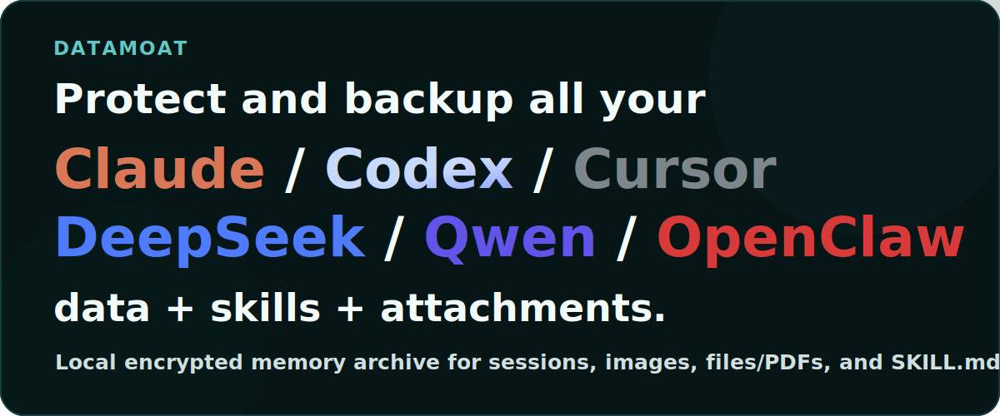
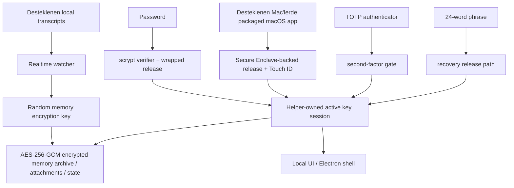

# DataMoat

Dil: [English](./README.md) | [Português (Brasil)](./README.pt-BR.md) | [简体中文](./README.zh-CN.md) | [繁體中文](./README.zh-Hant.md) | [日本語](./README.ja.md) | [한국어](./README.ko.md) | [Türkçe](./README.tr.md) | [Русский](./README.ru.md) | [Tiếng Việt](./README.vi.md) | [ไทย](./README.th.md) | [Deutsch](./README.de.md)

[](#)
[](#install)
[](./LICENSE.md)
[](#supported-today)
[](#supported-today)
[](#install)
[](#install)
[](#supported-today)
[](#supported-today)
[](#supported-today)
[](#supported-today)
[](#supported-today)
[](#supported-today)
[](#supported-today)
[](#supported-today)

Resmi website: [https://datamoat.org](https://datamoat.org)
GitHub deposu: [https://github.com/max-ng/datamoat](https://github.com/max-ng/datamoat)



> **Tüm ChatGPT / Claude / Codex / Cursor / DeepSeek / Qwen verilerinizi + skills + eklerinizi dışa aktarın ve yedekleyin.**
> DataMoat, AI çalışma geçmişinizi yerel ve şifreli tutar; raw source records kayıtlarını bozmadan saklar ve arama, export, reuse, handoff ve private AI memory için normalized index oluşturur.
>
> **Gelecekte en değerli olacak AI verileriniz zaten kayboluyor.**
> DataMoat'ı şimdi indirerek ChatGPT, Claude, Codex, Cursor, DeepSeek, Qwen ve OpenClaw çalışma geçmişinizin ne kadarını hâlâ capture edebileceğinizi görün.

**Temel backup kapsamı:** DataMoat desteklenen **skills + sessions + attachments** kayıtlarını aynı encrypted local memory archive içine yedekler. Skills yalnızca ad olarak değil, tam folder snapshot olarak saklanır.

**AI verilerine sahip olan insanlar ve şirketler geleceği kazanacak.**

DataMoat, ChatGPT exports, Claude CLI, Claude Desktop, Claude Code GUI workflows üzerinden DeepSeek ve Qwen, Codex CLI, Codex app, Cursor, OpenClaw ve diğer AI tools ile çalışan kişi ve ekipler için bir AI work history memory archive'dır. Tam çalışma kaydını korur: sessions, varsa locally stored thinking tokens ve reasoning blocks, prompts, responses, tool output, files, attachments, metadata, skills folder contents ve aynı makinedeki original source records. Böylece çalışmanız daha sonra review edilebilir, korunmuş, yeniden kullanılabilir ve handoff için daha kolay olur.


## DataMoat Çalışmanızı Nasıl Saklar

DataMoat iki katman tutar:

- **Raw archive:** original session JSONL, SQLite records, logs, attachments, metadata, skills folder snapshots ve locally stored thinking tokens veya reasoning blocks mümkün olduğunca source formatına yakın şekilde saklanır.
- **Normalized index:** farklı tools kayıtları common schema'ya dönüştürülür; böylece tools arasında search, review, export, analyze, reuse ve handoff yapabilirsiniz.

**Bugün desteklenen sources:** ChatGPT export ZIP/folder importları, Claude CLI, Codex CLI, Codex app local sessions, macOS'ta Claude Desktop local-agent sessions, Claude Code GUI workflows tarafından local yazıldığında DeepSeek ve Qwen sessions, desteklenen local OpenClaw session records ve desteklenen local Cursor agent transcripts.
**Daha fazla data source ve platform release roadmap'te:** yeni capture integrations ve platform updates çıktığında takip etmek için bu repository'yi star/watch edin.

## Neden DataMoat Kurmalı

- **Tam AI work history'nizi recoverable tutun.** Local records; compaction, cleanup, retention changes, account downgrades, device replacement veya environment loss sonrası tekrar bakması zor hale gelebilir.
- **En eksiksiz local version hâlâ varken koruyun.** DataMoat, source disk'e yazdığında locally stored thinking tokens ve reasoning blocks dahil locally written transcript'i kaydeder.
- **Çevredeki work context'i yedekleyin.** DataMoat desteklenen sessions, attachments ve `SKILL.md` tabanlı skills folder contents'i aynı encrypted memory archive içinde korur.
- **Geçmiş prompts, solutions, tool output ve thinking-token context içinde arama yapın.** Live service view'e bağlı kalmadan önceki fixes, workflows, timestamps ve attachments'ı bulun.
- **Bireyler ve ekipler için continuity koruyun.** Her protected machine, sonraki review, handoff ve audit için kendi encrypted local archive'ını tutabilir.
- **Records'ı encrypted ve local control altında tutun.** Diğer software veya services memory archive'ı doğrudan okuyamaz; yalnızca approved unlock ve recovery paths decrypt edebilir.

## Highlights

- AES-256-GCM kullanan transcripts, skills, attachments ve state için **encrypted local memory archive**.
- **Kaydedilen content local kalır**; plaintext transcript dumps değil, encrypted memory archive files olarak saklanır.
- Password, optional TOTP ve 24-word recovery phrase ile **strong local auth**.
- Desteklenen Mac'lerde hardware-assisted daily unlock için **Secure Enclave-backed unlock path**. Apple'ın [Secure Enclave](https://support.apple.com/guide/security/secure-enclave-sec59b0b31ff/web) özetine bakın. Touch ID, packaged macOS app path'in parçasıdır.
- **Helper-owned key custody** sayesinde main UI process active memory encryption key'i tutmaz.
- **Tamper-evident local audit chain**: current local audit entries hash-chained'dir ve `datamoat audit verify` ile doğrulanabilir.
- **Versioned local state** protected storage'ın zaman içinde güvenli migrate etmesini sağlar.
- General-purpose browser ve browser-extension exposure'ı azaltmak için **Electron shell by default**, local-only UI binding `127.0.0.1`.
- UI'da **third-party font veya CDN dependency yoktur**.

## Bugün Desteklenenler

### Platforms

| Platform | Status | Notes |
|---|---|---|
| **macOS** | Bugün destekleniyor | Source install ve signed packaged DMG şu anda mevcut |
| **Linux** | Bugün destekleniyor | Source install şu anda mevcut |
| **Packaged macOS DMG** | [DMG indir](https://datamoat.org/download/macos) (önerilir) | Desteklenen Mac'lerde Secure Enclave + Touch ID unlock içeren signed / notarized Apple Silicon DMG |
| **Windows x64 / ARM64** | ZIP + `DataMoat.exe` | Windows 11 x64 ve Windows 11 on Arm için unsigned manual packages; x64 GitHub Actions packaged runtime smoke geçti, ARM64 gerçek VM UI/background capture smoke geçti; signed installer hâlâ yapımda |

### Sources

| Source | Status | DataMoat neyi korur |
|---|---|---|
| **Claude CLI** | ✅ | Mevcut olduğunda locally written thinking blocks dahil full local transcript |
| **Codex CLI** | ✅ | Desteklenen local Codex CLI session records capture edilir; transcript text, tool output, timestamps, metadata ve stable image attachments korunur |
| **Codex app** | ✅ | Desteklenen local Codex app session records capture edilir; transcript text, tool output, timestamps, metadata ve stable image attachments korunur |
| **Claude Desktop local-agent sessions (macOS)** | ✅ | Mevcut olduğunda desteklenen local Claude Desktop agent session records |
| **DeepSeek via Claude Code GUI** | ✅ | Claude Code GUI DeepSeek-backed sessions için local records yazdığında transcript text, tool output, timestamps, metadata, skills folder snapshots, images ve supported attachments korunur |
| **Qwen via Claude Code GUI** | ✅ | Claude Code GUI Qwen-backed sessions için local records yazdığında transcript text, tool output, timestamps, metadata, skills folder snapshots, images ve supported attachments korunur |
| **OpenClaw** | ✅ | Desteklenen local OpenClaw session transcripts ve metadata |
| **Cursor** | ✅ | Okunabilir local Cursor `agent-transcripts` JSONL records capture edilir; varsa text ve tool blocks dahildir |
| **Attachments** | ✅ | Encrypted image ve supported file/PDF blocks, source sessions'a geri bağlanır |
| **Skills folders** | ✅ | Global ve project `SKILL.md` folder snapshots; yalnızca skill name değil, `SKILL.md` ve included helper files dahil |

## Security At A Glance

- **Memory archive encryption**: transcripts, skills, attachments ve local state AES-256-GCM ile at rest encrypted'dır.
- **Owner-only local file permissions**: protected memory archive files, attachment blobs ve state files restrictive local filesystem modes ile yazılır.
- **Password handling**: passwords plaintext değil, `scrypt` verifiers olarak saklanır.
- **Authenticator support**: TOTP; Google Authenticator, 1Password ve Authy gibi standard authenticator apps ile çalışır.
- **Recovery design**: her memory archive 24-word BIP39 recovery phrase alır.
- **Local-only UI**: UI `127.0.0.1` adresine bind eder ve `HttpOnly` + `SameSite=Strict` cookies kullanır.
- **Reduced browser attack surface**: default Electron shell normal general-purpose browser path'i önler; gerekirse browser fallback kullanılabilir.
- **Local API write protection**: mutating requests same origin'den gelmeli ve CSRF token içermelidir.
- **Unlock retry hardening**: password, Touch ID ve recovery failures sınırsız hızlı deneme yerine back off yapar.
- **Trusted source updates only**: in-place git updates yalnızca clean working tree üzerinde allow-listed remotes / branches için izinlidir.
- **Redacted diagnostics**: health, crash, log ve audit artifacts yazılmadan önce secrets scrub edilir.
- **Key isolation**: Electron renderer veya browser fallback raw memory encryption key almaz.
- **Auditability**: security-relevant local events hash-chained audit log'a yazılır. `datamoat audit verify` current local log içindeki changed veya broken entries'i tespit eder; remote notarization service veya deletion-proof ledger değildir.
- **Backup integrity**: viewer, mutable live source transcript yerine sealed memory archive copy'yi source of truth olarak okur.

### Neden 12 Yerine 24 Words?

DataMoat 24-word BIP39 phrase kullanır çünkü yüksek değerli encrypted memory archive için long-lived recovery material'dır. 12-word BIP39 phrase 128 bits entropy taşır, 24-word phrase ise 256 bits taşır. Twelve words hâlâ güçlüdür; ancak uzun yıllar access koruması gerekebilecek recovery material için DataMoat daha büyük security margin seçer.

### Memory Archive Nasıl Korunur



## Install

Signed / notarized macOS DMG, Mac users için önerilen install path'tir. Source install Linux, development ve fallback cases için kullanılabilir kalır. macOS DMG, DataMoat release downloads üzerinden [https://datamoat.org/download/macos](https://datamoat.org/download/macos) adresinde mevcuttur ve desteklenen Mac'lerde Secure Enclave + Touch ID unlock, login'de menu-bar auto-start ve DataMoat'ın R2 release feed'i üzerinden packaged auto-update içerir. Windows x64 ve ARM64, signed installer tamamlanırken unsigned ZIP + `DataMoat.exe` packages olarak mevcuttur.

Release downloads:

[](https://datamoat.org/download/macos)
[](https://datamoat.org/download/windows-x64)
[](https://datamoat.org/download/windows-arm64)

Her Windows ZIP, `DataMoat.exe` ve gerekli app files içerir. Windows package'i unzip edin, folder contents'i birlikte tutun ve `Install DataMoat.cmd` dosyasını bir kez çalıştırın. Bu, DataMoat'ı launch eder ve current Windows user için startup kaydeder; böylece tray/background app login veya restart sonrası geri gelir. Bu hâlâ portable ZIP package'tir, signed single-file installer değildir.

### AI-Assisted Install

Mac users için önce signed ve notarized packaged DMG kullanın: [Download DMG](https://datamoat.org/download/macos). Kullanıcı açıkça source install istemedikçe veya packaged release mevcut değilse macOS'ta `git clone` ile başlamayın.

Target desktop'a bakıyorken ChatGPT export ZIP/folder imports, Claude CLI, Codex CLI veya OpenClaw'dan DataMoat'ı kurmasını isteyebilirsiniz.

Typical prompt:

```text
DataMoat release downloads'taki latest signed macOS DMG'yi kullanarak bu Mac'e DataMoat kur. DataMoat.app'i Applications'a kopyala, launch et ve local setup UI göründüğünde bana söyle; password, authenticator, Touch ID ve recovery steps'i protected desktop üzerinde kendim tamamlayacağım.
```

Important:

- AI agent install'ı başlatabilir ve app'i hazırlayabilir
- final recovery ve unlock setup yine protected machine üzerinde human user tarafından tamamlanmalıdır
- OpenClaw, Telegram, WhatsApp veya target desktop'ı görmeden başka bir remote chat relay kullanıyorsanız normal AI-assisted flow yerine aşağıdaki dedicated remote no-screen flow'u kullanın

### Remote No-Screen Install

Install, protected desktop görünmeden OpenClaw, Codex veya herhangi bir remote chat relay üzerinden başlatılıyorsa, önce packaged macOS DMG veya Windows ZIP kullanın ve installed app'i single no-screen flag ile launch edin.

macOS remote prompt:

```text
Latest signed ve notarized macOS DMG'yi kullanarak bu Mac'e DataMoat kur.

DMG install başarısız olmadıkça git clone veya source install kullanma.

Steps:
1. Latest macOS DMG indir:
   https://datamoat.org/download/macos
2. DMG mount et.
3. DataMoat.app'i ~/Applications'a kopyala.
4. Tam olarak launch et:
   ~/Applications/DataMoat.app/Contents/MacOS/DataMoat --datamoat-remote-no-screen

Remote no-screen pre-setup capture için yalnızca --datamoat-remote-no-screen kullan.
Bu chat içinde password, authenticator, Touch ID veya recovery phrase setup tamamlama.

Launch sonrası bana söyle:
DataMoat was installed from the DMG and remote no-screen capture was started. I must finish setup later on the protected desktop GUI.
```

Windows remote prompt:

```text
Latest Windows ZIP ve DataMoat.exe kullanarak bu Windows machine'e DataMoat kur.

git clone veya source install kullanma.

Steps:
1. DataMoat release downloads'tan doğru latest Windows ZIP'i indir:
   x64: https://datamoat.org/download/windows-x64
   ARM64: https://datamoat.org/download/windows-arm64
2. ZIP'i Downloads'a extract et.
3. Tam olarak launch et:
   %USERPROFILE%\Downloads\DataMoat-win32-<arch>\DataMoat.exe --datamoat-remote-no-screen

x64 için DataMoat-win32-x64 veya ARM64 için DataMoat-win32-arm64 kullan.
Remote no-screen pre-setup capture için yalnızca --datamoat-remote-no-screen kullan.
Bu chat içinde password, authenticator veya recovery phrase setup tamamlama.

Launch sonrası bana söyle:
DataMoat was installed from the Windows ZIP and remote no-screen capture was started. I must finish setup later on the protected desktop GUI.
```

DMG kurduktan sonra manual macOS launch command:

```bash
"$HOME/Applications/DataMoat.app/Contents/MacOS/DataMoat" --datamoat-remote-no-screen
```

Bu mode, password, authenticator enrollment secret, Touch ID prompt ve 24-word recovery phrase'in Telegram, WhatsApp, OpenClaw chat, screenshots veya başka remote relay içinde görünmesini önlemek için kullanılır. DataMoat desteklenen local records'ı pre-setup encrypted capture ile hemen toplamaya başlar; ancak full unlock setup daha sonra protected desktop üzerinde tamamlanmalıdır.

Remote install bittikten sonra agent, DataMoat'ın başarıyla kurulduğunu ve desteklenen local records'ı zaten capture ettiğini bildirmelidir. Protected desktop'a döndüğünüzde DataMoat'ı orada açıp setup'ı local tamamlayın. Bot conversation içinde password, authenticator, Touch ID veya recovery setup tamamlamayın.

Linux fallback when no DMG exists:

```bash
git clone <repository-url> datamoat
cd datamoat
bash install.sh --remote-no-screen
```

### Manual Install

Source installs için önerilen: `git clone`.

```bash
git clone <repository-url> datamoat
cd datamoat
bash install.sh
datamoat
```

Requirements:

- `Node.js 18+`
- `macOS` veya `Linux`
- `macOS`: local native builds için Xcode Command Line Tools
- `Linux`: distro'nuz için normal Node build environment

First setup flow recovery material'ı local gösterir:

- password
- authenticator enrollment secret / QR
- 24-word recovery phrase

Final memory setup, chat apps, screenshots veya remote messaging channels üzerinden relay edilmeden protected machine'in actual desktop screen'inde tamamlanmalıdır.

## Commands

```bash
datamoat
datamoat status
datamoat stop
datamoat scan
datamoat audit verify
datamoat update check
```

Audit verification disk üzerinde bulunan audit log'un integrity'sini kontrol eder. External checkpoint olmadan, write access'e sahip birinin local audit file'ı hiç delete, truncate veya tamamen rewrite etmediğini tek başına kanıtlayamaz.

Live git source installs in-place source updates destekler. Packaged macOS installs, packaged update source olarak DataMoat R2 release downloads kullanır: DMG first install içindir; sonraki packaged updates signed ZIP payload indirir ve kullanıcıdan her release için yeni DMG mount etmesini istemek yerine macOS app updater üzerinden uygular.

## Source Service Boundaries

DataMoat, cihazınızda zaten bulunan ve sizin tarafınızdan zaten erişilebilir olan supported local transcript files'ı yedekler.

Content veya source services üzerinde ek hak vermez. ChatGPT, Claude, Codex, DeepSeek, Qwen, OpenClaw, Cursor ve kullandığınız diğer source service için geçerli terms, policies, plan restrictions ve internal rules'a uymaktan siz sorumlusunuz.

## Enterprise

Enterprise deployment ve management features roadmap'te. Daha fazla enterprise-focused capabilities geliyor; updates'i takip etmek için bu repository'yi star/watch edin.

## Consultation and Support

Sorular veya deployment help:


## License

DataMoat **Business Source License 1.1 (`BUSL-1.1`)** ve **Additional Use Grant** altında open-sourced olarak sunulur.

Bu şu anlama gelir:

- personal use izinlidir
- internal company use izinlidir
- bu grant dışındaki uses, licensor'dan separate commercial license gerektirir

Bu proje **source-available**'dır, OSI-approved open source değildir.

Tam koşullar için [LICENSE.md](LICENSE.md) dosyasına bakın.

---

## Official Website

Resmi DataMoat website: [https://datamoat.org](https://datamoat.org)
