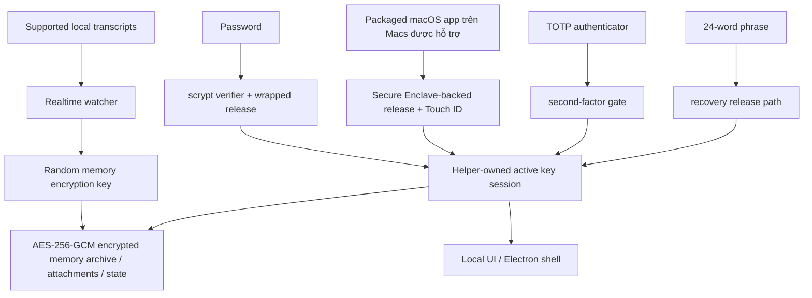

# DataMoat

Ngôn ngữ: [English](./README.md) | [Português (Brasil)](./README.pt-BR.md) | [简体中文](./README.zh-CN.md) | [繁體中文](./README.zh-Hant.md) | [日本語](./README.ja.md) | [한국어](./README.ko.md) | [Türkçe](./README.tr.md) | [Русский](./README.ru.md) | [Tiếng Việt](./README.vi.md) | [ไทย](./README.th.md) | [Deutsch](./README.de.md)

[](#)
[](#install)
[](./LICENSE.md)
[](#supported-today)
[](#supported-today)
[](#install)
[](#install)
[](#supported-today)
[](#supported-today)
[](#supported-today)
[](#supported-today)
[](#supported-today)
[](#supported-today)
[](#supported-today)
[](#supported-today)

Website chính thức: [https://datamoat.org](https://datamoat.org)
GitHub repo: [https://github.com/max-ng/datamoat](https://github.com/max-ng/datamoat)


> **Export và backup toàn bộ dữ liệu + skills + tệp đính kèm của ChatGPT / Claude / Codex / Cursor / DeepSeek / Qwen.**
> DataMoat giữ AI work history của bạn ở local và được mã hóa, bảo toàn raw source records nguyên vẹn và tạo normalized index cho search, export, reuse, handoff và private AI memory.
>
> **Dữ liệu AI quý giá nhất trong tương lai của bạn đang biến mất rồi.**
> Tải DataMoat ngay để xem bạn còn có thể capture được bao nhiêu work history từ ChatGPT, Claude, Codex, Cursor, DeepSeek, Qwen và OpenClaw.

**Phạm vi backup cốt lõi:** DataMoat backup **skills + sessions + attachments** được hỗ trợ vào cùng một encrypted local memory archive. Skills được lưu như full folder snapshots, không chỉ là tên.

**Những người và công ty sở hữu dữ liệu AI của họ sẽ thắng trong tương lai.**

DataMoat là AI work history memory archive cho cá nhân và đội nhóm làm việc với ChatGPT exports, Claude CLI, Claude Desktop, DeepSeek và Qwen qua Claude Code GUI workflows, Codex CLI, Codex app, Cursor, OpenClaw và các AI tools khác. Nó bảo toàn full working record: sessions, locally stored thinking tokens và reasoning blocks khi có, prompts, responses, tool output, files, attachments, metadata, skills folder contents và original source records trên cùng máy, để công việc của bạn vẫn reviewable, protected, reusable và dễ handoff hơn về sau.


## DataMoat Lưu Công Việc Của Bạn Như Thế Nào

DataMoat giữ hai lớp:

- **Raw archive:** original session JSONL, SQLite records, logs, attachments, metadata, skills folder snapshots và mọi locally stored thinking tokens hoặc reasoning blocks được giữ gần với source format nhất có thể.
- **Normalized index:** records từ các tools khác nhau được chuyển thành common schema để bạn có thể search, review, export, analyze, reuse và handoff work xuyên tools.

**Sources được hỗ trợ hôm nay:** ChatGPT export ZIP/folder imports, Claude CLI, Codex CLI, Codex app local sessions, Claude Desktop local-agent sessions trên macOS, DeepSeek và Qwen sessions khi được Claude Code GUI workflows ghi local, supported local OpenClaw session records và supported local Cursor agent transcripts.
**Nhiều data sources và platform releases khác nằm trên roadmap:** star và watch repository này để theo dõi capture integrations và platform updates mới khi chúng ship.

## New In 2.0.7: ChatGPT Export Memory Import

DataMoat now imports supported ChatGPT export ZIP files or extracted export folders into the same encrypted local memory archive used for Claude, Codex, Cursor, DeepSeek, Qwen, OpenClaw, skills, and attachments.

- **Restore, view, search, and backup ChatGPT exports.** Supported conversations, alternate branches, attachments, assets, and raw export files are imported into the encrypted vault.
- **Keep the raw export without wasting disk.** DataMoat preserves original source records and can store repetitive raw backup data in compressed encrypted archives; real source-record tests showed raw archive storage around 60% of original source bytes.
- **Move work across computers.** Copy the DataMoat folder to another machine and restore it across macOS, Windows, and Linux, including Mac to Windows and Linux to Mac.
- **Carry a second backup.** Save the encrypted DataMoat folder to USB or an external drive so your AI work history can travel separately from the source computer.

## Vì Sao Nên Cài DataMoat

- **Giữ full AI work history có thể recover.** Local records có thể khó xem lại hơn sau compaction, cleanup, retention changes, account downgrades, device replacement hoặc environment loss.
- **Bảo toàn local version đầy đủ nhất khi nó vẫn còn.** DataMoat lưu locally written transcript, bao gồm locally stored thinking tokens và reasoning blocks khi source lưu chúng vào disk.
- **Backup work context xung quanh.** DataMoat bảo vệ supported sessions, attachments và `SKILL.md`-based skills folder contents trong cùng encrypted memory archive.
- **Search prompts cũ, solutions, tool output và thinking-token context.** Tìm lại fixes, workflows, timestamps và attachments trước đây mà không phụ thuộc vào live service view.
- **Bảo vệ continuity cho cá nhân và đội nhóm.** Mỗi protected machine có thể giữ encrypted local archive riêng cho review, handoff và audit sau này.
- **Giữ records encrypted và dưới local control.** Software hoặc services khác không thể đọc memory archive trực tiếp; chỉ approved unlock và recovery paths mới decrypt được.

## Highlights

- **Encrypted local memory archive** cho transcripts, skills, attachments và state bằng AES-256-GCM.
- **Saved content stays local** dưới dạng encrypted memory archive files, không phải plaintext transcript dumps.
- **Strong local auth** với password, optional TOTP và 24-word recovery phrase.
- **Secure Enclave-backed unlock path trên Macs được hỗ trợ** cho daily unlock có hardware assist. Xem tổng quan của Apple về [Secure Enclave](https://support.apple.com/guide/security/secure-enclave-sec59b0b31ff/web). Touch ID là một phần của packaged macOS app path.
- **Helper-owned key custody** để main UI process không giữ active memory encryption key.
- **Tamper-evident local audit chain**: current local audit entries được hash-chained và verify bằng `datamoat audit verify`.
- **Versioned local state** để protected storage có thể migrate an toàn theo thời gian.
- **Electron shell by default** để giảm general-purpose browser và browser-extension exposure, với local-only UI binding tới `127.0.0.1`.
- **Không có third-party font hoặc CDN dependency** trong UI.

## Hỗ Trợ Hiện Tại

### Platforms

| Platform | Status | Notes |
|---|---|---|
| **macOS** | Hỗ trợ hôm nay | Source install và signed packaged DMG đã có |
| **Linux** | Hỗ trợ hôm nay | Source install đã có |
| **Packaged macOS DMG** | [Tải DMG](https://downloads.datamoat.org/releases/v2.0.7/DataMoat-2.0.7-macos-arm64.dmg) (khuyến nghị) | Signed / notarized Apple Silicon DMG với Secure Enclave + Touch ID unlock trên Macs được hỗ trợ |
| **Windows x64 / ARM64** | ZIP + `DataMoat.exe` | Unsigned manual packages cho Windows 11 x64 và Windows 11 on Arm; x64 đã pass GitHub Actions packaged runtime smoke, ARM64 đã pass real VM UI/background capture smoke; signed installer vẫn đang làm |

### Sources

| Source | Status | DataMoat bảo toàn gì |
|---|---|---|
| **Claude CLI** | ✅ | Full local transcript, bao gồm locally written thinking blocks khi có |
| **Codex CLI** | ✅ | Captures supported local Codex CLI session records; transcript text, tool output, timestamps, metadata và stable image attachments được bảo toàn |
| **Codex app** | ✅ | Captures supported local Codex app session records; transcript text, tool output, timestamps, metadata và stable image attachments được bảo toàn |
| **Claude Desktop local-agent sessions (macOS)** | ✅ | Supported local Claude Desktop agent session records khi có |
| **DeepSeek via Claude Code GUI** | ✅ | Khi Claude Code GUI ghi local records cho DeepSeek-backed sessions, transcript text, tool output, timestamps, metadata, skills folder snapshots, images và supported attachments được bảo toàn |
| **Qwen via Claude Code GUI** | ✅ | Khi Claude Code GUI ghi local records cho Qwen-backed sessions, transcript text, tool output, timestamps, metadata, skills folder snapshots, images và supported attachments được bảo toàn |
| **OpenClaw** | ✅ | Supported local OpenClaw session transcripts và metadata |
| **Cursor** | ✅ | Captures readable local Cursor `agent-transcripts` JSONL records, bao gồm text và tool blocks khi có |
| **Attachments** | ✅ | Encrypted image và supported file/PDF blocks, linked back về source sessions |
| **Skills folders** | ✅ | Global và project `SKILL.md` folder snapshots, gồm `SKILL.md` và included helper files, không chỉ skill name |

## Security At A Glance

- **Memory archive encryption**: transcripts, skills, attachments và local state được encrypted at rest bằng AES-256-GCM.
- **Owner-only local file permissions**: protected memory archive files, attachment blobs và state files được ghi với restrictive local filesystem modes.
- **Password handling**: passwords được lưu như `scrypt` verifiers, không phải plaintext.
- **Authenticator support**: TOTP hoạt động với standard authenticator apps như Google Authenticator, 1Password và Authy.
- **Recovery design**: mỗi memory archive có 24-word BIP39 recovery phrase.
- **Local-only UI**: UI bind tới `127.0.0.1` và dùng `HttpOnly` + `SameSite=Strict` cookies.
- **Reduced browser attack surface**: default Electron shell tránh normal general-purpose browser path; browser fallback vẫn có khi cần.
- **Local API write protection**: mutating requests phải đến từ same origin và có CSRF token.
- **Unlock retry hardening**: password, Touch ID và recovery failures back off thay vì cho phép unlimited rapid retries.
- **Trusted source updates only**: in-place git updates chỉ được cho allow-listed remotes / branches trên clean working tree.
- **Redacted diagnostics**: health, crash, log và audit artifacts scrub secrets trước khi ghi.
- **Key isolation**: Electron renderer hoặc browser fallback không nhận raw memory encryption key.
- **Auditability**: security-relevant local events được ghi vào hash-chained audit log. `datamoat audit verify` phát hiện changed hoặc broken entries trong current local log; nó không phải remote notarization service hay deletion-proof ledger.
- **Backup integrity**: viewer đọc sealed memory archive copy làm source of truth, không phải mutable live source transcript.

### Vì Sao 24 Words Thay Vì 12?

DataMoat dùng 24-word BIP39 phrase vì đó là long-lived recovery material cho high-value encrypted memory archive. 12-word BIP39 phrase có 128 bits of entropy, còn 24-word phrase có 256 bits. Twelve words vẫn mạnh, nhưng với recovery material có thể cần bảo vệ access nhiều năm, DataMoat chọn security margin lớn hơn.

### Memory Archive Được Bảo Vệ Như Thế Nào



## Install

Signed / notarized macOS DMG là install path được khuyến nghị cho Mac users. Source install vẫn có cho Linux, development và fallback cases. macOS DMG có trong DataMoat release downloads tại [https://downloads.datamoat.org/releases/v2.0.7/DataMoat-2.0.7-macos-arm64.dmg](https://downloads.datamoat.org/releases/v2.0.7/DataMoat-2.0.7-macos-arm64.dmg) và gồm Secure Enclave + Touch ID unlock trên Macs được hỗ trợ, menu-bar auto-start at login, và packaged auto-update qua DataMoat R2 release feed. Windows x64 và ARM64 có dưới dạng unsigned ZIP + `DataMoat.exe` packages trong khi signed installer được hoàn thiện.

Release downloads:

[](https://downloads.datamoat.org/releases/v2.0.7/DataMoat-2.0.7-macos-arm64.dmg)
[](https://downloads.datamoat.org/releases/v2.0.7/DataMoat-2.0.7-win32-x64.zip)
[](https://downloads.datamoat.org/releases/v2.0.7/DataMoat-2.0.7-win32-arm64.zip)

Mỗi Windows ZIP gồm `DataMoat.exe` và app files cần thiết. Unzip Windows package, giữ folder contents cùng nhau, và chạy `Install DataMoat.cmd` một lần. Việc đó launch DataMoat và register startup cho current Windows user để tray/background app quay lại sau login hoặc restart. Đây vẫn là portable ZIP package, chưa phải signed single-file installer.

### AI-Assisted Install

Với Mac users, dùng signed và notarized packaged DMG trước: [Download DMG](https://downloads.datamoat.org/releases/v2.0.7/DataMoat-2.0.7-macos-arm64.dmg). Đừng bắt đầu bằng `git clone` trên macOS trừ khi user rõ ràng muốn source install hoặc packaged release không khả dụng.

Bạn có thể nhờ ChatGPT export ZIP/folder imports, Claude CLI, Codex CLI hoặc OpenClaw cài DataMoat khi bạn đang nhìn target desktop.

Typical prompt:

```text
Cài DataMoat trên Mac này bằng latest signed macOS DMG từ DataMoat release downloads. Copy DataMoat.app vào Applications, launch nó, và báo tôi khi local setup UI xuất hiện để tôi tự hoàn tất password, authenticator, Touch ID và recovery steps trên protected desktop.
```

Important:

- AI agent có thể bắt đầu install và chuẩn bị app
- final recovery và unlock setup vẫn nên được human user hoàn tất trên protected machine
- nếu bạn dùng OpenClaw, Telegram, WhatsApp hoặc remote chat relay khác mà không thấy target desktop, hãy dùng dedicated remote no-screen flow bên dưới thay vì normal AI-assisted flow

### Remote No-Screen Install

Nếu install được bắt đầu qua OpenClaw, Codex hoặc remote chat relay trong khi bạn không thấy protected desktop, hãy dùng packaged macOS DMG hoặc Windows ZIP trước và launch installed app với single no-screen flag.

macOS remote prompt:

```text
Cài DataMoat trên Mac này bằng latest signed and notarized macOS DMG.

Không dùng git clone hoặc source install trừ khi DMG install fails.

Steps:
1. Download latest macOS DMG:
   https://downloads.datamoat.org/releases/v2.0.7/DataMoat-2.0.7-macos-arm64.dmg
2. Mount the DMG.
3. Copy DataMoat.app to ~/Applications.
4. Launch exactly:
   ~/Applications/DataMoat.app/Contents/MacOS/DataMoat --datamoat-remote-no-screen

Use only --datamoat-remote-no-screen for remote no-screen pre-setup capture.
Do not complete password, authenticator, Touch ID, or recovery phrase setup in this chat.

After launch, tell me:
DataMoat was installed from the DMG and remote no-screen capture was started. I must finish setup later on the protected desktop GUI.
```

Windows remote prompt:

```text
Cài DataMoat trên Windows machine này bằng latest Windows ZIP và DataMoat.exe.

Không dùng git clone hoặc source install.

Steps:
1. Download đúng latest Windows ZIP từ DataMoat release downloads:
   x64: https://downloads.datamoat.org/releases/v2.0.7/DataMoat-2.0.7-win32-x64.zip
   ARM64: https://downloads.datamoat.org/releases/v2.0.7/DataMoat-2.0.7-win32-arm64.zip
2. Extract ZIP vào Downloads.
3. Launch exactly:
   %USERPROFILE%\Downloads\DataMoat-win32-<arch>\DataMoat.exe --datamoat-remote-no-screen

Use DataMoat-win32-x64 for x64 or DataMoat-win32-arm64 for ARM64.
Use only --datamoat-remote-no-screen for remote no-screen pre-setup capture.
Do not complete password, authenticator, or recovery phrase setup in this chat.

After launch, tell me:
DataMoat was installed from the Windows ZIP and remote no-screen capture was started. I must finish setup later on the protected desktop GUI.
```

Manual macOS launch command after installing the DMG:

```bash
"$HOME/Applications/DataMoat.app/Contents/MacOS/DataMoat" --datamoat-remote-no-screen
```

Dùng mode này để ngăn password, authenticator enrollment secret, Touch ID prompt và 24-word recovery phrase xuất hiện trong Telegram, WhatsApp, OpenClaw chat, screenshots hoặc remote relay khác. DataMoat bắt đầu thu supported local records ngay bằng pre-setup encrypted capture, nhưng full unlock setup vẫn phải được hoàn tất sau trên protected desktop.

Sau khi remote install xong, agent nên báo DataMoat đã được cài thành công và đang capture supported local records. Khi bạn quay lại protected desktop, mở DataMoat ở đó và hoàn tất setup locally. Đừng hoàn tất password, authenticator, Touch ID hoặc recovery setup trong bot conversation.

Linux fallback when no DMG exists:

```bash
git clone <repository-url> datamoat
cd datamoat
bash install.sh --remote-no-screen
```

### Manual Install

Khuyến nghị cho source installs: dùng `git clone`.

```bash
git clone <repository-url> datamoat
cd datamoat
bash install.sh
datamoat
```

Requirements:

- `Node.js 18+`
- `macOS` hoặc `Linux`
- `macOS`: Xcode Command Line Tools for local native builds
- `Linux`: normal Node build environment cho distro của bạn

First setup flow hiển thị recovery material locally:

- password
- authenticator enrollment secret / QR
- 24-word recovery phrase

Final memory setup nên được hoàn tất trên actual desktop screen của machine được bảo vệ, không relay qua chat apps, screenshots hoặc remote messaging channels.

## Commands

```bash
datamoat
datamoat status
datamoat stop
datamoat scan
datamoat audit verify
datamoat update check
```

Audit verification kiểm tra integrity của audit log đang có trên disk. Nếu không có external checkpoint, nó không thể tự chứng minh local audit file chưa từng bị delete, truncate hoặc rewrite hoàn toàn bởi người có write access.

Live git source installs hỗ trợ in-place source updates. Packaged macOS installs dùng DataMoat R2 release downloads làm packaged update source: DMG dành cho first install, còn packaged updates sau đó download signed ZIP payload và apply qua macOS app updater thay vì yêu cầu users mount DMG mới cho mỗi release.

## Source Service Boundaries

DataMoat backup supported local transcript files đã có trên device của bạn và bạn đã có quyền truy cập.

Nó không cấp thêm quyền với content hoặc source services. Bạn vẫn chịu trách nhiệm tuân thủ terms, policies, plan restrictions và internal rules áp dụng cho ChatGPT, Claude, Codex, DeepSeek, Qwen, OpenClaw, Cursor và bất kỳ source service nào bạn dùng.

## Enterprise

Enterprise deployment và management features nằm trên roadmap. Nhiều enterprise-focused capabilities khác sẽ đến; star và watch repository này để theo dõi updates.

## Consultation and Support

Câu hỏi hoặc deployment help:


## License

DataMoat được open-sourced theo **Business Source License 1.1 (`BUSL-1.1`)** với **Additional Use Grant**.

Điều này nghĩa là:

- personal use được phép
- internal company use được phép
- uses ngoài grant này cần separate commercial license từ licensor

Đây là **source-available**, không phải OSI-approved open source.

Xem [LICENSE.md](LICENSE.md) để biết đầy đủ điều khoản.

---

## Official Website

Website DataMoat chính thức: [https://datamoat.org](https://datamoat.org)
