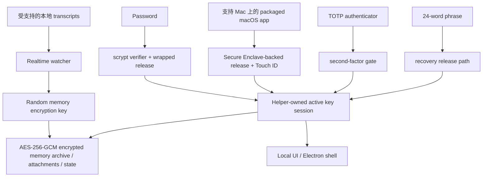

# DataMoat

语言: [English](./README.md) | [Português (Brasil)](./README.pt-BR.md) | [简体中文](./README.zh-CN.md) | [繁體中文](./README.zh-Hant.md) | [日本語](./README.ja.md) | [한국어](./README.ko.md) | [Türkçe](./README.tr.md) | [Русский](./README.ru.md) | [Tiếng Việt](./README.vi.md) | [ไทย](./README.th.md) | [Deutsch](./README.de.md)

[](#)
[](#install)
[](./LICENSE.md)
[](#supported-today)
[](#supported-today)
[](#install)
[](#install)
[](#supported-today)
[](#supported-today)
[](#supported-today)
[](#supported-today)
[](#supported-today)
[](#supported-today)
[](#supported-today)

官方网站: [https://datamoat.org](https://datamoat.org)
GitHub 仓库: [https://github.com/max-ng/datamoat](https://github.com/max-ng/datamoat)


> **导出并备份你的全部 Claude / Codex / Cursor / DeepSeek / Qwen 数据 + skills + 附件。**
> DataMoat 将你的 AI 工作历史保存在本地并加密，完整保留原始来源记录，同时建立统一索引，方便搜索、导出、复用、交接和私有 AI memory。
>
> **你未来最有价值的 AI 数据已经在消失。**
> 立即下载 DataMoat，看看你还能捕获多少 Claude、Codex、Cursor、OpenClaw、DeepSeek 和 Qwen 工作历史。

**核心备份范围:** DataMoat 会把受支持的 **skills + sessions + attachments** 备份进同一个本地加密 memory archive。Skills 会以完整文件夹快照保存，而不只是保存名称。

**拥有自己 AI 数据的人和公司，会赢得未来。**

DataMoat 是一个 AI work history memory archive，面向使用 Claude CLI、Claude Desktop、通过 Claude Code GUI workflow 使用 DeepSeek 和 Qwen、Codex CLI、Codex app、Cursor、OpenClaw 以及其他 AI 工具的个人和团队。它会保存完整工作记录：sessions、来源存在时本地保存的 thinking tokens 和 reasoning blocks、prompts、responses、tool output、files、attachments、metadata、skills folder contents，以及同一台机器上的原始来源记录，让你的工作之后仍然可以复查、受保护、复用，并更容易交接。


## DataMoat 怎样存储你的工作

DataMoat 保留两层数据:

- **Raw archive:** 原始 session JSONL、SQLite records、logs、attachments、metadata、skills folder snapshots，以及任何本地保存的 thinking tokens 或 reasoning blocks，会尽量以接近来源格式保存。
- **Normalized index:** 来自不同工具的 records 会转换成共同 schema，方便你跨工具搜索、复查、导出、分析、复用和交接工作。

**目前支持的来源:** Claude CLI、Codex CLI、Codex app local sessions、macOS 上的 Claude Desktop local-agent sessions、Claude Code GUI workflow 写入本地时的 DeepSeek 和 Qwen sessions、受支持的本地 OpenClaw session records，以及受支持的本地 Cursor agent transcripts。
**更多数据来源和平台版本已在 roadmap:** star 和 watch 这个 repository，就可以跟进新的 capture integrations 和平台更新发布。

## 为什么安装 DataMoat

- **让完整 AI 工作历史保持可恢复。** 本地 records 可能会在 compaction、cleanup、retention change、account downgrade、换机或环境丢失之后变得难以重新查看。
- **趁最完整的本地版本仍然存在时保存。** DataMoat 会保存本地写入的 transcript，包括来源把 thinking tokens 和 reasoning blocks 写入磁盘时的内容。
- **备份周边工作上下文。** DataMoat 会把受支持的 sessions、attachments 和基于 `SKILL.md` 的 skills folder contents 保护在同一个加密 memory archive。
- **搜索过去 prompts、solutions、tool output 和 thinking-token context。** 不依赖 live service view，也可以找回以前的 fixes、workflows、timestamps 和 attachments。
- **保护个人和团队的 continuity。** 每台受保护的机器都可以保留自己的本地加密 archive，方便之后 review、handoff 和 audit。
- **保持 records 加密并由本地控制。** 其他 software 或 services 无法直接读取 memory archive；只有经批准的 unlock 和 recovery path 才能解密。

## Highlights

- 使用 AES-256-GCM，为 transcripts、skills、attachments 和 state 建立 **本地加密 memory archive**。
- **保存内容留在本地**，以加密 memory archive files 保存，而不是 plaintext transcript dumps。
- **强本地验证**，支持 password、可选 TOTP 和 24-word recovery phrase。
- **支持 Mac 上的 Secure Enclave-backed unlock path**，提供硬件辅助日常 unlock。可参考 Apple 对 [Secure Enclave](https://support.apple.com/guide/security/secure-enclave-sec59b0b31ff/web) 的介绍。Touch ID 是 packaged macOS app path 的一部分。
- **Helper-owned key custody**，让 main UI process 不会持有 active memory encryption key。
- **Tamper-evident local audit chain**: 当前本地 audit entries 会用 hash chain 串起，并可用 `datamoat audit verify` 验证。
- **Versioned local state**，让受保护 storage 可以随时间安全 migrate。
- **默认使用 Electron shell**，减少 general-purpose browser 和 browser-extension exposure，UI 只 bind 到本地 `127.0.0.1`。
- **UI 无第三方 font 或 CDN dependency**。

## 目前支持

### 平台

| Platform | Status | Notes |
|---|---|---|
| **macOS** | 目前支持 | Source install 和已签名 packaged DMG 已可用 |
| **Linux** | 目前支持 | Source install 已可用 |
| **Packaged macOS DMG** | [下载 DMG](https://datamoat.org/download/macos) (推荐) | 已签名 / notarized Apple Silicon DMG，在支持的 Mac 上支持 Secure Enclave + Touch ID unlock |
| **Windows x64 / ARM64** | ZIP + `DataMoat.exe` | Windows 11 x64 和 Windows 11 on Arm 的未签名 manual packages；x64 已通过 GitHub Actions packaged runtime smoke，ARM64 已通过真实 VM UI/background capture smoke；signed installer 仍在制作中 |

### Sources

| Source | Status | DataMoat 保存内容 |
|---|---|---|
| **Claude CLI** | ✅ | 完整本地 transcript，包括存在时本地写入的 thinking blocks |
| **Codex CLI** | ✅ | 捕获受支持的本地 Codex CLI session records；会保存 transcript text、tool output、timestamps、metadata 和 stable image attachments |
| **Codex app** | ✅ | 捕获受支持的本地 Codex app session records；会保存 transcript text、tool output、timestamps、metadata 和 stable image attachments |
| **Claude Desktop local-agent sessions (macOS)** | ✅ | 存在时支持本地 Claude Desktop agent session records |
| **DeepSeek via Claude Code GUI** | ✅ | 当 Claude Code GUI 为 DeepSeek-backed sessions 写入本地 records 时，会保存 transcript text、tool output、timestamps、metadata、skills folder snapshots、images 和受支持的 attachments |
| **Qwen via Claude Code GUI** | ✅ | 当 Claude Code GUI 为 Qwen-backed sessions 写入本地 records 时，会保存 transcript text、tool output、timestamps、metadata、skills folder snapshots、images 和受支持的 attachments |
| **OpenClaw** | ✅ | 受支持的本地 OpenClaw session transcripts 和 metadata |
| **Cursor** | ✅ | 捕获可读取的本地 Cursor `agent-transcripts` JSONL records，包括存在时的 text 和 tool blocks |
| **Attachments** | ✅ | 加密 image 和受支持的 file/PDF blocks，并链接回来源 sessions |
| **Skills folders** | ✅ | Global 和 project `SKILL.md` folder snapshots，包括 `SKILL.md` 和包含的 helper files，而不只是 skill name |

## Security At A Glance

- **Memory archive encryption**: transcripts、skills、attachments 和本地 state 会以 AES-256-GCM at rest 加密。
- **Owner-only local file permissions**: 受保护的 memory archive files、attachment blobs 和 state files 会用限制性本地 filesystem modes 写入。
- **Password handling**: passwords 会以 `scrypt` verifiers 保存，不是 plaintext。
- **Authenticator support**: TOTP 可配合 Google Authenticator、1Password、Authy 等标准 authenticator apps 使用。
- **Recovery design**: 每个 memory archive 都会有 24-word BIP39 recovery phrase。
- **Local-only UI**: UI bind 到 `127.0.0.1`，并使用 `HttpOnly` + `SameSite=Strict` cookies。
- **Reduced browser attack surface**: 默认 Electron shell 避开一般用途 browser path；需要时仍保留 browser fallback。
- **Local API write protection**: 修改数据的 requests 必须来自同源，并带有 CSRF token。
- **Unlock retry hardening**: password、Touch ID 和 recovery failures 会 back off，避免无限快速重试。
- **Trusted source updates only**: in-place git updates 只允许在 clean working tree 上，针对 allow-listed remotes / branches。
- **Redacted diagnostics**: health、crash、log 和 audit artifacts 写入前会 scrub secrets。
- **Key isolation**: Electron renderer 或 browser fallback 不会收到 raw memory encryption key。
- **Auditability**: security-relevant local events 会写入 hash-chained audit log。`datamoat audit verify` 可侦测当前本地 log 被改动或断链的 entries；它不是 remote notarization service 或 deletion-proof ledger。
- **Backup integrity**: viewer 会以 sealed memory archive copy 作为 source of truth，而不是可变的 live source transcript。

### 为什么是 24 Words 而不是 12?

DataMoat 使用 24-word BIP39 phrase，因为它是高价值加密 memory archive 的长期 recovery material。12-word BIP39 phrase 有 128 bits entropy，而 24-word phrase 有 256 bits。12 words 仍然很强，但对于可能需要保护多年 access 的 recovery material，DataMoat 选择更大的安全 margin。

### Memory Archive 怎样受保护



## 安装

已签名 / notarized macOS DMG 是 Mac users 推荐的安装方式。Source install 仍然可用于 Linux、development 和 fallback cases。macOS DMG 可从 DataMoat release downloads 下载: [https://datamoat.org/download/macos](https://datamoat.org/download/macos)，并包括支持 Mac 上的 Secure Enclave + Touch ID unlock、menu-bar login 自动启动，以及通过 DataMoat R2 release feed 的 packaged auto-update。Windows x64 和 ARM64 目前提供未签名 ZIP + `DataMoat.exe` packages，signed installer 正在完成中。

Release downloads:

[](https://datamoat.org/download/macos)
[](https://datamoat.org/download/windows-x64)
[](https://datamoat.org/download/windows-arm64)

每个 Windows ZIP 都包括 `DataMoat.exe` 和所需 app files。解压 Windows package，保持 folder 内容放在一起，然后执行一次 `Install DataMoat.cmd`。它会 launch DataMoat，并为当前 Windows user 注册 startup，让 tray/background app 在 login 或 restart 后自动回来。这个仍然是 portable ZIP package，暂时还不是已签名 single-file installer。

### AI-Assisted Install

Mac users 应先使用已签名和 notarized 的 packaged DMG: [Download DMG](https://datamoat.org/download/macos)。除非 user 明确想 source install，或者 packaged release 无法使用，否则不要在 macOS 从 `git clone` 开始。

当你看着 target desktop 时，可以让 Claude CLI、Codex CLI 或 OpenClaw 帮你安装 DataMoat。

Typical prompt:

```text
使用 DataMoat release downloads 里的最新已签名 macOS DMG，在这台 Mac 安装 DataMoat。将 DataMoat.app 复制到 Applications，启动它，然后在本地 setup UI 出现时告诉我，让我可以亲自在受保护 desktop 上完成 password、authenticator、Touch ID 和 recovery steps。
```

Important:

- AI agent 可以开始 install 和准备 app
- 最后 recovery 和 unlock setup 仍然应由 human user 在受保护机器上完成
- 如果你使用 OpenClaw、Telegram、WhatsApp 或其他 remote chat relay，而且看不到 target desktop，请使用下面专用 remote no-screen flow，而不是一般 AI-assisted flow

### Remote No-Screen Install

如果 install 是通过 OpenClaw、Codex 或任何 remote chat relay 开始，而你看不到受保护 desktop，请先使用 packaged macOS DMG 或 Windows ZIP，并用单一 no-screen flag 启动已安装 app。

macOS remote prompt:

```text
使用最新已签名并 notarized 的 macOS DMG，在这台 Mac 安装 DataMoat。

除非 DMG 安装失败，否则不要使用 git clone 或 source install。

Steps:
1. 下载最新 macOS DMG:
   https://datamoat.org/download/macos
2. Mount DMG。
3. 将 DataMoat.app 复制到 ~/Applications。
4. 完全照以下方式 launch:
   ~/Applications/DataMoat.app/Contents/MacOS/DataMoat --datamoat-remote-no-screen

Remote no-screen pre-setup capture 只使用 --datamoat-remote-no-screen。
不要在这个 chat 内完成 password、authenticator、Touch ID 或 recovery phrase setup。

Launch 后告诉我:
DataMoat 已经由 DMG 安装，并已开始 remote no-screen capture。我之后必须在受保护 desktop GUI 上完成 setup。
```

Windows remote prompt:

```text
使用最新 Windows ZIP 和 DataMoat.exe，在这台 Windows machine 安装 DataMoat。

不要使用 git clone 或 source install。

Steps:
1. 从 DataMoat release downloads 下载正确的最新 Windows ZIP:
   x64: https://datamoat.org/download/windows-x64
   ARM64: https://datamoat.org/download/windows-arm64
2. 将 ZIP 解压到 Downloads。
3. 完全照以下方式 launch:
   %USERPROFILE%\Downloads\DataMoat-win32-<arch>\DataMoat.exe --datamoat-remote-no-screen

x64 使用 DataMoat-win32-x64，ARM64 使用 DataMoat-win32-arm64。
Remote no-screen pre-setup capture 只使用 --datamoat-remote-no-screen。
不要在这个 chat 内完成 password、authenticator 或 recovery phrase setup。

Launch 后告诉我:
DataMoat 已经由 Windows ZIP 安装，并已开始 remote no-screen capture。我之后必须在受保护 desktop GUI 上完成 setup。
```

安装 DMG 后的 manual macOS launch command:

```bash
"$HOME/Applications/DataMoat.app/Contents/MacOS/DataMoat" --datamoat-remote-no-screen
```

使用这个 mode，可以防止 password、authenticator enrollment secret、Touch ID prompt 和 24-word recovery phrase 出现在 Telegram、WhatsApp、OpenClaw chat、screenshots 或任何其他 remote relay。DataMoat 会立即开始以 pre-setup encrypted capture 收集受支持的本地 records，但完整 unlock setup 仍然必须之后在受保护 desktop 完成。

Remote install 完成后，agent 应报告 DataMoat 已成功安装，并已开始捕获受支持的本地 records。当你返回受保护 desktop，在当地打开 DataMoat 并完成 setup。不要在 bot conversation 里面完成 password、authenticator、Touch ID 或 recovery setup。

Linux fallback when no DMG exists:

```bash
git clone <repository-url> datamoat
cd datamoat
bash install.sh --remote-no-screen
```

### Manual Install

Source installs 建议使用 `git clone`。

```bash
git clone <repository-url> datamoat
cd datamoat
bash install.sh
datamoat
```

Requirements:

- `Node.js 18+`
- `macOS` 或 `Linux`
- `macOS`: Xcode Command Line Tools for local native builds
- `Linux`: 适合你 distro 的一般 Node build environment

First setup flow 会在本地显示 recovery material:

- password
- authenticator enrollment secret / QR
- 24-word recovery phrase

Final memory setup 应该在受保护机器的实际 desktop screen 完成，而不是通过 chat apps、screenshots 或 remote messaging channels relay。

## Commands

```bash
datamoat
datamoat status
datamoat stop
datamoat scan
datamoat audit verify
datamoat update check
```

Audit verification 会检查当前磁盘上 audit log 的完整性。若无 external checkpoint，它本身无法证明一个本地 audit file 从未被有 write access 的人 delete、truncate 或完整 rewrite。

Live git source installs 支持 in-place source updates。Packaged macOS installs 使用 DataMoat R2 release downloads 作为 packaged update source: DMG 用于首次安装，之后 packaged updates 会下载 signed ZIP payload，并通过 macOS app updater 应用，而不需要 user 每次 release 都 mount 新 DMG。

## Source Service Boundaries

DataMoat 备份的是你 device 上已存在、而且你已可访问的受支持本地 transcript files。

它不会授予你对内容或 source services 额外权利。你仍然有责任遵守 Claude、Codex、DeepSeek、Qwen、OpenClaw、Cursor 以及你使用的任何其他 source service 适用的 terms、policies、plan restrictions 和 internal rules。

## Enterprise

Enterprise deployment 和 management features 已列入 roadmap。更多 enterprise-focused capabilities 将会推出；star 和 watch 这个 repository 以跟进更新。

## Consultation and Support

问题或 deployment help:


## License

DataMoat 根据 **Business Source License 1.1 (`BUSL-1.1`)** 连同 **Additional Use Grant** 发布。

意思是:

- personal use 允许
- internal company use 允许
- grant 以外的用途需要向 licensor 取得 separate commercial license

这是 **source-available**，不是 OSI-approved open source。

完整条款见 [LICENSE.md](LICENSE.md)。

---

## Official Website

DataMoat 官方网站: [https://datamoat.org](https://datamoat.org)
