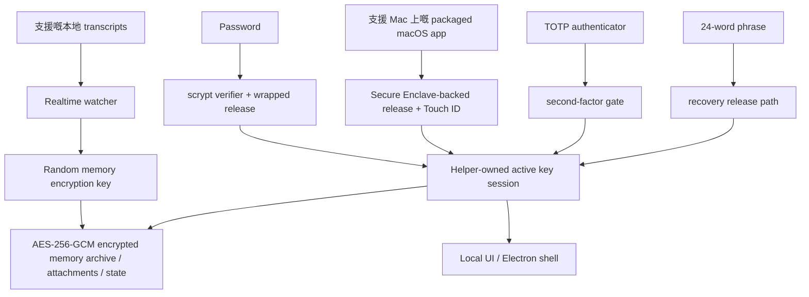

# DataMoat

語言: [English](./README.md) | [Português (Brasil)](./README.pt-BR.md) | [简体中文](./README.zh-CN.md) | [繁體中文](./README.zh-HK.md) | [日本語](./README.ja.md) | [한국어](./README.ko.md) | [Türkçe](./README.tr.md) | [Русский](./README.ru.md) | [Tiếng Việt](./README.vi.md) | [ไทย](./README.th.md) | [Deutsch](./README.de.md)

[](#)
[](#install)
[](./LICENSE.md)
[](#supported-today)
[](#supported-today)
[](#install)
[](#install)
[](#supported-today)
[](#supported-today)
[](#supported-today)
[](#supported-today)
[](#supported-today)
[](#supported-today)
[](#supported-today)

官方網站: [https://datamoat.org](https://datamoat.org)
GitHub repo: [https://github.com/max-ng/datamoat](https://github.com/max-ng/datamoat)


> **匯出並備份你所有 Claude / Codex / Cursor / DeepSeek / Qwen 資料 + skills + 附件。**
> DataMoat 將你嘅 AI 工作歷史保留喺本地並加密，完整保存原始來源紀錄，同時建立統一索引，方便搜尋、匯出、重用、交接同私人 AI memory。
>
> **你未來最值錢嘅 AI 資料已經開始消失。**
> 立即下載 DataMoat，睇下你仲可以捕捉到幾多 Claude、Codex、Cursor、OpenClaw、DeepSeek 同 Qwen 工作歷史。

**核心備份範圍:** DataMoat 會將支援嘅 **skills + sessions + attachments** 備份到同一個本地加密 memory archive。Skills 會以完整 folder snapshot 保存，而唔只係保存名稱。

**擁有自己 AI data 嘅人同公司，會贏得未來。**

DataMoat 係一個 AI work history memory archive，為使用 Claude CLI、Claude Desktop、透過 Claude Code GUI workflow 使用 DeepSeek 同 Qwen、Codex CLI、Codex app、Cursor、OpenClaw 同其他 AI 工具嘅個人同團隊而設。佢會保存完整工作紀錄：sessions、來源存在時本地儲存嘅 thinking tokens 同 reasoning blocks、prompts、responses、tool output、files、attachments、metadata、skills folder contents，以及同一部機上嘅原始來源紀錄，令你嘅工作之後仍然可以 review、受保護、重用，同更容易交接。


## DataMoat 點樣儲存你嘅工作

DataMoat 保留兩層資料:

- **Raw archive:** 原始 session JSONL、SQLite records、logs、attachments、metadata、skills folder snapshots，以及任何本地儲存嘅 thinking tokens 或 reasoning blocks，會盡量以接近來源格式保存。
- **Normalized index:** 來自唔同工具嘅 records 會轉成共同 schema，方便你跨工具搜尋、review、匯出、分析、重用同交接工作。

**目前支援嘅來源:** Claude CLI、Codex CLI、Codex app local sessions、macOS 上嘅 Claude Desktop local-agent sessions、Claude Code GUI workflow 寫入本地時嘅 DeepSeek 同 Qwen sessions、支援嘅本地 OpenClaw session records，以及支援嘅本地 Cursor agent transcripts。
**更多資料來源同平台版本已喺 roadmap:** star 同 watch 呢個 repository，就可以跟住新 capture integrations 同平台更新發佈。

## 點解要安裝 DataMoat

- **保持完整 AI 工作歷史可恢復。** 本地 records 可能會喺 compaction、cleanup、retention change、account downgrade、換機或者環境遺失之後變得難以重看。
- **趁最完整嘅本地版本仲存在時保存。** DataMoat 會保存本地寫入嘅 transcript，包括來源將 thinking tokens 同 reasoning blocks 寫入磁碟時嘅內容。
- **備份周邊工作上下文。** DataMoat 會將支援嘅 sessions、attachments 同以 `SKILL.md` 為基礎嘅 skills folder contents 保護喺同一個加密 memory archive。
- **搜尋過去 prompts、solutions、tool output 同 thinking-token context。** 唔需要依賴 live service view，都可以搵返以前嘅 fixes、workflows、timestamps 同 attachments。
- **保護個人同團隊嘅 continuity。** 每部受保護嘅機都可以保留自己嘅本地加密 archive，方便之後 review、handoff 同 audit。
- **保持 records 加密並由本地控制。** 其他 software 或 services 無法直接讀取 memory archive；只有經批准嘅 unlock 同 recovery path 先可以解密。

## Highlights

- 使用 AES-256-GCM，為 transcripts、skills、attachments 同 state 建立 **本地加密 memory archive**。
- **保存內容留喺本地**，以加密 memory archive files 保存，而唔係 plaintext transcript dumps。
- **強本地驗證**，支援 password、可選 TOTP 同 24-word recovery phrase。
- **支援 Mac 上嘅 Secure Enclave-backed unlock path**，提供硬件輔助日常 unlock。可參考 Apple 對 [Secure Enclave](https://support.apple.com/guide/security/secure-enclave-sec59b0b31ff/web) 嘅介紹。Touch ID 係 packaged macOS app path 嘅一部分。
- **Helper-owned key custody**，令 main UI process 唔會持有 active memory encryption key。
- **Tamper-evident local audit chain**: 目前本地 audit entries 會用 hash chain 串起，並可用 `datamoat audit verify` 驗證。
- **Versioned local state**，令受保護 storage 可以隨時間安全 migrate。
- **預設使用 Electron shell**，減少 general-purpose browser 同 browser-extension exposure，UI 只 bind 到本地 `127.0.0.1`。
- **UI 無第三方 font 或 CDN dependency**。

## 目前支援

### 平台

| Platform | Status | Notes |
|---|---|---|
| **macOS** | 目前支援 | Source install 同已簽名 packaged DMG 已可用 |
| **Linux** | 目前支援 | Source install 已可用 |
| **Packaged macOS DMG** | [下載 DMG](https://datamoat.org/download/macos) (建議) | 已簽名 / notarized Apple Silicon DMG，在支援嘅 Mac 上支援 Secure Enclave + Touch ID unlock |
| **Windows x64 / ARM64** | ZIP + `DataMoat.exe` | Windows 11 x64 同 Windows 11 on Arm 嘅未簽名 manual packages；x64 已通過 GitHub Actions packaged runtime smoke，ARM64 已通過真 VM UI/background capture smoke；signed installer 仍在製作中 |

### Sources

| Source | Status | DataMoat 保存內容 |
|---|---|---|
| **Claude CLI** | ✅ | 完整本地 transcript，包括存在時本地寫入嘅 thinking blocks |
| **Codex CLI** | ✅ | 捕捉支援嘅本地 Codex CLI session records；會保存 transcript text、tool output、timestamps、metadata 同 stable image attachments |
| **Codex app** | ✅ | 捕捉支援嘅本地 Codex app session records；會保存 transcript text、tool output、timestamps、metadata 同 stable image attachments |
| **Claude Desktop local-agent sessions (macOS)** | ✅ | 存在時支援本地 Claude Desktop agent session records |
| **DeepSeek via Claude Code GUI** | ✅ | 當 Claude Code GUI 為 DeepSeek-backed sessions 寫入本地 records 時，會保存 transcript text、tool output、timestamps、metadata、skills folder snapshots、images 同支援嘅 attachments |
| **Qwen via Claude Code GUI** | ✅ | 當 Claude Code GUI 為 Qwen-backed sessions 寫入本地 records 時，會保存 transcript text、tool output、timestamps、metadata、skills folder snapshots、images 同支援嘅 attachments |
| **OpenClaw** | ✅ | 支援嘅本地 OpenClaw session transcripts 同 metadata |
| **Cursor** | ✅ | 捕捉可讀取嘅本地 Cursor `agent-transcripts` JSONL records，包括存在時嘅 text 同 tool blocks |
| **Attachments** | ✅ | 加密 image 同支援嘅 file/PDF blocks，並連返去來源 sessions |
| **Skills folders** | ✅ | Global 同 project `SKILL.md` folder snapshots，包括 `SKILL.md` 同包含嘅 helper files，而唔只係 skill name |

## Security At A Glance

- **Memory archive encryption**: transcripts、skills、attachments 同本地 state 會以 AES-256-GCM at rest 加密。
- **Owner-only local file permissions**: 受保護嘅 memory archive files、attachment blobs 同 state files 會用限制性本地 filesystem modes 寫入。
- **Password handling**: passwords 會以 `scrypt` verifiers 保存，唔係 plaintext。
- **Authenticator support**: TOTP 可配合 Google Authenticator、1Password、Authy 等標準 authenticator apps 使用。
- **Recovery design**: 每個 memory archive 都會有 24-word BIP39 recovery phrase。
- **Local-only UI**: UI bind 到 `127.0.0.1`，並使用 `HttpOnly` + `SameSite=Strict` cookies。
- **Reduced browser attack surface**: 預設 Electron shell 避開一般用途 browser path；需要時仍保留 browser fallback。
- **Local API write protection**: 修改資料嘅 requests 必須來自同源，並帶有 CSRF token。
- **Unlock retry hardening**: password、Touch ID 同 recovery failures 會 back off，避免無限制快速重試。
- **Trusted source updates only**: in-place git updates 只允許在 clean working tree 上，針對 allow-listed remotes / branches。
- **Redacted diagnostics**: health、crash、log 同 audit artifacts 寫入前會 scrub secrets。
- **Key isolation**: Electron renderer 或 browser fallback 唔會收到 raw memory encryption key。
- **Auditability**: security-relevant local events 會寫入 hash-chained audit log。`datamoat audit verify` 可偵測目前本地 log 被改動或斷鏈嘅 entries；佢唔係 remote notarization service 或 deletion-proof ledger。
- **Backup integrity**: viewer 會以 sealed memory archive copy 作為 source of truth，而唔係可變嘅 live source transcript。

### 點解係 24 Words 而唔係 12?

DataMoat 使用 24-word BIP39 phrase，因為佢係高價值加密 memory archive 嘅長期 recovery material。12-word BIP39 phrase 有 128 bits entropy，而 24-word phrase 有 256 bits。12 words 仍然好強，但對可能需要保護多年 access 嘅 recovery material，DataMoat 選擇更大安全 margin。

### Memory Archive 點樣受保護



## 安裝

已簽名 / notarized macOS DMG 係 Mac users 建議嘅安裝方式。Source install 仍然可用於 Linux、development 同 fallback cases。macOS DMG 可由 DataMoat release downloads 下載: [https://datamoat.org/download/macos](https://datamoat.org/download/macos)，並包括支援 Mac 上嘅 Secure Enclave + Touch ID unlock、menu-bar login 自動啟動，以及透過 DataMoat R2 release feed 嘅 packaged auto-update。Windows x64 同 ARM64 目前提供未簽名 ZIP + `DataMoat.exe` packages，signed installer 正在完成中。

Release downloads:

[](https://datamoat.org/download/macos)
[](https://datamoat.org/download/windows-x64)
[](https://datamoat.org/download/windows-arm64)

每個 Windows ZIP 都包括 `DataMoat.exe` 同所需 app files。解壓 Windows package，保持 folder 內容放埋一齊，然後執行一次 `Install DataMoat.cmd`。佢會 launch DataMoat，並為目前 Windows user 註冊 startup，令 tray/background app 喺 login 或 restart 後自動回來。呢個仍然係 portable ZIP package，暫時未係已簽名 single-file installer。

### AI-Assisted Install

Mac users 應先使用已簽名同 notarized 嘅 packaged DMG: [Download DMG](https://datamoat.org/download/macos)。除非 user 明確想 source install，或者 packaged release 無法使用，否則唔好喺 macOS 由 `git clone` 開始。

當你望住 target desktop 時，可以叫 Claude CLI、Codex CLI 或 OpenClaw 幫你安裝 DataMoat。

Typical prompt:

```text
使用 DataMoat release downloads 入面最新已簽名 macOS DMG，在這台 Mac 安裝 DataMoat。將 DataMoat.app 複製到 Applications，啟動它，然後在本地 setup UI 出現時告訴我，讓我可以親自在受保護 desktop 上完成 password、authenticator、Touch ID 和 recovery steps。
```

Important:

- AI agent 可以開始 install 同準備 app
- 最後 recovery 同 unlock setup 仍然應由 human user 喺受保護機器上完成
- 如果你使用 OpenClaw、Telegram、WhatsApp 或其他 remote chat relay，而且睇唔到 target desktop，請使用下面專用 remote no-screen flow，而唔係一般 AI-assisted flow

### Remote No-Screen Install

如果 install 係透過 OpenClaw、Codex 或任何 remote chat relay 開始，而你睇唔到受保護 desktop，請先使用 packaged macOS DMG 或 Windows ZIP，並用單一 no-screen flag 啟動已安裝 app。

macOS remote prompt:

```text
使用最新已簽名並 notarized 的 macOS DMG，在這台 Mac 安裝 DataMoat。

除非 DMG 安裝失敗，否則不要使用 git clone 或 source install。

Steps:
1. 下載最新 macOS DMG:
   https://datamoat.org/download/macos
2. Mount DMG。
3. 將 DataMoat.app 複製到 ~/Applications。
4. 完全照以下方式 launch:
   ~/Applications/DataMoat.app/Contents/MacOS/DataMoat --datamoat-remote-no-screen

Remote no-screen pre-setup capture 只使用 --datamoat-remote-no-screen。
不要在這個 chat 內完成 password、authenticator、Touch ID 或 recovery phrase setup。

Launch 後告訴我:
DataMoat 已經由 DMG 安裝，並已開始 remote no-screen capture。我之後必須在受保護 desktop GUI 上完成 setup。
```

Windows remote prompt:

```text
使用最新 Windows ZIP 和 DataMoat.exe，在這台 Windows machine 安裝 DataMoat。

不要使用 git clone 或 source install。

Steps:
1. 從 DataMoat release downloads 下載正確嘅最新 Windows ZIP:
   x64: https://datamoat.org/download/windows-x64
   ARM64: https://datamoat.org/download/windows-arm64
2. 將 ZIP 解壓到 Downloads。
3. 完全照以下方式 launch:
   %USERPROFILE%\Downloads\DataMoat-win32-<arch>\DataMoat.exe --datamoat-remote-no-screen

x64 使用 DataMoat-win32-x64，ARM64 使用 DataMoat-win32-arm64。
Remote no-screen pre-setup capture 只使用 --datamoat-remote-no-screen。
不要在這個 chat 內完成 password、authenticator 或 recovery phrase setup。

Launch 後告訴我:
DataMoat 已經由 Windows ZIP 安裝，並已開始 remote no-screen capture。我之後必須在受保護 desktop GUI 上完成 setup。
```

安裝 DMG 後嘅 manual macOS launch command:

```bash
"$HOME/Applications/DataMoat.app/Contents/MacOS/DataMoat" --datamoat-remote-no-screen
```

使用呢個 mode，可以防止 password、authenticator enrollment secret、Touch ID prompt 同 24-word recovery phrase 出現在 Telegram、WhatsApp、OpenClaw chat、screenshots 或任何其他 remote relay。DataMoat 會即時開始以 pre-setup encrypted capture 收集支援嘅本地 records，但完整 unlock setup 仍然必須之後喺受保護 desktop 完成。

Remote install 完成後，agent 應報告 DataMoat 已成功安裝，並已開始捕捉支援嘅本地 records。當你返回受保護 desktop，喺當地打開 DataMoat 並完成 setup。不要在 bot conversation 入面完成 password、authenticator、Touch ID 或 recovery setup。

Linux fallback when no DMG exists:

```bash
git clone <repository-url> datamoat
cd datamoat
bash install.sh --remote-no-screen
```

### Manual Install

Source installs 建議使用 `git clone`。

```bash
git clone <repository-url> datamoat
cd datamoat
bash install.sh
datamoat
```

Requirements:

- `Node.js 18+`
- `macOS` 或 `Linux`
- `macOS`: Xcode Command Line Tools for local native builds
- `Linux`: 適合你 distro 嘅一般 Node build environment

First setup flow 會在本地顯示 recovery material:

- password
- authenticator enrollment secret / QR
- 24-word recovery phrase

Final memory setup 應該在受保護機器嘅實際 desktop screen 完成，而唔係透過 chat apps、screenshots 或 remote messaging channels relay。

## Commands

```bash
datamoat
datamoat status
datamoat stop
datamoat scan
datamoat audit verify
datamoat update check
```

Audit verification 會檢查目前磁碟上 audit log 嘅完整性。若無 external checkpoint，佢本身無法證明一個本地 audit file 從未被有 write access 嘅人 delete、truncate 或完整 rewrite。

Live git source installs 支援 in-place source updates。Packaged macOS installs 使用 DataMoat R2 release downloads 作為 packaged update source: DMG 用於首次安裝，之後 packaged updates 會下載 signed ZIP payload，並透過 macOS app updater 套用，而唔需要 user 每次 release 都 mount 新 DMG。

## Source Service Boundaries

DataMoat 備份嘅係你 device 上已存在、而且你已可存取嘅支援本地 transcript files。

佢唔會授予你對內容或 source services 額外權利。你仍然有責任遵守 Claude、Codex、DeepSeek、Qwen、OpenClaw、Cursor 以及你使用嘅任何其他 source service 適用嘅 terms、policies、plan restrictions 同 internal rules。

## Enterprise

Enterprise deployment 同 management features 已列入 roadmap。更多 enterprise-focused capabilities 將會推出；star 同 watch 呢個 repository 以跟進更新。

## Consultation and Support

問題或 deployment help:


## License

DataMoat 根據 **Business Source License 1.1 (`BUSL-1.1`)** 連同 **Additional Use Grant** 發佈。

意思係:

- personal use 允許
- internal company use 允許
- grant 以外嘅用途需要向 licensor 取得 separate commercial license

呢個係 **source-available**，唔係 OSI-approved open source。

完整條款見 [LICENSE.md](LICENSE.md)。

---

## Official Website

DataMoat 官方網站: [https://datamoat.org](https://datamoat.org)
