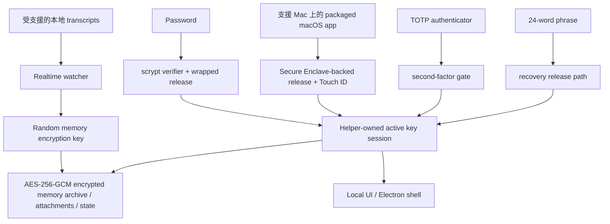

# DataMoat

語言: [English](./README.md) | [Português (Brasil)](./README.pt-BR.md) | [簡體中文](./README.zh-CN.md) | [繁體中文](./README.zh-Hant.md) | [日本語](./README.ja.md) | [한국어](./README.ko.md) | [Türkçe](./README.tr.md) | [Русский](./README.ru.md) | [Tiếng Việt](./README.vi.md) | [ไทย](./README.th.md) | [Deutsch](./README.de.md)

[](#)
[](#install)
[](./LICENSE.md)
[](#supported-today)
[](#supported-today)
[](#install)
[](#install)
[](#supported-today)
[](#supported-today)
[](#supported-today)
[](#supported-today)
[](#supported-today)
[](#supported-today)
[](#supported-today)
[](#supported-today)

官方網站: [https://datamoat.org](https://datamoat.org)
GitHub 儲存庫: [https://github.com/max-ng/datamoat](https://github.com/max-ng/datamoat)

## 匯出並備份 ChatGPT / Claude / Codex / Cursor / DeepSeek / Qwen 資料 + skills + 附件

用於 sessions、images、files/PDFs 和 `SKILL.md` folders 的本地加密備份 archive。

> **匯出並備份你的全部 ChatGPT / Claude / Codex / Cursor / DeepSeek / Qwen 資料 + skills + 附件。**
> DataMoat 將你的 AI 工作歷史儲存在本地並加密，完整保留原始來源記錄，同時建立統一索引，方便搜尋、匯出、重複使用、交接和私有 AI memory。
>
> **你未來最有價值的 AI 資料已經在消失。**
> 立即下載 DataMoat，看看你還能擷取多少 ChatGPT、Claude、Codex、Cursor、DeepSeek、Qwen 和 OpenClaw 工作歷史。

**核心備份範圍:** DataMoat 會把受支援的 **skills + sessions + attachments** 備份進同一個本地加密 memory archive。Skills 會以完整資料夾快照儲存，而不只是儲存名稱。

**擁有自己 AI 資料的人和公司，會贏得未來。**

DataMoat 是一個 AI work history memory archive，面向使用 ChatGPT exports、Claude CLI、Claude Desktop、透過 Claude Code GUI workflow 使用 DeepSeek 和 Qwen、Codex CLI、Codex app、Cursor、OpenClaw 以及其他 AI 工具的個人和團隊。它會保留完整工作記錄：sessions、來源存在時本地儲存的 thinking tokens 和 reasoning blocks、prompts、responses、tool output、files、attachments、metadata、skills folder contents，以及同一台機器上的原始來源記錄，讓你的工作之後仍然可以複查、受保護、重複使用，並更容易交接。


## DataMoat 怎樣儲存你的工作

DataMoat 保留兩層資料:

- **Raw archive:** 原始 session JSONL、SQLite records、logs、attachments、metadata、skills folder snapshots，以及任何本地儲存的 thinking tokens 或 reasoning blocks，會盡量以接近來源格式儲存。
- **Normalized index:** 來自不同工具的 records 會轉換成共同 schema，方便你跨工具搜尋、複查、匯出、分析、重複使用和交接工作。

**目前支援的來源:** ChatGPT export ZIP/資料夾匯入、Claude CLI、Codex CLI、Codex app local sessions、macOS 上的 Claude Desktop local-agent sessions、Claude Code GUI workflow 寫入本地時的 DeepSeek 和 Qwen sessions、受支援的本地 OpenClaw session records，以及受支援的本地 Cursor agent transcripts。
**更多資料來源和平台版本已在 roadmap:** star 和 watch 這個 repository，就可以跟進新的 capture integrations 和平台更新發布。

## 2.0.8 新功能：從 vault 直接重用上下文

DataMoat 現在可以把支援的 ChatGPT export ZIP 檔案或解壓後的 export 資料夾匯入到同一個加密本地 memory archive 中，和 Claude、Codex、Cursor、DeepSeek、Qwen、OpenClaw、skills 與附件放在一起保護。

- **還原、查看、搜尋和備份 ChatGPT exports。** 支援的對話、分支、附件、assets 和 raw export 檔案會匯入到加密 vault。
- **從 vault 直接複製上下文。** 每條 message 都可以複製「到這一條為止」的 context pack。這不是瀏覽器選取文字，也不是從畫面 DOM 複製；DataMoat 會直接讀取加密 vault 裡已捕捉的 records，按順序重建角色、時間、模型/來源 metadata、tool call、tool result、已捕捉的 thinking block、usage、raw references 和附件引用。
- **比手動 copy/paste 更少丟失結構。** 超長 session 不需要全部 render 在畫面上，也可以複製到指定位置以前的內容，方便貼到 ChatGPT、Claude 或其他模型繼續使用。DataMoat 只會匯出本機來源記錄或匯入備份中實際捕捉到的資料；如果原平台從未提供某些隱藏狀態，DataMoat 不會憑空生成。
- **預設可讀格式，保留 plain text fallback。** Message text 預設以可讀的 Markdown-like 格式顯示 code block、list、table 和 heading；Settings 可關閉，回到原本 plain text layout。
- **保留 raw export，同時避免浪費磁碟。** DataMoat 保留原始 source records，並把重複度高的 raw backup data 存入壓縮加密 archive；真實 source-record 測試顯示 raw archive 大約是原始來源 bytes 的 60%。
- **自動清理 raw-archive pending metadata。** 2.0.8 會在 unlock 後和 transfer export 前靜默把 `pending/` metadata 合併入加密 manifest，先確認對應 chunk file 存在，成功後才移除 pending file，減少 USB copy 和 backup 時的大量 tiny files。
- **跨電腦轉移工作。** 複製 DataMoat 資料夾到另一台機器，即可跨 macOS、Windows 和 Linux 還原，包括 Mac 到 Windows、Linux 到 Mac。
- **隨身保存第二份備份。** 把加密 DataMoat 資料夾保存到 USB 或外置硬碟，讓 AI 工作歷史可以獨立於原電腦保存和攜帶。

## 為什麼安裝 DataMoat

- **讓完整 AI 工作歷史保持可復原。** 本地 records 可能會在 compaction、cleanup、retention change、account downgrade、換機或環境遺失之後變得難以重新檢視。
- **趁最完整的本地版本仍然存在時儲存。** DataMoat 會儲存本地寫入的 transcript，包括來源把 thinking tokens 和 reasoning blocks 寫入磁碟時的內容。
- **備份周邊工作上下文。** DataMoat 會把受支援的 sessions、attachments 和基於 `SKILL.md` 的 skills folder contents 保護在同一個加密 memory archive。
- **搜尋過去 prompts、solutions、tool output 和 thinking-token context。** 不依賴 live service view，也可以找回以前的 fixes、workflows、timestamps 和 attachments。
- **保護個人和團隊的 continuity。** 每台受保護的機器都可以保留自己的本地加密 archive，方便之後 review、handoff 和 audit。
- **保持 records 加密並由本地控制。** 其他 software 或 services 無法直接讀取 memory archive；只有經批准的 unlock 和 recovery path 才能解密。

## Highlights

- 使用 AES-256-GCM，為 transcripts、skills、attachments 和 state 建立 **本地加密 memory archive**。
- **儲存內容留在本地**，以加密 memory archive files 儲存，而不是 plaintext transcript dumps。
- **強本地驗證**，支援 password、可選 TOTP 和 24-word recovery phrase。
- **支援 Mac 上的 Secure Enclave-backed unlock path**，提供硬體輔助日常 unlock。可參考 Apple 對 [Secure Enclave](https://support.apple.com/guide/security/secure-enclave-sec59b0b31ff/web) 的介紹。Touch ID 是 packaged macOS app path 的一部分。
- **Helper-owned key custody**，讓 main UI process 不會持有 active memory encryption key。
- **Tamper-evident local audit chain**: 目前本地 audit entries 會用 hash chain 串起，並可用 `datamoat audit verify` 驗證。
- **Versioned local state**，讓受保護 storage 可以隨時間安全 migrate。
- **預設使用 Electron shell**，減少 general-purpose browser 和 browser-extension exposure，UI 只 bind 到本地 `127.0.0.1`。
- **UI 無第三方 font 或 CDN dependency**。

## 目前支援

### 平台

| Platform | Status | Notes |
|---|---|---|
| **macOS** | 目前支援 | Source install 和已簽名 packaged DMG 已可用 |
| **Linux** | 目前支援 | Source install 已可用 |
| **Packaged macOS DMG** | [下載 DMG](https://downloads.datamoat.org/releases/v2.0.7/DataMoat-2.0.7-macos-arm64.dmg) (推薦) | 已簽名 / notarized Apple Silicon DMG，在支援的 Mac 上支援 Secure Enclave + Touch ID unlock |
| **Windows x64 / ARM64** | ZIP + `DataMoat.exe` | Windows 11 x64 和 Windows 11 on Arm 的帶 SHA256 校驗的 portable ZIP packages；x64 已透過 GitHub Actions packaged runtime smoke，ARM64 已透過真實 VM UI/background capture smoke；signed installer 仍在製作中 |

### Sources

| Source | Status | DataMoat 儲存內容 |
|---|---|---|
| **Claude CLI** | ✅ | 完整本地 transcript，包括存在時本地寫入的 thinking blocks |
| **Codex CLI** | ✅ | 擷取受支援的本地 Codex CLI session records；會儲存 transcript text、tool output、timestamps、metadata 和 stable image attachments |
| **Codex app** | ✅ | 擷取受支援的本地 Codex app session records；會儲存 transcript text、tool output、timestamps、metadata 和 stable image attachments |
| **Claude Desktop local-agent sessions (macOS)** | ✅ | 存在時支援本地 Claude Desktop agent session records |
| **DeepSeek via Claude Code GUI** | ✅ | 當 Claude Code GUI 為 DeepSeek-backed sessions 寫入本地 records 時，會儲存 transcript text、tool output、timestamps、metadata、skills folder snapshots、images 和受支援的 attachments |
| **Qwen via Claude Code GUI** | ✅ | 當 Claude Code GUI 為 Qwen-backed sessions 寫入本地 records 時，會儲存 transcript text、tool output、timestamps、metadata、skills folder snapshots、images 和受支援的 attachments |
| **OpenClaw** | ✅ | 受支援的本地 OpenClaw session transcripts 和 metadata |
| **Cursor** | ✅ | 擷取可讀取的本地 Cursor `agent-transcripts` JSONL records，包括存在時的 text 和 tool blocks |
| **Attachments** | ✅ | 加密 image 和受支援的 file/PDF blocks，並連結回來源 sessions |
| **Skills folders** | ✅ | Global 和 project `SKILL.md` folder snapshots，包括 `SKILL.md` 和包含的 helper files，而不只是 skill name |

## Security At A Glance

- **Memory archive encryption**: transcripts、skills、attachments 和本地 state 會以 AES-256-GCM at rest 加密。
- **Owner-only local file permissions**: 受保護的 memory archive files、attachment blobs 和 state files 會用限制性本地 filesystem modes 寫入。
- **Password handling**: passwords 會以 `scrypt` verifiers 儲存，不是 plaintext。
- **Authenticator support**: TOTP 可配合 Google Authenticator、1Password、Authy 等標準 authenticator apps 使用。
- **Recovery design**: 每個 memory archive 都會有 24-word BIP39 recovery phrase。
- **Local-only UI**: UI bind 到 `127.0.0.1`，並使用 `HttpOnly` + `SameSite=Strict` cookies。
- **Reduced browser attack surface**: 預設 Electron shell 避開一般用途 browser path；需要時仍保留 browser fallback。
- **Local API write protection**: 修改資料的 requests 必須來自同源，並帶有 CSRF token。
- **Unlock retry hardening**: password、Touch ID 和 recovery failures 會 back off，避免無限快速重試。
- **Trusted source updates only**: in-place git updates 只允許在 clean working tree 上，針對 allow-listed remotes / branches。
- **Redacted diagnostics**: health、crash、log 和 audit artifacts 寫入前會 scrub secrets。
- **Key isolation**: Electron renderer 或 browser fallback 不會收到 raw memory encryption key。
- **Auditability**: security-relevant local events 會寫入 hash-chained audit log。`datamoat audit verify` 可偵測目前本地 log 被改動或斷鏈的 entries；它不是 remote notarization service 或 deletion-proof ledger。
- **Backup integrity**: viewer 會以 sealed memory archive copy 作為 source of truth，而不是可變的 live source transcript。

### 為什麼是 24 Words 而不是 12?

DataMoat 使用 24-word BIP39 phrase，因為它是高價值加密 memory archive 的長期 recovery material。12-word BIP39 phrase 有 128 bits entropy，而 24-word phrase 有 256 bits。12 words 仍然很強，但對於可能需要保護多年 access 的 recovery material，DataMoat 選擇更大的安全 margin。

### Memory Archive 怎樣受保護



## 安裝

已簽名 / notarized macOS DMG 是 Mac users 推薦的安裝方式。Source install 仍然可用於 Linux、development 和 fallback cases。macOS DMG 可從 DataMoat release downloads 下載: [https://downloads.datamoat.org/releases/v2.0.7/DataMoat-2.0.7-macos-arm64.dmg](https://downloads.datamoat.org/releases/v2.0.7/DataMoat-2.0.7-macos-arm64.dmg)，並包括支援 Mac 上的 Secure Enclave + Touch ID unlock、menu-bar login 自動啟動，以及透過 DataMoat R2 release feed 的 packaged auto-update。Windows x64 和 ARM64 目前提供帶 SHA256 校驗的 ZIP + `DataMoat.exe` packages，signed installer 正在完成中。

Release downloads:

[](https://downloads.datamoat.org/releases/v2.0.7/DataMoat-2.0.7-macos-arm64.dmg)
[](https://downloads.datamoat.org/releases/v2.0.7/DataMoat-2.0.7-win32-x64.zip)
[](https://downloads.datamoat.org/releases/v2.0.7/DataMoat-2.0.7-win32-arm64.zip)

每個 Windows ZIP 都包括 `DataMoat.exe` 和所需 app files。解壓 Windows package，保持 folder 內容放在一起，然後執行一次 `Install DataMoat.cmd`。它會 launch DataMoat，並為目前 Windows user 註冊 startup，讓 tray/background app 在 login 或 restart 後自動回來。這個仍然是 portable ZIP package，暫時還不是已簽名 single-file installer。

### AI-Assisted Install

Mac users 應先使用已簽名和 notarized 的 packaged DMG: [Download DMG](https://downloads.datamoat.org/releases/v2.0.7/DataMoat-2.0.7-macos-arm64.dmg)。除非 user 明確想 source install，或者 packaged release 無法使用，否則不要在 macOS 從 `git clone` 開始。

當你看着 target desktop 時，可以讓 Claude CLI、Codex CLI 或 OpenClaw 幫你安裝 DataMoat。

Typical prompt:

```text
使用 DataMoat release downloads 裡的最新已簽名 macOS DMG，在這台 Mac 安裝 DataMoat。將 DataMoat.app 複製到 Applications，啟動它，然後在本地 setup UI 出現時告訴我，讓我可以親自在受保護 desktop 上完成 password、authenticator、Touch ID 和 recovery steps。
```

Important:

- AI agent 可以開始 install 和準備 app
- 最後 recovery 和 unlock setup 仍然應由 human user 在受保護機器上完成
- 如果你使用 OpenClaw、Telegram、WhatsApp 或其他 remote chat relay，而且看不到 target desktop，請使用下面專用 remote no-screen flow，而不是一般 AI-assisted flow

### Remote No-Screen Install

如果 install 是透過 OpenClaw、Codex 或任何 remote chat relay 開始，而你看不到受保護 desktop，請先使用 packaged macOS DMG 或 Windows ZIP，並用單一 no-screen flag 啟動已安裝 app。

macOS remote prompt:

```text
使用最新已簽名並 notarized 的 macOS DMG，在這台 Mac 安裝 DataMoat。

除非 DMG 安裝失敗，否則不要使用 git clone 或 source install。

Steps:
1. 下載最新 macOS DMG:
   https://downloads.datamoat.org/releases/v2.0.7/DataMoat-2.0.7-macos-arm64.dmg
2. Mount DMG。
3. 將 DataMoat.app 複製到 ~/Applications。
4. 完全照以下方式 launch:
   ~/Applications/DataMoat.app/Contents/MacOS/DataMoat --datamoat-remote-no-screen

Remote no-screen pre-setup capture 只使用 --datamoat-remote-no-screen。
不要在這個 chat 內完成 password、authenticator、Touch ID 或 recovery phrase setup。

Launch 後告訴我:
DataMoat 已經由 DMG 安裝，並已開始 remote no-screen capture。我之後必須在受保護 desktop GUI 上完成 setup。
```

Windows remote prompt:

```text
使用最新 Windows ZIP 和 DataMoat.exe，在這台 Windows machine 安裝 DataMoat。

不要使用 git clone 或 source install。

Steps:
1. 從 DataMoat release downloads 下載正確的最新 Windows ZIP:
   x64: https://downloads.datamoat.org/releases/v2.0.7/DataMoat-2.0.7-win32-x64.zip
   ARM64: https://downloads.datamoat.org/releases/v2.0.7/DataMoat-2.0.7-win32-arm64.zip
2. 將 ZIP 解壓到 Downloads。
3. 完全照以下方式 launch:
   %USERPROFILE%\Downloads\DataMoat-win32-<arch>\DataMoat.exe --datamoat-remote-no-screen

x64 使用 DataMoat-win32-x64，ARM64 使用 DataMoat-win32-arm64。
Remote no-screen pre-setup capture 只使用 --datamoat-remote-no-screen。
不要在這個 chat 內完成 password、authenticator 或 recovery phrase setup。

Launch 後告訴我:
DataMoat 已經由 Windows ZIP 安裝，並已開始 remote no-screen capture。我之後必須在受保護 desktop GUI 上完成 setup。
```

安裝 DMG 後的 manual macOS launch command:

```bash
"$HOME/Applications/DataMoat.app/Contents/MacOS/DataMoat" --datamoat-remote-no-screen
```

使用這個 mode，可以防止 password、authenticator enrollment secret、Touch ID prompt 和 24-word recovery phrase 出現在 Telegram、WhatsApp、OpenClaw chat、screenshots 或任何其他 remote relay。DataMoat 會立即開始以 pre-setup encrypted capture 收集受支援的本地 records，但完整 unlock setup 仍然必須之後在受保護 desktop 完成。

Remote install 完成後，agent 應報告 DataMoat 已成功安裝，並已開始擷取受支援的本地 records。當你返回受保護 desktop，在當地打開 DataMoat 並完成 setup。不要在 bot conversation 裡面完成 password、authenticator、Touch ID 或 recovery setup。

Linux fallback when no DMG exists:

```bash
git clone <repository-url> datamoat
cd datamoat
bash install.sh --remote-no-screen
```

### Manual Install

Source installs 建議使用 `git clone`。

```bash
git clone <repository-url> datamoat
cd datamoat
bash install.sh
datamoat
```

Requirements:

- `Node.js 18+`
- `macOS` 或 `Linux`
- `macOS`: Xcode Command Line Tools for local native builds
- `Linux`: 適合你 distro 的一般 Node build environment

First setup flow 會在本地顯示 recovery material:

- password
- authenticator enrollment secret / QR
- 24-word recovery phrase

Final memory setup 應該在受保護機器的實際 desktop screen 完成，而不是透過 chat apps、screenshots 或 remote messaging channels relay。

## Commands

```bash
datamoat
datamoat status
datamoat stop
datamoat scan
datamoat audit verify
datamoat update check
```

Audit verification 會檢查目前磁碟上 audit log 的完整性。若無 external checkpoint，它本身無法證明一個本地 audit file 從未被有 write access 的人 delete、truncate 或完整 rewrite。

Live git source installs 支援 in-place source updates。Packaged macOS installs 使用 DataMoat R2 release downloads 作為 packaged update source: DMG 用於首次安裝，之後 packaged updates 會下載 signed ZIP payload，並透過 macOS app updater 應用，而不需要 user 每次 release 都 mount 新 DMG。

## Source Service Boundaries

DataMoat 備份的是你 device 上已存在、而且你已可訪問的受支援本地 transcript files。

它不會授予你對內容或 source services 額外權利。你仍然有責任遵守 ChatGPT、Claude、Codex、DeepSeek、Qwen、OpenClaw、Cursor 以及你使用的任何其他 source service 適用的 terms、policies、plan restrictions 和 internal rules。

DataMoat 旨在保護你自己機器上已經存在的 AI records。它不是讓 sessions、skills、attachments 和 memory files 繼續散落在已知本地路徑裡，也不是依賴不透明的 memory plugins，而是加入由使用者控制的 local encryption、backup scope、recovery 和 auditability。

當這些 records 已經存在於本地時，DataMoat 也可以保留並遷移 captured versions 或 alternate conversation branches 裡的 images、files/PDFs、generated assets 和 attachments。多數 AI memory plugins 和 simple export tools 只停留在 text；DataMoat 會把產生這些工作的 surrounding files 一起保存在 work history 裡。

DataMoat 不會為你的 AI work history 創造新的訪問權限。它保護的是你電腦上 source-tool folders、exports、logs、attachments 或 session stores 裡已經存在、但可能仍然分散、可讀且未加密的 local records。

很多 AI tools 本身已經把 work history 當作普通本地檔案存放在電腦上。任何擁有這個 user account、disk、backup 或 source-tool folders 訪問權限的人或 process，都可能在 DataMoat 保護之前讀到這些 records。DataMoat 不會讓這些 data 變得更 exposed；它會把使用者選擇的 already-present records 移入由使用者控制的 encrypted archive。

DataMoat backup scope 由使用者和受保護機器上已經可用的 source records 決定。它不會繞過 account permissions，不會解鎖 remote services，也不會授予超過使用者在這台電腦上已有範圍之外的 rights。

## Threat model: why installing can reduce local exposure

### 為什麼什麼都不做也可能有風險

DataMoat 不是要求你從零建立一個新的 sensitive dataset。對許多 AI tools 來說，這個 dataset 已經以 local transcripts、logs、exports、SQLite records、JSONL files、attachments 和 skills folders 的形式存在於你的電腦上。

如果沒有專門的 archive，這些 records 可能繼續散落在可預測的本地路徑裡，只受普通 OS account permissions 控制。DataMoat 的工作是幫你識別這些 records，把使用者選擇的 supported records 複製到本地 encrypted vault，並保留一個由你控制、可恢復、可搜尋、可審計的 archive。

### 使用 DataMoat 之前

許多 AI tools 已經把 transcripts、tool output、attachments、project context，有時還有 reasoning-related blocks，作為普通本地檔案保存。這些檔案可能位於已知 application folders、exports、logs、SQLite databases、JSONL transcripts 和 attachment caches。任何以同一 OS user 身分執行的 process，都可能已經能讀取其中一部分。

### DataMoat 做什麼

DataMoat 不會建立對 remote AI services 的新 access，也不會繞過 OS permissions。它只讀取目前本地使用者已經可 access 的 records，然後把使用者選擇的 supported records 存入由使用者控制的本地 encrypted archive。受支援的本地讀取路徑和捕獲原因，都可以在公開的 application code 中審閱；DataMoat 不使用隱藏的 cloud collection，也不使用未公開的 remote capture。

### DataMoat 不會自動解決什麼

DataMoat 不會神奇地抹掉原始 source files。除非使用者選擇 cleanup/export workflow，原始 records 仍可能留在 source apps 的 folders 裡。DataMoat 透過建立受保護的 encrypted copy 來減少分散 plaintext 暴露；它不能替代 endpoint security、disk encryption 或 source-app retention policy。

### 主要取捨

安裝 DataMoat 會引入一個 local watcher/importer process，並讓它 access 使用者選擇的 AI record locations。作為交換，使用者得到 searchable encrypted archive、recovery path、audit log 和 portable backup，而不是讓重要 AI work 繼續散落在 unencrypted local files 裡。

Windows packages 目前是 unsigned manual builds，signed installer 仍在進行中。Codebase 是 public 且 source-available for review；需要 signed 或 managed builds 的 teams 可以聯絡我們。

你不需要是 power user 才能開始擁有自己的 AI work history。DataMoat 讓你今天就可以從一個小的 local archive 開始，然後隨著 conversations、files、prompts 和 project context 成長，看見它的價值不斷累積。

## Enterprise

Enterprise deployment 和 management features 已列入 roadmap。更多 enterprise-focused capabilities 將會推出；star 和 watch 這個 repository 以跟進更新。

## Consultation and Support

問題或 deployment help:


## License

DataMoat 以 **Business Source License 1.1 (`BUSL-1.1`)** 連同 **Additional Use Grant** 開源發佈。

意思是:

- personal use 允許
- internal company use 允許
- grant 以外的用途需要向 licensor 取得 separate commercial license

我們選擇 **BUSL-1.1**，是為了讓程式碼保持可審計，同時降低誤導性重新打包版本、惡意軟體複製品，以及不受支援的商業 fork 濫用這個安全敏感本地 archive tool 的風險。所有 application code 都公開供審閱。

完整條款見 [LICENSE.md](LICENSE.md)。

---

## Official Website

DataMoat 官方網站: [https://datamoat.org](https://datamoat.org)
